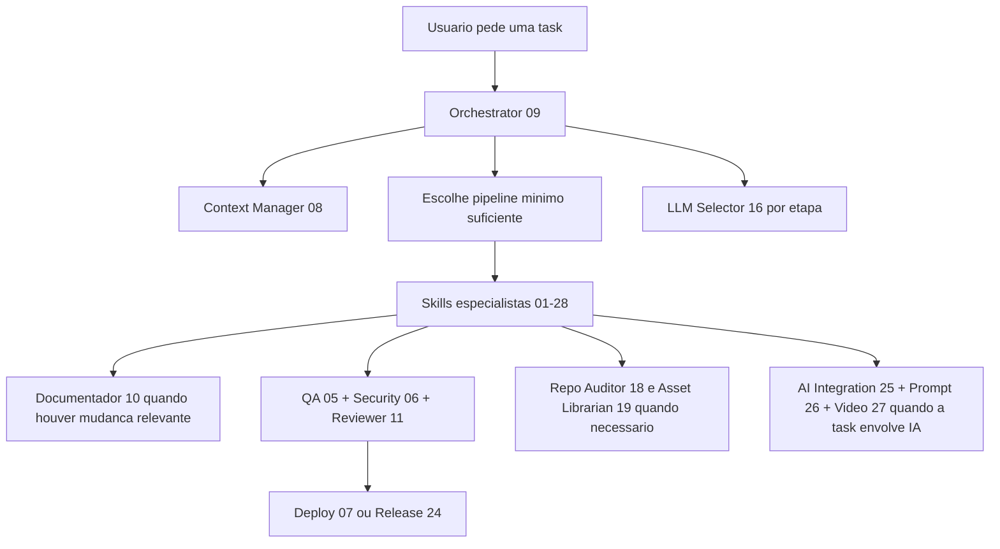
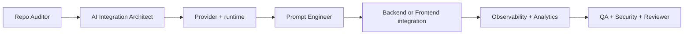

# Dev Team Kit for Coding Agents


> Um kit visual e governado para agentes de coding trabalharem com pipeline, contexto persistente, auditoria de repo e skills especializadas.

## Visao Geral

Este repositorio entrega um sistema completo para agentes compativeis com Claude, OpenCode, Copilot, Windsurf, Gemini CLI e Antigravity:

- `GLOBAL.md` define as regras universais do kit
- `policies/` concentra execucao, seguranca de tools, handoffs, evals e qualidade
- `skills/*/SKILL.md` implementa 28 especialistas numerados
- `templates/` oferece formatos curtos e reutilizaveis
- `docs/` guarda guias, quickstart, contexto e auditorias reutilizaveis
- `patterns/ai-integration/` organiza padroes para integrar IA em apps reais
- `setup/install.sh` instala o kit em `.bot/` e configura multiplas plataformas
- `scripts/` inclui utilitarios reais, como geracao de imagens via fal.ai
- `src/` traz codigo de referencia pronto para reaproveitamento

## O Que o Sistema Faz



## Governanca Global

- `GLOBAL.md` e a camada mais alta de instrucao
- `policies/` padroniza execucao, risco, persistencia, qualidade e avaliacao
- `templates/` reduz variacao de handoff, plano, review e rejeicao
- `docs/repo-audit/current.md` e `docs/repo-audit/assets.md` evitam releitura desnecessaria do repo
- `policies/tool-safety.md` define o uso seguro de escrita, rede, MCP e acoes externas
- `policies/evals.md` define evidencia minima para mudancas estruturais no kit

### Hierarquia de Instrucoes

1. `GLOBAL.md`
2. `policies/*.md`
3. `skills/*/SKILL.md`
4. `templates/*.md`

## Organograma do Kit

```mermaid
graph TD
    O[09 Orchestrator] --> C[08 Context Manager]
    O --> G1[Gestao e Coordenacao]
    O --> G2[Produto e Design]
    O --> G3[Desenvolvimento]
    O --> G4[Conteudo e SEO]
    O --> G5[Qualidade, Release e Operacao]

    G1 --> S10[10 Documentador]
    G1 --> S11[11 Reviewer]
    G1 --> S16[16 LLM Selector]
    G1 --> S17[17 Image Generator]
    G1 --> S18[18 Repo Auditor]
    G1 --> S19[19 Asset Librarian]
    G1 --> S28[28 CLAUDE.md Generator]

    G2 --> S01[01 PO]
    G2 --> S02[02 UI/UX]
    G2 --> S22[22 Accessibility]

    G3 --> S03[03 Backend]
    G3 --> S04[04 Frontend]
    G3 --> S12[12 Motion]
    G3 --> S15[15 Mobile Tauri]
    G3 --> S23[23 Migration Refactor]
    G3 --> S25[25 AI Integration Architect]
    G3 --> S26[26 Prompt Engineer]
    G3 --> S27[27 Video Integration]

    G4 --> S13[13 Marketing Copy]
    G4 --> S14[14 SEO]
    G4 --> S21[21 Data Analytics]

    G5 --> S05[05 QA]
    G5 --> S06[06 Security]
    G5 --> S07[07 Deploy]
    G5 --> S20[20 Observability SRE]
    G5 --> S24[24 Release Manager]
```



## Pipeline Principal

### Feature completa

```text
PO -> UI/UX -> Backend -> Frontend -> Motion -> Copy -> SEO -> QA -> Security -> Reviewer -> Deploy
```

### Adaptacoes comuns

| Tipo de tarefa | Pipeline tipico |
|---|---|
| Feature completa | `PO -> UI/UX -> Backend -> Frontend -> Motion -> Copy -> SEO -> QA -> Security -> Reviewer -> Deploy` |
| Bug fix | `Backend -> QA -> Security -> Reviewer -> Deploy` |
| Hotfix critico | `Backend -> Security -> Reviewer -> Deploy` |
| Melhoria de UI | `UI/UX -> Frontend -> Motion -> QA -> Security -> Reviewer -> Deploy` |
| Landing page | `Copy -> UI/UX -> Frontend -> Motion -> SEO -> QA -> Security -> Reviewer -> Deploy` |
| Integracao de IA | `Repo Auditor -> AI Integration Architect -> Prompt Engineer -> Backend/Frontend -> Observability -> QA -> Security -> Reviewer` |
| Release formal | `Reviewer -> Observability SRE -> Release Manager -> Deploy` |

### Etapas obrigatorias

- `QA` 05 nao e pulada
- `Security` 06 nao e pulada
- `Reviewer` 11 nao e pulada
- `Documentador` 10 entra sempre que houver mudanca de feature, contrato, arquitetura ou operacao

## As 28 Skills

### Gestao e coordenacao

| # | Skill | Papel |
|---|---|---|
| 08 | Context Manager | rastreia foco, tasks, historico e persistencia enxuta |
| 09 | Orchestrator | define pipeline, delega, adapta ordem e fecha o fluxo |
| 10 | Documentador | registra decisao, contrato, operacao e impactos |
| 11 | Reviewer | valida delta final antes de liberar |
| 16 | LLM Selector | recomenda nivel de modelo por etapa |
| 17 | Image Generator | gera e adapta assets visuais com fluxo real em Python |
| 18 | Repo Auditor | fotografa stack, convencoes, riscos e contexto do repo |
| 19 | Asset Librarian | inventaria logos, icones, fontes e tokens visuais |
| 20 | Observability SRE | define logs, metricas, tracing, alertas e rollback |
| 21 | Data Analytics | define eventos, naming, funis e KPIs |
| 22 | Accessibility Specialist | revisa WCAG, teclado, semantica e motion reduction |
| 23 | Migration Refactor Specialist | conduz migracoes, rollout incremental e rollback |
| 24 | Release Manager | organiza changelog, release notes e rollout |
| 25 | AI Integration Architect | projeta adapters, hooks, gateways e custo de IA |
| 26 | Prompt Engineer | cria prompts e templates reutilizaveis |
| 27 | Video Integration Specialist | integra video generativo com foco em UX e latencia |
| 28 | CLAUDE.md Generator | gera CLAUDE.md inteligente para projetos consumidores |

### Produto e design

| # | Skill | Papel |
|---|---|---|
| 01 | PO | spec, historias, criterios de aceitacao e prioridade |
| 02 | UI/UX | layout, tokens, responsividade e heuristicas de uso |

### Desenvolvimento

| # | Skill | Papel |
|---|---|---|
| 03 | Backend | APIs, contratos, auth, validacao e integracoes |
| 04 | Frontend | React/Next, estado, chamadas e experiencia do app |
| 12 | Motion Design | animacoes, transicoes e comportamento visual |
| 15 | Mobile Tauri | extensao opcional para desktop/mobile com Tauri |

### Conteudo e descoberta

| # | Skill | Papel |
|---|---|---|
| 13 | Marketing Copy | copy, CTAs, landing pages e brand voice |
| 14 | SEO Specialist | metadata, schema, performance e discoverability |

### Qualidade e entrega

| # | Skill | Papel |
|---|---|---|
| 05 | QA | testes unitarios, integracao, E2E e cobertura |
| 06 | Security | OWASP, headers, CORS, CSRF, XSS e risco real |
| 07 | Deploy | containerizacao, CI/CD, rollout e rollback |

## Estrutura Real Deste Repo

```text
.
├── AGENTS.md
├── CLAUDE.md
├── GLOBAL.md
├── README.md
├── VERSION
├── commands/
│   ├── audit-repo.md
│   ├── inventory-assets.md
│   ├── plan-feature.md
│   └── review-release.md
├── docs/
│   ├── README.md
│   ├── ai-integration-playbook.md
│   ├── context/
│   ├── plans/
│   ├── quickstart.md
│   ├── repo-audit/
│   ├── setup-bot-folder.md
│   ├── skill-call-matrix.md
│   └── skill-guides/
├── evals/
│   └── flows/
├── patterns/
│   └── ai-integration/
├── policies/
├── scripts/
│   ├── generate-image.py
│   └── tests/
├── setup/
│   ├── README.md
│   ├── configs/
│   ├── install.sh
│   └── mcp-servers.json
├── skills/
│   └── */SKILL.md
├── src/
│   ├── components/ui/
│   ├── hooks/
│   ├── lib/
│   ├── middleware.ts
│   ├── stores/
│   └── types/
└── templates/
```

### O que existe hoje em `src/`

- hooks de API, auth, debounce, media query, formulario, infinite scroll e utilitarios
- `src/components/ui/Skeleton.tsx` e `src/components/ui/ErrorBoundary.tsx`
- `src/lib/index.ts`, `src/stores/index.ts`, `src/types/index.ts`
- `src/middleware.ts` como referencia de middleware auth/security

## Estrutura Recomendada no Repo Consumidor

Quando este kit e instalado em outro projeto, o modo recomendado e:

```text
repo-consumidor/
├── AGENTS.md
├── CLAUDE.md
├── GEMINI.md
├── .claude/settings.json
├── .github/copilot-instructions.md
├── .windsurf/rules/dev-team-kit.md
├── .windsurf/mcp.json
├── .gemini/settings.json
├── .agent/skills/
└── .bot/
    ├── GLOBAL.md
    ├── README.md
    ├── commands/
    ├── docs/
    ├── evals/
    ├── patterns/
    ├── policies/
    ├── scripts/
    ├── setup/
    ├── skills/
    └── templates/
```

Ver `docs/setup-bot-folder.md` para a estrutura detalhada.

## Instalacao em Repo Existente

```bash
# a partir do repo do kit
bash setup/install.sh /caminho/do/projeto

# ou de dentro do repo consumidor ja com o kit em .bot/
bash .bot/setup/install.sh
```

O instalador em `setup/install.sh`:

1. verifica Node.js e opcionalmente Python e uv
2. copia o kit para `.bot/`
3. gera `CLAUDE.md`, `AGENTS.md` e `GEMINI.md`
4. cria configs para Claude Code, Copilot, Windsurf, Gemini CLI e Antigravity
5. configura MCPs essenciais e opcionais
6. oferece autenticacao NotebookLM e configuracao de `FAL_KEY`
7. adiciona `.bot/` e `.agent/skills/` ao `.gitignore`

## MCPs Recomendados

### Essenciais

| MCP | Estado padrao | Uso |
|---|---|---|
| `context7` | habilitado | documentacao atualizada de bibliotecas |
| `playwright` | habilitado | navegacao e validacao E2E |

### Opcionais

| MCP | Estado padrao | Quando ativar |
|---|---|---|
| `fal` | desabilitado | geracao de imagem com a skill 17 |
| `fetch` | desabilitado | leitura e transformacao de conteudo web |
| `notebooklm` | desabilitado | pesquisa com fontes citadas |

Ver `setup/README.md` para detalhes por plataforma.

## Ergonomia Diaria

- leia `docs/quickstart.md` para entrar rapido no fluxo
- reutilize `docs/repo-audit/current.md` antes de explorar o repo inteiro
- reutilize `docs/repo-audit/assets.md` antes de criar ou mudar assets
- use `commands/` como atalhos operacionais
- consulte `docs/skill-call-matrix.md` quando houver overlap entre skills
- consulte `docs/skill-guides/` apenas sob demanda
- use `patterns/ai-integration/` e `docs/ai-integration-playbook.md` quando a task envolver IA
- use `docs/skill-guides/ui-component-mcps.md` quando quiser acelerar UI ou validar interfaces com MCP

## AI Integration



Os artefatos principais ficam em:

- `patterns/ai-integration/README.md`
- `patterns/ai-integration/providers.md`
- `patterns/ai-integration/runtime-requirements.md`
- `patterns/ai-integration/install-policy.md`
- `patterns/ai-integration/prompt-patterns.md`
- `patterns/ai-integration/text-generation.md`
- `patterns/ai-integration/image-generation.md`
- `patterns/ai-integration/video-generation.md`

## Utilitarios Reais Incluidos

- `scripts/generate-image.py` gera assets via fal.ai com suporte a `t2i`, `i2i`, resize, `ico`, `rembg` e icones para Tauri
- `scripts/tests/test_generate_image.py` valida payloads, modelos e deteccao de saida
- `src/` funciona como base reutilizavel para hooks, stores, middleware e componentes utilitarios

## Como Usar no Dia a Dia

1. rode o setup para instalar o kit no projeto consumidor
2. se faltar auditoria, comece por `Repo Auditor`
3. inicie pelo `Orchestrator` para definir o pipeline minimo suficiente
4. deixe o `Context Manager` rastrear foco, tarefas e handoffs
5. passe por `QA`, `Security` e `Reviewer` antes de considerar a entrega pronta

## Arquivos-Chave

| Arquivo | Funcao |
|---|---|
| `GLOBAL.md` | regra universal do kit |
| `AGENTS.md` | entrada rapida para agentes compativeis |
| `CLAUDE.md` | entry point para Claude Code |
| `docs/repo-audit/current.md` | resumo operacional reutilizavel do repo |
| `docs/repo-audit/assets.md` | resumo visual reutilizavel |
| `setup/install.sh` | instalador multi-plataforma |
| `setup/README.md` | detalhes de setup e MCP |

## Validacao Rapida

```bash
pytest scripts/tests -q
```

## Regras Globais

- responder curto por padrao
- agir primeiro quando houver default seguro
- usar tools com minimo privilegio
- persistir decisao util, nao conversa excessiva
- manter mudancas pequenas e revisaveis
- seguir `policies/tool-safety.md` e `policies/evals.md` em mudancas sensiveis
