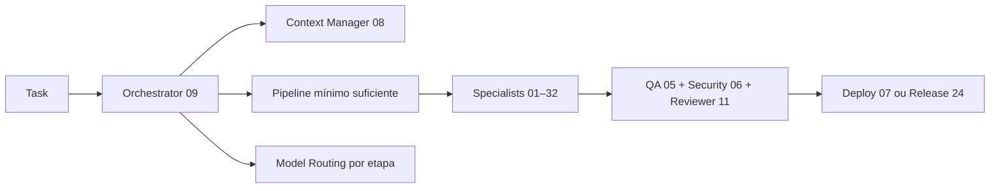

# Dev Team Kit — 31 Specialist Skills for Coding Agents


> Um time completo de especialistas de software dentro do seu agente de código.  
> Cada task é roteada para o especialista certo, executada no modelo certo, e entregue com qualidade de produção.

---

## O Que É

O **Dev Team Kit** é um conjunto de 31 skills especializadas que transforma qualquer agente de coding compatível em um time completo de desenvolvimento — com orchestrator, backend, frontend, QA, security, deploy, design, copy, SEO, observability e mais.

**O que você ganha:**

- **Pipeline estruturado** — cada task passa pelas etapas certas, na ordem certa, sem improvisar
- **QA, Security e Reviewer obrigatórios** — nenhuma entrega sai sem validação
- **Model routing automático** — haiku para boilerplate, sonnet para implementação, opus para arquitetura
- **Lifecycle hooks** — o agente detecta contexto vago, re-lê arquivos antes de editar, monitora custo de tokens
- **MCP server próprio** — 31 tools expostas para qualquer cliente MCP
- **Memória persistente** — working set, context pack, learned skills acumuladas por projeto
- **Instalação multi-plataforma** — Claude Code, Cursor, Windsurf, Copilot, Gemini CLI e mais

---

## Instalação Rápida

### Modo 1 — Plugin Global (Claude Code)

Instala as 31 skills e hooks globalmente. Funciona em qualquer projeto sem configuração adicional.

```bash
# Via Claude Code CLI
claude plugin install https://github.com/felvieira/claude-skills-fv
```

O que é instalado globalmente: skills, hooks, commands (`/audit-repo`, `/devkit-install-fv`, `/plan-feature`, `/review-release`, `/inventory-assets`).

### Modo 2 — Kit Completo por Repo (via comando)

Com o plugin instalado, rode dentro do repo que quer configurar:

```
/devkit-install-fv
```

Isso instala `.bot/` completo: MCP server, policies, templates, docs, hooks, learned-skills e configs multi-plataforma.

### Modo 3 — Bash Direto

```bash
git clone https://github.com/felvieira/claude-skills-fv /tmp/dev-team-kit
bash /tmp/dev-team-kit/setup/install.sh /caminho/do/projeto
```

### Comparativo dos Modos

| O que é instalado | Plugin Global | /devkit-install-fv | Bash direto |
|---|:---:|:---:|:---:|
| 31 skills | ✅ | ✅ | ✅ |
| Hooks (lifecycle) | ✅ | ✅ | ✅ |
| Slash commands | ✅ | ✅ | ✅ |
| Policies | ❌ | ✅ | ✅ |
| MCP server (31 tools) | ❌ | ✅ | ✅ |
| Templates de handoff | ❌ | ✅ | ✅ |
| Docs + repo-audit | ❌ | ✅ | ✅ |
| Configs multi-plataforma | ❌ | ✅ | ✅ |
| Learned skills por projeto | ❌ | ✅ | ✅ |

---

## Plataformas Compatíveis

| Plataforma | Skills | Hooks | MCP | Slash Commands | Notas |
|---|:---:|:---:|:---:|:---:|---|
| **Claude Code** | ✅ | ✅ | ✅ | ✅ | suporte completo — plugin nativo |
| **Cursor** | ✅ via `.bot/` | ❌ | ✅ | ❌ | skills via AGENTS.md, MCP via config |
| **Windsurf** | ✅ via `.bot/` | ❌ | ✅ | ❌ | skills via rules, MCP via `.windsurf/mcp.json` |
| **GitHub Copilot** | ✅ via `.bot/` | ❌ | ❌ | ❌ | skills via `.github/copilot-instructions.md` |
| **Gemini CLI** | ✅ via `.bot/` | ❌ | ✅ | ❌ | skills via GEMINI.md, MCP via `.gemini/settings.json` |
| **OpenCode** | ✅ via `.bot/` | ❌ | ✅ | ❌ | skills via AGENTS.md |
| **Antigravity** | ✅ via `.bot/` | ❌ | ✅ | ❌ | skills via config local |

> Para plataformas sem hooks nativos, as mesmas regras estão em `policies/hooks.md` — o agente as aplica manualmente.

---

## Os 31 Especialistas

### Gestao e Coordenacao

| # | Skill | O que faz |
|---|---|---|
| 08 | **Context Manager** | rastreia foco, tasks abertas, arquivos quentes e handoffs entre sessões |
| 09 | **Orchestrator** | define o pipeline mínimo suficiente, delega para specialists, adapta em caso de rejeição |
| 10 | **Documenter** | registra decisões, contratos de API, operações e impactos em docs vivos |
| 11 | **Reviewer** | valida o delta final antes de liberar — qualidade, escopo e risco |
| 17 | **Image Generator** | gera e adapta assets visuais via fal.ai com suporte a t2i, i2i, rembg e ícones Tauri |
| 18 | **Repo Auditor** | fotografia completa do repo — stack, convenções, riscos, entry points e dívida técnica |
| 19 | **Asset Librarian** | inventaria logos, ícones, fontes, tokens visuais e assets reutilizáveis |
| 20 | **Observability SRE** | define logs estruturados, métricas, tracing, alertas e plano de rollback |
| 21 | **Data Analytics** | define eventos de tracking, naming, funis e KPIs de produto |
| 22 | **Accessibility Specialist** | revisa WCAG 2.2, navegação por teclado, semântica HTML e motion reduction |
| 23 | **Migration & Refactor Specialist** | conduz migrações incrementais, feature flags e rollback seguro |
| 24 | **Release Manager** | organiza changelog, release notes, versionamento e rollout gradual |
| 25 | **AI Integration Architect** | projeta adapters de IA, gateways, streaming, fallbacks e custo de inferência |
| 26 | **Prompt Engineer** | cria e itera prompts, templates reutilizáveis e estratégias de few-shot |
| 27 | **Video Integration Specialist** | integra vídeo generativo com foco em UX, latência e formatos de output |
| 28 | **CLAUDE.md Generator** | gera `CLAUDE.md` inteligente para projetos consumidores do kit |
| 30 | **Cost Tracker** | rastreia custo de tokens e API calls por sessão, por skill e por tier de modelo |
| 31 | **Session Summary** | consolida resumo de sessão para handoff limpo entre sessões longas |
| 32 | **Smart Suggestions** | sugere a próxima ação mais impactante baseado no estado real do projeto |

### Produto e Design

| # | Skill | O que faz |
|---|---|---|
| 01 | **PO** | escreve spec, histórias de usuário, critérios de aceitação e define prioridade |
| 02 | **UI/UX Designer** | define layout, sistema de tokens, responsividade e heurísticas de uso |
| 29 | **Design Intelligence** | pesquisa concorrentes, captura screenshots, analisa tendências visuais e entrega dossier estratégico para UI/UX |

### Desenvolvimento

| # | Skill | O que faz |
|---|---|---|
| 03 | **Backend Engineer** | APIs REST/GraphQL, contratos, auth, validação, banco de dados e integrações |
| 04 | **Frontend Engineer** | React/Next.js, estado, chamadas de API, performance e experiência do app |
| 12 | **Motion Designer** | animações, transições, micro-interações e comportamento visual coeso |
| 15 | **Mobile / Tauri** | extensão opcional para apps desktop e mobile com Tauri + React Native |

### Conteudo e Descoberta

| # | Skill | O que faz |
|---|---|---|
| 13 | **Marketing Copy** | copy de produto, CTAs, landing pages, brand voice e mensagens de conversão |
| 14 | **SEO Specialist** | metadata, schema.org, Core Web Vitals, sitemap e discoverability |

### Qualidade e Entrega

| # | Skill | O que faz |
|---|---|---|
| 05 | **QA Engineer** | testes unitários, integração, E2E, cobertura e edge cases críticos |
| 06 | **Security Reviewer** | OWASP Top 10, headers, CORS, CSRF, XSS, injeção e exposição de dados |
| 07 | **Deploy Engineer** | containerização, CI/CD, rollout blue-green, rollback e infra como código |

---

## Pipeline Principal


```mermaid
flowchart LR
    A[Task] --> B[Orchestrator 09]
    B --> C[Context Manager 08]
    B --> D[Pipeline mínimo suficiente]
    D --> E[Specialists 01–32]
    E --> F[QA 05 + Security 06 + Reviewer 11]
    F --> G[Deploy 07 ou Release 24]
    B --> H[Model Routing por etapa]
```

### Pipelines Comuns

| Tipo de tarefa | Pipeline |
|---|---|
| Feature completa | `PO → UI/UX → Backend → Frontend → Motion → Copy → SEO → QA → Security → Reviewer → Deploy` |
| Bug fix | `Backend → QA → Security → Reviewer → Deploy` |
| Hotfix crítico | `Backend → Security → Reviewer → Deploy` |
| Melhoria de UI | `UI/UX → Frontend → Motion → QA → Security → Reviewer → Deploy` |
| Landing page | `Copy → Design Intelligence → UI/UX → Frontend → SEO → QA → Reviewer` |
| Integração de IA | `Repo Auditor → AI Architect → Prompt Engineer → Backend → Observability → QA → Security → Reviewer` |
| Release formal | `Reviewer → Observability SRE → Release Manager → Deploy` |

---

## Model Routing — Modelo Certo para Cada Etapa

| Tier | Modelo | Quando usar |
|---|---|---|
| Fast | haiku | boilerplate, rename, microcopy, templates, formatação |
| Balanced | sonnet | implementação, testes, debug, integração, design |
| Deep | opus | arquitetura, security review, orquestração, decisões críticas |

**Enforcement automático (Claude Code):**
- `EnterPlanMode` → hook sugere `/model opus`
- `ExitPlanMode` → hook sugere `/model sonnet`
- Subagent sem `model` explícito → hook alerta e sugere tier por keywords

**Em outros ambientes:** seguir `policies/model-routing.md` manualmente.

---

## Hook System — Inteligência em Lifecycle Events

| Hook | Evento | O que faz |
|------|--------|-----------|
| `pre-execution-gate` | UserPromptSubmit | detecta prompt vago e confirma antes de agir |
| `keyword-detector` | UserPromptSubmit | injeta skill ou learned skill relevante automaticamente |
| `context-guard-stop` | Stop | bloqueia stop quando contexto > 75%, sugere /compact |
| `persistent-mode` | Stop | bloqueia stop quando pipeline está ativo |
| `pre-tool-enforcer` | PreToolUse | re-lê antes de editar, sugere code intelligence tools |
| `session-start` | SessionStart | restaura estado da sessão anterior |
| `post-tool-verifier` | PostToolUse | detecta debugging patterns, sugere extração de learned skill |
| `model-routing-hook` | PreToolUse | sugere troca de modelo em plan mode e valida subagent spawns |

---

## MCP Server — 31 Tools para Qualquer Cliente MCP

```json
{
  "mcpServers": {
    "dev-team-kit": {
      "command": "node",
      "args": [".bot/mcp-server/dist/index.js"],
      "env": {
        "FAL_KEY": "fal-...",
        "BRAVE_SEARCH_KEY": "BSA...",
        "FIRECRAWL_KEY": "fc-..."
      }
    }
  }
}
```

Funciona no Claude Code, Windsurf, Gemini CLI, Cursor e qualquer cliente MCP.

| Bloco | Tools | Exemplos |
|-------|-------|----------|
| **Knowledge** | 14 | classifica task, monta pipeline, resume diff, monta context pack |
| **Execution** | 6 | busca concorrentes (Brave), scraping (Playwright/Firecrawl), gera imagens (fal.ai) |
| **Persistence** | 11 | salva contexto, working set, custo, learned skills e guardrails de sessão |

Ver `mcp-server/README.md` para documentação completa das tools.

---

## API Keys Necessárias

| Key | Para que serve | Onde obter |
|-----|---------------|-----------|
| `FAL_KEY` | geração de imagens (skill 17, MCP moodboards) | fal.ai/dashboard/keys |
| `BRAVE_SEARCH_KEY` | pesquisa de concorrentes (skill 29, MCP) | brave.com/search/api |
| `FIRECRAWL_KEY` | scraping avançado (opcional) | firecrawl.dev |

O instalador solicita cada key e salva em `.env.local` do projeto.

---

## Ergonomia Diaria

- leia `docs/quickstart.md` para entrar rápido no fluxo
- reutilize `docs/repo-audit/current.md` antes de explorar o repo
- use `devkit_context_pack` para iniciar task sem reler metade do repo
- use `devkit_diff_brief` para retomar trabalho ou preparar review
- use `devkit_working_set` para persistir arquivos quentes e próximos passos
- use `commands/` como atalhos operacionais
- consulte `docs/skill-call-matrix.md` quando houver overlap entre skills
- consulte `docs/skill-guides/` apenas sob demanda

---

## Governanca Global

- `GLOBAL.md` é a camada mais alta de instrução
- `policies/` padroniza execução, risco, persistência, qualidade e avaliação
- `templates/` reduz variação de handoff, plano, review e rejeição
- `policies/tool-safety.md` — uso seguro de escrita, rede, MCP e ações externas
- `policies/model-routing.md` — tiers de modelo, enforcement e integração com cost-tracker
- `policies/evals.md` — evidência mínima para mudanças estruturais no kit

### Hierarquia de Instrucoes

1. `GLOBAL.md`
2. `policies/*.md`
3. `skills/*/SKILL.md`
4. `templates/*.md`

---

## Estrutura Real Deste Repo

```text
.
├── .claude-plugin/       ← manifesto do plugin Claude Code
│   └── plugin.json
├── AGENTS.md
├── CLAUDE.md
├── GLOBAL.md
├── README.md
├── commands/             ← slash commands (/audit-repo, /devkit-install-fv, ...)
├── docs/
│   ├── quickstart.md
│   ├── repo-audit/
│   ├── skill-guides/
│   └── skill-call-matrix.md
├── evals/
├── hooks/                ← lifecycle hooks para Claude Code
│   ├── hooks.json
│   ├── config.json
│   └── scripts/
├── mcp-server/           ← MCP server com 31 tools
├── patterns/ai-integration/
├── policies/             ← model-routing, tool-safety, cost-optimization, evals
├── scripts/              ← generate-image.py e utilitários
├── setup/                ← install.sh multi-plataforma
├── skills/               ← 31 specialists (*/SKILL.md)
├── src/                  ← hooks, stores, components e middleware reutilizáveis
└── templates/            ← handoff, plano, review, rejeição
```

---

## Estrutura Instalada no Repo Consumidor

Quando instalado via `/devkit-install-fv` ou `setup/install.sh`:

```text
repo-consumidor/
├── AGENTS.md
├── CLAUDE.md
├── GEMINI.md
├── .claude/settings.json         ← hooks + MCP registrados
├── .github/copilot-instructions.md
├── .windsurf/rules/dev-team-kit.md
├── .windsurf/mcp.json
├── .gemini/settings.json
└── .bot/
    ├── GLOBAL.md
    ├── hooks/                    ← lifecycle hooks
    ├── learned-skills/           ← conhecimento acumulado do projeto
    ├── mcp-server/               ← compilado e pronto
    ├── policies/
    ├── skills/
    └── templates/
```

---

## Validacao Rapida

```bash
pytest scripts/tests -q
node scripts/check-consistency.mjs
cd mcp-server && npm run build
bash scripts/smoke-install.sh
```

---

## Timestamp Log

### 2026-04-04

- alinhado o setup para instalação em `.bot/`, hooks automáticos, MCP local `dev-team-kit` e smoke test do instalador
- corrigidos hooks para ler config no modo instalado e reduzir injeção de contexto de learned skills
- implementados `devkit_context_pack`, `devkit_diff_brief`, `devkit_working_set` e telemetria expandida em `devkit_track_cost`
- adicionados perfis de setup `lean`, `daily-dev` e `research`, com modo não interativo
- atualizadas docs principais, README do MCP, quickstart e guias de operação com foco em economia de token

### 2026-04-08

- unificado model routing em policy única (`policies/model-routing.md`), absorvendo skill 16 (llm-selector)
- adicionado hook `model-routing-hook.mjs` para enforcement em plan mode e subagent spawns
- atualizadas referências em cost-tracker, cost-optimization, orchestrator, design-intelligence e hooks policy

### 2026-04-09

- adicionado manifesto de plugin Claude Code (`.claude-plugin/plugin.json`) com 31 skills, hooks e commands
- adicionado slash command `/devkit-install-fv` para instalação full `.bot/` a partir do plugin global
- README redesenhado com hero section, tabela de especialistas com descrição por skill, comparativo de modos de instalação e tabela de compatibilidade multi-plataforma
