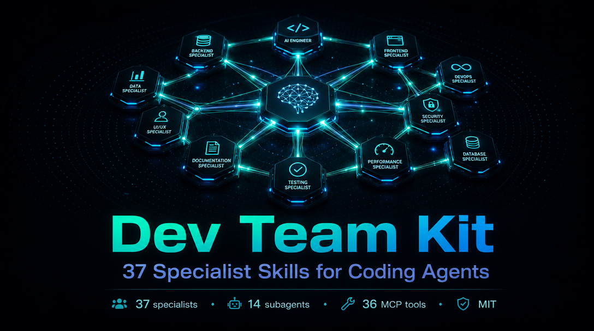
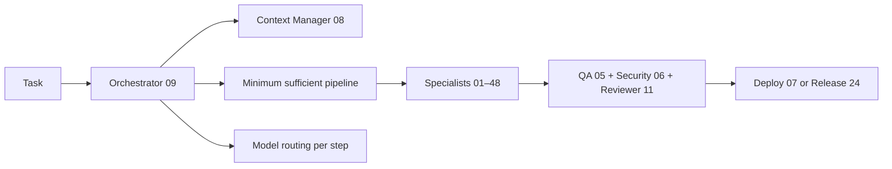

<p align="center">
  
</p>

> 🇧🇷 [Versão em Português](README.pt-BR.md) · 🌎 English version

# Dev Team Kit — 53 Specialist Skills for Coding Agents


> A complete team of software specialists inside your coding agent.  
> Every task is routed to the right specialist, run on the right model, and shipped at production quality.

### ✨ What's new in v2.22-v2.25

| Version | Highlight | Where |
|---|---|---|
| **v2.40.0** | **Skill 53 `doubt-driven-review`** — absorbed from [addyosmani/agent-skills](https://github.com/addyosmani/agent-skills) (MIT, 76.7k stars). In-flight adversarial review — distinct from skill 11's post-hoc PR gate — for non-trivial decisions while course-correction is still cheap: CLAIM (name the decision) → EXTRACT (smallest reviewable unit, no reasoning) → DOUBT (fresh-context reviewer, adversarial prompt, biased to refute) → RECONCILE (classify findings: contract-misread / actionable / trade-off / noise) → STOP (bounded at 3 cycles). Cross-referenced from skill 11 (reviewer). Also tightened skill 01's Deep Interview protocol (`templates/deep-interview.md`) with the same repo's `interview-me` discipline: guess-attached questions, "want vs. should-want" probing, mandatory "out of scope" line in the restate, and a stricter explicit-yes confirmation gate. | [`skills/53-doubt-driven-review/SKILL.md`](skills/53-doubt-driven-review/SKILL.md), [`templates/deep-interview.md`](templates/deep-interview.md) |
| **v2.39.0** | **Idea absorption (not code) from ponytail + repowise + COMPILOT paper** — ponytail's 7-rung pre-code ladder (YAGNI → already-in-codebase → stdlib → native feature → installed dependency → one-liner → only then new code) as a policy + PreToolUse hook gate before code generation, plus a delete-list mode for `/simplify` and skill 23; repowise's risk-weighted deductions in skill 18's harnessability score, qualitative risk banding in `/diff-impact` and skill 11, and the reversible `_meta.omitted` truncation pattern documented in `mcp-builder-patterns.md` (concepts only — repowise itself is AGPL); the COMPILOT PACT 2025 paper's anti-premature-stopping and categorized feedback taxonomy applied to `/loop` and `/swarm`. | [`policies/`](policies/), [`hooks/scripts/pre-code-ladder-guard.mjs`](hooks/scripts/pre-code-ladder-guard.mjs) |
| **v2.38.0** | **Skill 52 `ui-polish`** — absorbed from the external agent skill [jakubkrehel/make-interfaces-feel-better](https://github.com/jakubkrehel/make-interfaces-feel-better) (MIT). 16 visual-polish principles: concentric border radius, optical alignment, shadows over borders, interruptible animations, split/stagger enter, subtle exit, contextual icon animation (exact values: scale 0.25→1, blur 4px→0, spring bounce 0), font smoothing, tabular numbers, text wrapping (balance/pretty), image outlines (pure black/white, never tinted), scale-on-press (0.96), skip-animation-on-load, no `transition: all`, sparing `will-change`, 40×40px minimum hit area. Cross-referenced from skill 12 (motion-design, owns the token system) and skill 02 (ui-ux-design, post-Frontend polish checklist). | [`skills/52-ui-polish/SKILL.md`](skills/52-ui-polish/SKILL.md), [`docs/skill-guides/ui-polish.md`](docs/skill-guides/ui-polish.md) |
| **v2.37.0** | **7-ebook absorption (Casa do Código)** — only the real gap became a new skill: **skill 51 `ux-research`** (qualitative discovery — user interview, research-based persona, journey map, usability testing, information architecture; sits *before* PO 01 and UI/UX 02). The rest became surgical increments: 3 XP policies (`pair-programming`, `continuous-integration`, `sustainable-pace`, wired to skill 37); skill 01 gains a **Business Foundation** section (hypothesis validation, MVP, monetization, AARRR, product-market fit — from *Guia da Startup*); skill 14 gains **Keyword Research** (KEI, intent, long-tail) + **Off-Page/Link Building**; skill 07 gains **Infrastructure as Code** (declarative provisioning, idempotency, drift — DevOps principles mapped to Terraform/Ansible); skill 38 gains cohesion/coupling, distributed-seam (REST/async/RPC, HATEOAS) and layer lenses. HTML5 Canvas game-dev dropped (niche <2%). | [`skills/51-ux-research/SKILL.md`](skills/51-ux-research/SKILL.md), [`policies/pair-programming.md`](policies/pair-programming.md) |
| **v2.36.0** | **Skill 50 `direct-response-copy`** — direct response copywriting distilled from 3 classic PT-BR copy ebooks: headline formula library in 20 trigger categories (357 models distilled into parameterized formulas), the 8 mental triggers + sales storytelling structure, Instagram caption/engagement copy. Hard integrity gate: no unverifiable claims, no fabricated testimonials, real scarcity only. Complements skill 13 (product copy) — 13 covers landing/microcopy/brand voice, 50 covers ads/sales pages/email/social. | [`skills/50-direct-response-copy/SKILL.md`](skills/50-direct-response-copy/SKILL.md), [`skills/50-direct-response-copy/references/headline-formulas.md`](skills/50-direct-response-copy/references/headline-formulas.md) |
| **v2.29.0** | **Claim verifier + context hygiene** — two PostToolUse/UserPromptSubmit hooks: (1) `claim-verifier` detects output with unverified result claims ("email sent", "deploy OK", "tests passed", "migration ran") and injects the specific command to verify before asserting — passes free if inline evidence present (exit code 0, HTTP 200, query result); (2) `context-turn-counter` suggests `/compact` every 25 turns and recommends full session handoff at 50 turns (save to `D:\claude-memory\logs\`, open new session with resumption prompt). New policy: `claim-verification.md`. Two new GLOBAL.md defaults: "verify before asserting" + "compact proactively". | [`hooks/scripts/claim-verifier.mjs`](hooks/scripts/claim-verifier.mjs), [`hooks/scripts/context-turn-counter.mjs`](hooks/scripts/context-turn-counter.mjs), [`policies/claim-verification.md`](policies/claim-verification.md) |
| **v2.28.0** | **SDD absorption from Medium articles** — 3 additions inspired by "Spec-Driven Development with AI Coding Agents" + "Claude Code plugins" articles: (1) `/spec-kit` unified SDD pipeline (specify→plan→tasks→implement with explicit checkpoints + inline Adversarial Verifier); (2) `/swarm` upgraded with Phase 3 Adversarial Verify (Implementor vs Verifier with opposing goals — verifier tries to refute, spec updated in real-time from gaps found); (3) `/insights` usage-based recommendations (reads hook telemetry JSONLs — gate decisions, investigate-first blocks, tool repetitions — recommends what to calibrate). | [`commands/spec-kit.md`](commands/spec-kit.md), [`commands/insights.md`](commands/insights.md), [`commands/swarm.md`](commands/swarm.md) |
| **v2.27.0** | **Investigate-first guard** — a principle with active enforcement: the AI must never ask the user something it can discover itself. New PreToolUse hook intercepts `AskUserQuestion`, detects self-discoverable questions (github user, gh logged-in, branch, package manager, port, runtime version, stack, MCP account) and tells the model to run the command first (`gh auth status`, `git config`, Glob lockfile, MCP `whoami`) instead of interrupting. Doesn't block — educates. Conservative: preference/intent/trade-off questions pass through. 10/10 discoverable patterns caught, 5/5 legit questions pass. | [`policies/investigate-first.md`](policies/investigate-first.md), [`hooks/scripts/investigate-first-guard.mjs`](hooks/scripts/investigate-first-guard.mjs) |
| **v2.26.0** | **ECC absorption (round 2)** — `silent-failure-hunter` (16th subagent, review-only: hunts empty catch{}, swallowed errors, dangerous fallbacks, lost stack traces, missing rollback) + skill 49 `context-budget` (audits loaded context weight per component, headroom + overflow alerts; distinct from cost-tracker which tracks runtime completions) + `/context-budget` command. Full count-drift reconciliation across all 8 doc locations. | [`agents/silent-failure-hunter.md`](agents/silent-failure-hunter.md), [`skills/49-context-budget/SKILL.md`](skills/49-context-budget/SKILL.md) |
| **v2.25.0** | **Path-scoped rules system** (`.claude/rules/` with `paths:` glob — the harness attaches a coding standard only when an edited file matches, common+language layering, inspired by [ECC](https://github.com/affaan-m/ECC)) + debt paydown: fixed the subagent-allowlist bug (15th subagent `anti-ai-writing` was missing from the enumerated allowlist), reconciled pervasive count drift, and rewrote the 5 stub skills (19/21/22/24/27) with real depth. | [`rules/`](rules/), [`policies/rules-system.md`](policies/rules-system.md) |
| **v2.24.0** | Memory curator goes **autonomous** — the agent prunes its own memory without asking. Async on SessionStart, it does decay/archive/dedup in pure JS (zero LLM) and delegates only the *semantic* merge work to the already-present session agent (no forked `claude -p` = no double billing). | [`hooks/scripts/memory-curator.mjs`](hooks/scripts/memory-curator.mjs), [`policies/memory-curator.md`](policies/memory-curator.md) |
| **v2.23.0** | Curated absorption from addozhang — skill 48 `research-prep`, Spring Boot 2→3 migration playbook (skill 23), mem9 memory patterns in session-start + skill 08. | [`skills/48-research-prep/SKILL.md`](skills/48-research-prep/SKILL.md), [`skills/23-migration-refactor-specialist/playbooks/spring-boot-2-to-3.md`](skills/23-migration-refactor-specialist/playbooks/spring-boot-2-to-3.md) |
| **v2.22.0** | Memory curator (first cut) — inactivity-triggered Stop hook that *suggested* `/consolidate-memory`. Superseded by the autonomous curator in v2.24.0. | [`policies/memory-curator.md`](policies/memory-curator.md) |
| **v2.21.0** | Context-cost guards — automates the 9 plan-saving tactics. `topic-shift-detector` suggests `/clear` when you switch subjects; `session-start` warns about a bloated CLAUDE.md (>200 lines) + project MCPs. Conservative sensors (precision > coverage). | [`hooks/scripts/topic-shift-detector.mjs`](hooks/scripts/topic-shift-detector.mjs), [`policies/token-efficiency.md`](policies/token-efficiency.md) |
| **v2.20.0** | Skill 47 `pattern-conformity` — detects and codifies existing codebase coding patterns (naming, file structure, error handling, testing style, async, DI, API design) into `memory/patterns.md`. New code is gated against it. 46/46 eval-triggers PASS. | [`skills/47-pattern-conformity/SKILL.md`](skills/47-pattern-conformity/SKILL.md), [`evals/triggers/47-pattern-conformity.json`](evals/triggers/47-pattern-conformity.json) |
| **v2.19.1** | Polish pass: bugs in `skill-health.mjs` (multiline YAML parser), 9 cross-section overlaps refined, 4 commands got frontmatter. Clean portfolio: 0 overlaps, 0 dead policies, 100% fixture coverage, 45/45 eval-triggers PASS. | [`scripts/skill-health.mjs`](scripts/skill-health.mjs), [`docs/skill-health.md`](docs/skill-health.md) |
| **v2.19.0** | Curated absorption from ECC/gstack/mattpocock/ruflo — 3 new skills (zoom-out, handoff-context, post-deploy-canary-monitor), 6 commands (instinct-export/import/promote, multi-plan, aside, skill-health), `policies/boil-the-lake.md`, truth-score in verification + stream-chain in programs-schema. | [`docs/plans/2026-05-27-v2.19.0-absorption-plan.md`](docs/plans/2026-05-27-v2.19.0-absorption-plan.md), [`docs/inspiration/ruflo-evaluation.md`](docs/inspiration/ruflo-evaluation.md) |
| **v2.18.0** | Interactive web dashboard: 6 tabs (Graph, Bench, Savings, Drift, Skill Quality, Trigger Eval). Zero-build, zero-dep, single-file HTML + CDN. | [`docs/preview/dashboard.html`](docs/preview/dashboard.html), [`scripts/build-dashboard.mjs`](scripts/build-dashboard.mjs) |
| **v2.17.0** | `/diff-impact` (ripple analysis) + graph auto-update hook (PostToolUse regenerates graphify-out after Edit/Write). | [`commands/diff-impact.md`](commands/diff-impact.md), [`scripts/diff-impact.mjs`](scripts/diff-impact.mjs) |

**How to use:** see [`docs/quickstart.md`](docs/quickstart.md) for the 4 common scenarios (CLI image generation, swarm with automatic generation, template bootstrap, runtime adapter).

---

### 📖 Full Wiki — recommended starting point

| Language | Link |
|---|---|
| 🌎 **English** | [`docs/WIKI.md`](docs/WIKI.md) |
| 🇧🇷 **Português** | [`docs/WIKI.pt-BR.md`](docs/WIKI.pt-BR.md) |

Every skill, subagent, command, policy, plugin and MCP tool documented — in the format of [aihero.dev's "5 Agent Skills I Use Every Day"](https://www.aihero.dev/5-agent-skills-i-use-every-day).

---

### 📊 Quality Bench — measured results, not marketing claims

We tested every skill and subagent with a published rubric. 53 isolation scenarios + 3 end-to-end tests. Same model, same prompt — with and without the kit. Numbers are measured, code is real, results are auditable.

| Language | Link | Highlights |
|---|---|---|
| 🌎 **English** | [`analyze-doc/index.en.html`](analyze-doc/index.en.html) | 92.6% pass rate · +1.84 avg delta · 53/53 E2E green |
| 🇧🇷 **Português** | [`analyze-doc/index.pt-BR.html`](analyze-doc/index.pt-BR.html) | Mesmo relatório em PT-BR |

Includes before/after with full output text, per-skill delta scores, process-based test results, and v2.10.1 fix verification. Methodology in [`eval-bench/`](eval-bench/).

---

## Why It Matters (For Anyone)

If you use AI to build product — whether you're an experienced dev, an indie hacker shipping SaaS, or someone who only knows how to describe what they want — this kit changes the game. In plain language, here's what it does:

### 💰 Saves your API bill (up to 70%)
AI loves to read everything: the entire output of an `npm install`, repeated stack traces, huge file lists. All of that turns into tokens, which turn into money. The kit **automatically compresses** that noise before sending it to the model — you only pay for what matters.

### 🧠 Understands what you want before it starts coding
Instead of a generic agent that "guesses" the implementation, the kit has an **orchestrator** that reads your request, classifies the complexity, and assembles the minimum sufficient pipeline. If you're vague, it asks. If you're clear, it runs. It never makes things up.

### 🗂️ Persistent memory across sessions
Most agents forget everything when you close the window. This one **remembers**: what you decided, which files matter, the patterns your project follows, the bugs that came up before. Result: less rework, fewer tokens spent re-contextualizing, and far sharper answers each session.

### 🤖 Autonomous mode — fire and forget
Hand off a complex task with `/auto` or `/loop` and go grab a coffee. The agent runs, tests, fixes, validates and **only stops when it's ready, working and tested**. There's a safety circuit: if it gets stuck on the same error 3 times, it detects and warns — no burning API for nothing.

### 🖼️ Professional image generation, no placeholders
Landing page with a gray "image here" box? Never again. The kit integrates **fal.ai** with prompts written by a generative-AI specialist — you describe the scene, the system translates it into a technical prompt, and delivers production-ready images. Illustrations, hero images, icons, mockups, all consistent with your brand.

### 🔒 Security before deploy, not after the leak
A **security auditor** thinks like an attacker and reviews the code before it reaches production. Critical findings come with a proof of concept. No more discovering vulnerabilities on the customer's account.

### 🧪 Tests that actually prove it works
A **QA engineer** that follows the "prove-it" principle: if you say it works, prove it with a test. No "looks ok". Covers happy path, failure paths, edge cases and regressions.

### 🎨 Design and copy that sell
- **Designer** with competitive analysis: looks at competitors and recommends what converts
- **Copywriter** specialized in marketing: ready-to-ship copy for landing pages, email, ads
- **SEO** that optimizes before Google indexes — your site is born findable

### 🚀 From zero to deploy without hiring 5 freelancers
Backend, frontend, mobile (Tauri), observability, analytics, accessibility (WCAG), refactoring, release, **canary deployments** (v2.12+), documentation — **48 specialists in total** (numeric IDs run 01–48; ID 16 was deprecated and the number is reserved, so 47 physical skill files). Each task goes to the right professional, on the right AI model (Haiku for simple, Sonnet for medium, Opus for architecture) — you don't pay Opus to generate boilerplate.

### 🔌 Works with everything you already use
Native **Claude Code** plugin + universal MCP server that runs in **Cursor, Windsurf, Copilot, Gemini CLI** and any MCP-compatible agent. **Zero vendor lock-in.** Switched tools? Your team comes with you.

### 🆓 Free, Apache-2.0, open source
No subscription. No trial. No hidden premium tier. Clone it, install it, use it forever — including in commercial projects. Apache-2.0 with a `NOTICE` file enforces attribution downstream: anyone repackaging the kit must preserve credit to the people whose ideas shaped it.

---

## What It Is

The **Dev Team Kit** is a set of 48 specialized skills that turns any compatible coding agent into a complete development team — with orchestrator, backend, frontend, QA, security, deploy, design, copy, SEO, observability, blog publishing automation and more.

**What you get:**

- **Structured pipeline** — every task goes through the right steps, in the right order, no improvising
- **QA, Security and Reviewer mandatory** — no delivery ships without validation
- **Automatic model routing** — haiku for boilerplate, sonnet for implementation, opus for architecture
- **Lifecycle hooks** — the agent detects vague context, re-reads files before editing, monitors token cost
- **Built-in MCP server** — 38 tools exposed for any MCP client
- **Persistent memory** — working set, context pack, learned skills with confidence scoring accumulated per project
- **Multi-platform install** — Claude Code, Cursor, Windsurf, Copilot, Gemini CLI and more

### Built on Context Engineering principles

The kit's architecture maps to the [context engineering hierarchy](https://github.com/davidkimai/Context-Engineering): individual skills are **atoms**, templates are **molecules**, learned-skills + working-set are **cells**, dispatched subagents are **organs**, and protocol-shell-composed programs are the **emergent field layer**. New in v1.1: typed protocol shells for 3 pilot subagents, I/O schemas in `schemas/skill-io/`, iteration scoring in the auto-loop circuit breaker, and declarative `programs/` definitions. See `docs/WIKI.md → Context Engineering Stack`.

> **5-min tour:** [`docs/SKILLS-OVERVIEW.md`](docs/SKILLS-OVERVIEW.md) — every skill, mode, subagent and policy in one navigable page (aihero.dev format).

---

## Quick Install

### Mode 1 — Global Plugin (Claude Code)

Installs the 53 skills and hooks globally. Works in any project with no extra configuration.

```bash
# Via Claude Code CLI
claude plugin install https://github.com/felvieira/claude-skills-fv
```

What gets installed globally: skills, hooks, commands (`/audit-repo`, `/devkit-install-fv`, `/plan-feature`, `/review-release`, `/inventory-assets`).

### Mode 2 — Full Kit Per Repo (via command)

With the plugin installed, run inside the repo you want to configure:

```
/devkit-install-fv
```

This installs the full `.bot/`: MCP server, policies, templates, docs, hooks, learned-skills and multi-platform configs.

### Mode 3 — Direct Bash

```bash
git clone https://github.com/felvieira/claude-skills-fv /tmp/dev-team-kit
bash /tmp/dev-team-kit/setup/install.sh /path/to/project
```

If the kit is already in `.bot/`, you can also run directly from the installed repo:

```bash
bash .bot/setup/install.sh
```

The installer ships `setup/` and every kit directory under `.bot/`. Supports non-interactive profile flags:
- `--profile lean` — installs without MCP and heavy scripts
- `--no-input` — no prompts, uses defaults
- `--yes` — accepts everything automatically

In the table below, treat `dev-team-kit` as 38 tools backed by the 52 skills (52 installed skill directories; ID 16 is reserved).
The MCP exposes 38 tools backed by the installed skills.

### Install Modes Compared

| What gets installed | Global Plugin | /devkit-install-fv | Direct Bash |
|---|:---:|:---:|:---:|
| 53 skills | ✅ | ✅ | ✅ |
| Hooks (lifecycle) | ✅ | ✅ | ✅ |
| Slash commands | ✅ | ✅ | ✅ |
| Policies | ❌ | ✅ | ✅ |
| MCP server (38 tools) | ❌ | ✅ | ✅ |
| Handoff templates | ❌ | ✅ | ✅ |
| Docs + repo-audit | ❌ | ✅ | ✅ |
| Multi-platform configs | ❌ | ✅ | ✅ |
| Learned skills per project | ❌ | ✅ | ✅ |

---

## Supported Platforms

| Platform | Skills | Hooks | MCP | Slash Commands | Notes |
|---|:---:|:---:|:---:|:---:|---|
| **Claude Code** | ✅ | ✅ | ✅ | ✅ | full support — native plugin |
| **Cursor** | ✅ via `.bot/` | ❌ | ✅ | ❌ | skills via AGENTS.md, MCP via config |
| **Windsurf** | ✅ via `.bot/` | ❌ | ✅ | ❌ | skills via rules, MCP via `.windsurf/mcp.json` |
| **GitHub Copilot** | ✅ via `.bot/` | ❌ | ❌ | ❌ | skills via `.github/copilot-instructions.md` |
| **Gemini CLI** | ✅ via `.bot/` | ❌ | ✅ | ❌ | skills via GEMINI.md, MCP via `.gemini/settings.json` |
| **OpenCode** | ✅ via `.bot/` | ❌ | ✅ | ❌ | skills via AGENTS.md |
| **Antigravity** | ✅ via `.bot/` | ❌ | ✅ | ❌ | skills via local config |

> For platforms without native hooks, the same rules live in `policies/hooks.md` — the agent applies them manually.

---

## The 48 Specialists

### Management and Coordination

| # | Skill | What it does |
|---|---|---|
| 08 | **Context Manager** | tracks focus, open tasks, hot files and handoffs across sessions |
| 09 | **Orchestrator** | defines the minimum sufficient pipeline, delegates to specialists, adapts on rejection |
| 10 | **Documenter** | records decisions, API contracts, operations and impacts in living docs |
| 11 | **Reviewer** | validates the final delta before release — quality, scope and risk |
| 17 | **Image Generator** | generates and adapts visual assets via fal.ai with t2i, i2i, rembg and Tauri icons support |
| 18 | **Repo Auditor** | full snapshot of the repo — stack, conventions, risks, entry points and tech debt |
| 19 | **Asset Librarian** | catalogs logos, icons, fonts, visual tokens and reusable assets |
| 20 | **Observability SRE** | defines structured logs, metrics, tracing, alerts and rollback plan |
| 21 | **Data Analytics** | defines tracking events, naming, funnels and product KPIs |
| 22 | **Accessibility Specialist** | reviews WCAG 2.2, keyboard navigation, HTML semantics and motion reduction |
| 23 | **Migration & Refactor Specialist** | runs incremental migrations, feature flags and safe rollback |
| 24 | **Release Manager** | organizes changelog, release notes, versioning and gradual rollout |
| 25 | **AI Integration Architect** | designs AI adapters, gateways, streaming, fallbacks and inference cost |
| 26 | **Prompt Engineer** | writes and iterates prompts, reusable templates and few-shot strategies |
| 27 | **Video Integration Specialist** | integrates generative video with focus on UX, latency and output formats |
| 28 | **CLAUDE.md Generator** | generates a smart `CLAUDE.md` for projects consuming the kit |
| 30 | **Cost Tracker** | tracks token cost and API calls per session, per skill and per model tier |
| 31 | **Session Summary** | consolidates a session summary for clean handoff between long sessions |
| 32 | **Smart Suggestions** | suggests the next most impactful action based on the project's real state |
| 33 | **Detective Spec** | reverse-engineers executable specs from legacy code — modules, business rules, flows, retroactive ADRs, zero writes outside `_detective_sdd/` |
| 35 | **Skill Author** | meta-skill to create, edit, eval and optimize the kit's own skills — sustains the kit as it grows past 48 specialists |
| 38 | **Architecture Deepener** | finds deepening opportunities (deletion test, deep modules) using domain glossary + architecture vocabulary; pairs with skill 23 (Migration & Refactor) for execution |
| 39 | **Program Router** | decides which `programs/*.yml` pipeline to run from task classification — works alongside the orchestrator (ad-hoc) and the intent-classifier hook (suggestion) |
| 40 | **Parallel Dispatcher** | fans out N independent slices/reviews to subagents correctly, avoiding the skill-vs-agent trap; scatter-gather with worktree isolation |
| 44 | **Zoom Out** | builds a module map and topology of the codebase — complements smart-suggestions with a structural bird's-eye view |
| 45 | **Handoff Context** | prospective handoff between sessions/agents — packages what the next session needs to continue without re-deriving context |

### Product and Design

| # | Skill | What it does |
|---|---|---|
| 01 | **PO** | writes spec, user stories, acceptance criteria and sets priority |
| 02 | **UI/UX Designer** | defines layout, token system, responsiveness and usage heuristics |
| 29 | **Design Intelligence** | researches competitors, captures screenshots, analyzes visual trends and ships a strategic dossier for UI/UX |
| 36 | **Web Asset Generator** | favicons (multi-size), PWA icons (incl. maskable), Open Graph and Twitter card images, manifest and meta tag snippets — derived from a logo or brand text |

### Development

| # | Skill | What it does |
|---|---|---|
| 03 | **Backend Engineer** | REST/GraphQL APIs, contracts, auth, validation, database and integrations |
| 04 | **Frontend Engineer** | React/Next.js, state, API calls, performance and app experience |
| 12 | **Motion Designer** | animations, transitions, micro-interactions and coherent visual behavior |
| 15 | **Mobile / Tauri** | optional extension for desktop and mobile apps with Tauri + React Native |
| 47 | **Pattern Conformity** | detects and codifies an existing codebase's coding conventions (naming, structure, error handling, testing, async, DI, API design) into `memory/patterns.md` so new code matches house style |

### Content and Discovery

| # | Skill | What it does |
|---|---|---|
| 13 | **Marketing Copy** | product copy, CTAs, landing pages, brand voice and conversion messaging |
| 14 | **SEO Specialist** | metadata, schema.org, Core Web Vitals, sitemap and discoverability |
| 48 | **Research Prep** | multi-source technical research before writing docs/PRDs/ADRs/articles — official docs + GitHub + Stack Overflow + papers, scored by authority, output to `memory/research/<slug>.md`; feeds skills 10, 01, 26, 41 |
| 49 | **Context Budget** | audits loaded context weight (skills, agents, MCP descriptions, rules, CLAUDE.md) — estimates tokens per component, headroom available and overflow alerts. Distinct from skill 30 (cost-tracker) which tracks runtime completion costs |

### Quality and Delivery

| # | Skill | What it does |
|---|---|---|
| 05 | **QA Engineer** | unit, integration, E2E tests, coverage and critical edge cases |
| 06 | **Security Reviewer** | OWASP Top 10, headers, CORS, CSRF, XSS, injection and data exposure |
| 34 | **Static Analysis** | automated security and bug scan via Semgrep + CodeQL with SARIF output, severity triage and CI integration — feeds findings to skill 06 |
| 37 | **TDD Engineer** | red-green-refactor enforced; combats horizontal slicing anti-pattern (writing all tests before all impl); 1 test → 1 impl → repeat. Pairs with skill 38 for deep module identification |
| 07 | **Deploy Engineer** | containerization, CI/CD, blue-green rollout, rollback and infra as code |

### Publishing and Automation (v2.11.0+)

| # | Skill | What it does |
|---|---|---|
| 41 | **Blog Publisher** | composer skill — receives text/topic → writes HTML post → generates images (via skill 17 fal.ai or skill 42 Playwright) → commits/pushes to your blog repo → returns public URL. Multi-user via `~/.dev-team-kit/blog-config.json`. |
| 42 | **Blog Screenshot** | Playwright-based capture for posts: viewports per destination (cover/hero/mobile), cookie banner removal, FOUT prevention, naming convention compatible with skill 41 |
| 43 | **Canary Deployment** | gradual rollout (1%/10%/50%/100%) + 7-metric watch + automatic rollback. 3 strategies (traffic-based, feature flag, blue-green). Sits between skill 24 (release-manager) and skill 07 (deploy-docker). v2.12.0. |
| 46 | **Post-Deploy Canary Monitor** | continuous post-100% monitoring after a canary completes — watches error budget, latency and anomaly signals, opens a postmortem trigger on regression |

**Setup (one-time per user):**

```bash
# Create your blog repo + GitHub Pages + config
node scripts/init-blog-repo.mjs \
  --path=/abs/path/to/blog \
  --user=<github-username> \
  --repo=blog \
  --create-github

# Then in any Claude Code session:
# "publica um post sobre <topic>"  → skill 41 takes it from there
```

The init script creates `~/.dev-team-kit/blog-config.json` so the skill knows where to publish. See `scripts/init-blog-repo.mjs` and `templates/blog/` for details.

---

## Main Pipeline


```mermaid
flowchart LR
    A[Task] --> B[Orchestrator 09]
    B --> C[Context Manager 08]
    B --> D[Minimum sufficient pipeline]
    D --> E[Specialists 01–48]
    E --> F[QA 05 + Security 06 + Reviewer 11]
    F --> G[Deploy 07 or Release 24]
    B --> H[Model routing per step]
```

### Common Pipelines

| Task type | Pipeline |
|---|---|
| Full feature | `PO → UI/UX → Backend → Frontend → Motion → Copy → SEO → QA → Security → Reviewer → Deploy` |
| Bug fix | `Backend → QA → Security → Reviewer → Deploy` |
| Critical hotfix | `Backend → Security → Reviewer → Deploy` |
| UI improvement | `UI/UX → Frontend → Motion → QA → Security → Reviewer → Deploy` |
| Landing page | `Copy → Design Intelligence → UI/UX → Frontend → SEO → QA → Reviewer` |
| AI integration | `Repo Auditor → AI Architect → Prompt Engineer → Backend → Observability → QA → Security → Reviewer` |
| Formal release | `Reviewer → Observability SRE → Release Manager → Deploy` |

---

## Model Routing — Right Model for Each Step

| Tier | Model | When to use |
|---|---|---|
| Fast | haiku | boilerplate, rename, microcopy, templates, formatting |
| Balanced | sonnet | implementation, tests, debug, integration, design |
| Deep | opus | architecture, security review, orchestration, critical decisions |

**Automatic enforcement (Claude Code):**
- `EnterPlanMode` → hook suggests `/model opus`
- `ExitPlanMode` → hook suggests `/model sonnet`
- Subagent without explicit `model` → hook warns and suggests tier by keywords

**On other environments:** follow `policies/model-routing.md` manually.

---

## Hook System — Intelligence on Lifecycle Events

| Hook | Event | What it does | Profile |
|------|-------|--------------|---------|
| `pre-execution-gate` | UserPromptSubmit | detects vague prompt and confirms before acting | standard, strict |
| `keyword-detector` | UserPromptSubmit | injects relevant skill or learned skill automatically | standard, strict |
| `context-guard-stop` | Stop | warns at 50% (non-blocking) and blocks at 75% with smart summary | all |
| `persistent-mode` | Stop | blocks stop while a pipeline is active | all |
| `pre-tool-enforcer` | PreToolUse | re-reads before editing, suggests code intelligence tools | all |
| `investigate-first-guard` | PreToolUse | intercepts `AskUserQuestion`, blocks self-discoverable questions (github user, branch, package manager, port…) and tells the model to run the command first | standard, strict |
| `session-start` | SessionStart | restores state from previous session and injects skill-discovery | standard, strict |
| `post-tool-verifier` | PostToolUse | detects debugging patterns, suggests extracting a learned skill | standard, strict |
| `model-routing-hook` | PreToolUse | suggests model swap on plan mode and validates subagent spawns | standard, strict |
| `simplify-ignore` | PreToolUse + PostToolUse | protects `simplify-ignore-start/end` blocks from auto-simplification | standard, strict |
| `claim-verifier` | PostToolUse | detects unverified result claims ("email sent", "deploy OK", "tests passed") — passes free if there's exit code 0 / HTTP 200 / query result | standard, strict |
| `context-turn-counter` | UserPromptSubmit | suggests `/compact` every 25 turns, intelligent handoff at 50 using the memory vault | standard, strict |
| `pre-build-gate` | UserPromptSubmit | detects creation intent and injects the "decide before you code" checklist per discipline (acceptance / api-contract / schema / ui-design / deploy) — brings the `/auto` phase gates to passive mode | standard, strict |
| `auto-skillify` | UserPromptSubmit | every 20 turns, asks whether recent activity is worth a learned-skill (3 criteria) — codification cadence, absorbed from hivemind | standard, strict |
| `topic-shift-detector` | UserPromptSubmit | warns when the subject changed (infra→data) so the old topic doesn't inflate token cost silently | standard, strict |
| `intent-classifier` | UserPromptSubmit | classifies prompt intent to route enrichment | standard, strict |
| `memory-curator` | SessionStart (async) | autonomous vault maintenance: decay/archive/dedup in pure JS, delegates the semantic part to the present agent | standard, strict |
| `session-event-logger` | multiple | telemetry of hook events to `.bot/*.jsonl` for `/insights` | standard, strict |

> 27 hook scripts total in `hooks/scripts/` — the table above lists the user-facing ones. Toggle any via `DEVKIT_DISABLED_HOOKS` or the `minimal` profile.

### Hook Profiles

Controlled by the env variable `DEVKIT_HOOK_PROFILE` (default: `standard`):

| Profile | Active hooks |
|---------|--------------|
| `minimal` | `context-guard-stop`, `persistent-mode`, `pre-tool-enforcer` |
| `standard` | all |
| `strict` | all |

- **`DEVKIT_HOOK_PROFILE`** — sets the active profile (`minimal`, `standard` or `strict`)
- **`DEVKIT_DISABLED_HOOKS`** — comma-separated list of hookIds to disable regardless of profile

### Context Guard — Strategic Compact

The `context-guard-stop` hook operates on two levels:
- **50%** — non-blocking warning: suggests `/compact` while there's still margin
- **75%** — smart block: shows current task hint, files edited in the session and decisions from the working set before blocking

---

## Subagents — Specialists Dispatchable via the `Task` Tool

The kit ships 16 Claude Code subagents in `.claude/agents/`, ready to dispatch with the `Task` tool or invoke from the prompt.

### Core (5)
| Subagent | When to use | Tools |
|---|---|---|
| `code-reviewer` | PR review, finished feature or any code before merge | Read, Grep, Glob, Bash |
| `security-auditor` | Auth flows, input handling, deps, CORS, headers, pre-deploy | Read, Grep, Glob, Bash |
| `test-engineer` | Write tests, fill coverage gaps, validate regressions | Read, Grep, Glob, Bash, Edit, Write |
| `orchestrator` | Classify a complex task, build pipeline, resolve skill overlap | all |
| `debugger` | Bug, unexpected behavior, failure you can't explain — uses Evidence Ledger + anti-rationalization table | Read, Grep, Glob, Bash, Edit |

### Detective Spec (4) — phases of `/detective-spec`
| Subagent | When to use | Tools |
|---|---|---|
| `detective-contracts` | Phase 2: extract module contracts (API, deps, invariants, consumers) from legacy code — read-only | Read, Grep, Glob, Bash |
| `detective-business-rules` | Phase 3: extract hidden business rules from validations, magic constants, state transitions, tests — read-only | Read, Grep, Glob, Bash |
| `detective-flows` | Phase 4: reconstruct end-to-end flows (entry → side effects) with edge cases and mutated state — read-only | Read, Grep, Glob, Bash |
| `detective-adrs` | Phase 5: infer retroactive ADRs and synthesize overview + traceability — read-only | Read, Grep, Glob, Bash |

### Static Analysis (5) — pipeline of skill 34
| Subagent | When to use | Tools |
|---|---|---|
| `semgrep-scanner` | Multi-language repo: parallel Semgrep scans by language category, aggregate SARIF | Read, Grep, Glob, Bash |
| `semgrep-triager` | >20 findings batch: classify TP/FP/needs-investigation reading source context, propose fixes | Read, Grep, Glob, Write |
| `codeql-runner` | Bug needs interprocedural taint tracking: orchestrate CodeQL database build + queries | Read, Grep, Glob, Bash |
| `sarif-parsing` | Multiple SARIF sources: parse, dedup, aggregate into single report (Semgrep + CodeQL + others) | Read, Glob, Bash, Write |
| `variant-analysis` | Confirmed bug → hunt variants of same pattern, generate reusable custom rule for CI | Read, Grep, Glob, Bash, Write |

### Content (1)
| Subagent | When to use | Tools |
|---|---|---|
| `anti-ai-writing` | New prose entering the repo: detects the 29 AI-generated writing patterns in docs, PRDs, copy, changelogs | Read, Grep, Glob, Write |

### Quality (1)
| Subagent | When to use | Tools |
|---|---|---|
| `silent-failure-hunter` | Review-only: hunts silent failures — empty `catch{}`, `.catch(() => [])`, lost stack traces, fallbacks that hide failure, missing rollback | Read, Grep, Glob, Bash |

**Invocation example:**

```
Dispatch the code-reviewer subagent to review changes in src/auth/login.ts
```

```
Use the debugger subagent to investigate the crash TypeError: Cannot read properties of undefined in api/users.ts
```

Subagents are copied to the consuming repo's `.claude/agents/` by `install.sh`.
See `docs/skill-guides/subagents.md` for the full guide on when to use each.

---

## MCP Server — 36 Tools for Any MCP Client

```json
{
  "mcpServers": {
    "dev-team-kit": {
      "command": "node",
      "args": [".bot/mcp-server/dist/index.js"],
      "env": {
        "FAL_KEY": "fal-...",
        "BRAVE_SEARCH_KEY": "BSA...",
        "FIRECRAWL_KEY": "fc-..."
      }
    }
  }
}
```

Works in Claude Code, Windsurf, Gemini CLI, Cursor and any MCP client.

| Block | Tools | Examples |
|-------|-------|----------|
| **Knowledge** | 14 | classify task, build pipeline, summarize diff, build context pack |
| **Execution** | 6 | competitor search (Brave), scraping (Playwright/Firecrawl), image generation (fal.ai) |
| **Persistence** | 12 | save context, working set, cost, learned skills and session guardrails |
| **Session Intelligence** | 4 | compress verbose output, read session JSONL log, list seen files/errors |

See `mcp-server/README.md` for full tool documentation.

---

## API Keys Required

| Key | What it's for | Where to get it |
|-----|---------------|-----------------|
| `FAL_KEY` | image generation (skill 17, MCP moodboards) | fal.ai/dashboard/keys |
| `BRAVE_SEARCH_KEY` | competitor research (skill 29, MCP) | brave.com/search/api |
| `FIRECRAWL_KEY` | advanced scraping (optional) | firecrawl.dev |

The installer prompts for each key and saves them in the project's `.env.local`.

---

## Daily Ergonomics

- read `docs/quickstart.md` to get into the flow fast
- reuse `docs/repo-audit/current.md` before exploring the repo
- use `devkit_context_pack` to start a task without re-reading half the repo
- use `devkit_diff_brief` to resume work or prep a review
- use `devkit_working_set` to persist hot files and next steps
- use `commands/` as operational shortcuts
- consult `docs/skill-call-matrix.md` when there's overlap between skills
- consult `docs/skill-guides/` only on demand
- consult `docs/skill-guides/ideation-frameworks.md` — SCAMPER, HMW, First Principles, JTBD for the ideation phase
- consult `docs/skill-guides/skill-discovery.md` — decision tree to pick the right skill per task type
- consult `docs/skill-guides/context-engineering.md` — context hierarchy, trust levels and packing strategies
- consult `docs/skill-guides/autonomous-loop.md` — `/auto` protocol for autonomous execution

---

## Slash Commands — Shortcuts by Development Phase

| Command | What it does | Skills activated |
|---------|--------------|------------------|
| `/spec` | Spec a feature with acceptance criteria | PO (01) |
| `/plan` | Classify task and build pipeline | Orchestrator (09) |
| `/build` | Implement with the project stack | Backend (03) + Frontend (04) |
| `/test` | Write and run tests | QA (05) |
| `/review` | Final review + security audit | Reviewer (11) + Security (06) |
| `/simplify` | Simplify and refactor code | Migration & Refactor (23) |
| `/ship` | Release and deploy | Release Manager (24) + Deploy (07) |
| `/pipeline` | Full end-to-end pipeline | Orchestrator (09) → all |
| `/best` | Best practices, clean code and DRY audit | Reviewer (11) + Security (06) + QA (05) |
| `/auto` | Autonomous agent — runs full task without intervention | All needed + circuit breaker |
| `/loop` | Multi-agent autonomous orchestrator (auto-loop v2) — claude + codex, parallel via worktree, polishing pass | `scripts/auto-loop/` |
| `/worktree` | Creates isolated git worktree, copies `.env*`, validates env in background | — |
| `/detective-spec` | Reverse-engineer specs from a legacy codebase — extracts contracts without touching the code | Detective Spec (33) |
| `/grill-me` | Relentless interrogation of an idea/plan — one question + suggested answer per turn | PO (01) Deep Interview |
| `/to-prd` | Convert current conversation into a PRD published in the issue tracker (label `needs-triage`) | PO (01) PRD mode |
| `/to-issues` | Break PRD into N independent issues (vertical slices) and publish to tracker | Orchestrator (09) + vertical-slices |
| `/pipeline-discovery` | FULL discovery flow: grill-me → to-prd → to-issues → loop+TDD → ship | Orchestrator (09) coordinated, all skills |
| `/constitution` | Bootstrap/update `memory/constitution.md` with governing principles (Code Quality, Testing, UX, Performance, Security) — hierarchical authority over PRD/plan/ADRs | PO (01) governance mode |
| `/checklist` | Generate contextual checklist per feature ("unit tests for English") — Completeness, Clarity, Consistency, Coverage, Edge Cases | PO (01) + validation |
| `/analyze` | Cross-artifact consistency check (read-only) — constitution → specs → plan → issues. Findings classified CRITICAL/HIGH/MEDIUM/LOW | Reviewer (11) audit mode |
| `/humanize` | Remove 29 AI writing patterns from any prose (docs, PRDs, copy, changelogs). Self-audits before final version. | Documenter (10) editor mode |
| `/consolidate-memory` | Memory vault janitor — merge duplicates, archive stale, prune index. Snapshot-first safe workflow. | Context Manager (08) janitor mode |
| `/run-program` | Execute declarative YAML pipeline (programs/*.yml) with human gates, parallel/conditional steps, variable substitution | Orchestrator (09) executor mode |
| `/swarm` | **TOTAL AUTONOMY**: prompt → PR mergeable. Worktree isolado + Ralph loop (fresh context per story) + 4-agent parallel review + self-fix CRITICAL/HIGH + auto PR. v2.0.0 | All skills coordinated |

### `/loop` — Auto-Loop v2 (Multi-Agent Orchestrator)

`scripts/auto-loop/` is an autonomous orchestrator that ships tasks **ready, working, polished and tested**. Run it overnight, wake up to a PR ready to merge.

```bash
# Basic usage (single run, claude agent)
node scripts/auto-loop "your task here"

# Pick the agent
node scripts/auto-loop "task" --agent codex
node scripts/auto-loop "task" --agent claude

# Isolated worktree + parallel (3 tasks in 3 worktrees)
node scripts/auto-loop --worktree --parallel 3 -- "task A" -- "task B" -- "task C"

# Configurable polishing pass (default: standard)
node scripts/auto-loop "task" --polish=full

# Fine-grained control
node scripts/auto-loop "task" --max-tokens 200000 --stop-when "tests cover the new endpoint"
```

**v2 features:**

| Feature | Detail |
|---------|--------|
| Multi-agent | adapters for `claude --print` and `codex exec`, common interface, swap via `--agent` |
| Integrated worktree | creates `<repo>-auto-worktrees/<slug>/` on branch `auto/<slug>`, preserved if committed |
| Parallel mode | `--worktree --parallel N` runs N isolated runners, aggregates logs by run-id |
| Polishing pass | `--polish=none\|light\|standard\|full` — `simplify` + `review` (+ `security-review` + `test` on `full`) before commit |
| Cross-OS prevent-sleep | macOS `caffeinate`, Linux `systemd-inhibit`, Windows `SetThreadExecutionState` |
| JSONL debug log | `.auto/runs/<run-id>/debug.jsonl` with full `error.cause` chain |
| Classified backoff | `permanent` aborts, `retryable` exponential (60s→600s, 5x), `agent-reported` retries immediately |
| Graceful interrupt | 1× Ctrl+C = finish iteration and exit clean, 2× = SIGKILL with rollback |
| Robust resume | `session.json` with prompt/model/agent/branch — rerun asks update/new branch/quit |
| Token cap | `--max-tokens N` aborts mid-run with clean commit if valid |
| Stop-when | `--stop-when "<condition>"` — agent reports `STOP_WHEN_MET: true|false` per iteration |

**Circuit breaker:** same error 3x, stall (3 iterations without `git diff`), budget exhausted, or task blocked — stops automatically.

**Exit codes:** `0` ok / `1` usage / `2` permanent error / `3` retryable exhausted / `4` breaker tripped / `5` stall / `6` token cap / `7` polish incomplete / `130` interrupted / `99` fatal.

**Production-ready:**
- 21 smoke tests under `scripts/tests/auto-loop/`, all green. Run: `node scripts/tests/auto-loop/run-all.mjs`.
- Cross-platform (macOS, Linux, **Windows**) — adapters spawn through the shell on Windows so `npm`-installed `.cmd` launchers resolve.
- Each run writes `.auto/runs/<runId>/status.json` with `{iterations, commits, exitCode, worktreePath, ...}` for parallel parents and external tooling to consume.
- Opt-in real-LLM smoke: `node scripts/tests/auto-loop/smoke-real.mjs` (manual, costs tokens).

**What changed 2026-04-30 → 2026-05-01:**
- Initial v2 release on 04-30: multi-agent (claude + codex), integrated worktree, parallel mode, polishing pass, gnhf-inspired flags (`--max-tokens`, `--stop-when`, prevent-sleep, JSONL log, classified backoff, 2-stage Ctrl+C, robust resume), bilingual docs.
- Gap fixes shipped 05-01: codex E2E test with fake CLI shim (zero tokens), polish skill-path verification + retry path test, runner+worktree integration test, status.json wired into parallel summary (was showing `-` placeholders), Windows portability fixes (`gitDiffSinceBaseline` no longer POSIX-only; adapters resolve `.cmd`/`.bat` launchers).
- Tests: 17 → 21, all passing. Commands and exit codes unchanged.

---

## Global Governance

- `GLOBAL.md` is the highest instruction layer
- `policies/` standardize execution, risk, persistence, quality and evaluation
- `templates/` reduce variation in handoff, plan, review and rejection
- `policies/tool-safety.md` — safe usage of write, network, MCP and external actions
- `policies/model-routing.md` — model tiers, enforcement and integration with cost-tracker
- `policies/evals.md` — minimum evidence for structural changes to the kit
- `policies/search-first.md` — research mandatory before implementing (feature, bugfix, integration, refactor)
- `policies/iterative-retrieval.md` — progressive retrieval in 3 rounds for delegated subagents and skills
- `policies/anti-rationalization.md` — common rationalization tables + rebuttals per critical skill
- `policies/source-driven.md` — mandatory source hierarchy for framework/lib decisions
- `policies/confusion-management.md` — STOP-NAME-OPTIONS-WAIT protocol for detected confusion
- `policies/context-engineering.md` — 5-level context hierarchy and 3 trust levels

### Instruction Hierarchy

1. `GLOBAL.md`
2. `policies/*.md`
3. `skills/*/SKILL.md`
4. `templates/*.md`

---

## Real Repo Structure

```text
.
├── .claude/              ← slash commands (/spec, /plan, /build, /test, /review, /simplify, /ship, /pipeline, /best, /auto, /loop)
│   └── commands/
├── .claude-plugin/       ← Claude Code plugin manifest
│   └── plugin.json
├── .github/              ← CI workflows (validate-plugin, validate)
│   └── workflows/
├── AGENTS.md
├── CLAUDE.md
├── GLOBAL.md
├── README.md
├── commands/             ← slash commands (/audit-repo, /devkit-install-fv, ...)
├── docs/
│   ├── quickstart.md
│   ├── repo-audit/
│   ├── skill-guides/
│   └── skill-call-matrix.md
├── evals/
├── hooks/                ← lifecycle hooks for Claude Code
│   ├── hooks.json
│   ├── config.json
│   └── scripts/
├── mcp-server/           ← MCP server with 38 tools
├── patterns/ai-integration/
├── personas/             ← agent personas (code-reviewer, security-auditor, test-engineer)
├── policies/             ← model-routing, tool-safety, cost-optimization, evals
├── scripts/              ← generate-image.py and utilities
├── setup/                ← multi-platform install.sh
├── skills/               ← 48 specialists (*/SKILL.md)
├── src/                  ← reusable hooks, stores, components and middleware
└── templates/            ← handoff, plan, review, rejection
```

---

## Installed Structure in the Consumer Repo

When installed via `/devkit-install-fv` or `setup/install.sh`:

```text
consumer-repo/
├── AGENTS.md
├── CLAUDE.md
├── GEMINI.md
├── .mcp.json                     ← Claude Code project MCPs
├── .claude/settings.json         ← hooks registered
├── .claude/commands/             ← slash commands (/spec, /plan, /build, /loop, ...)
├── .claude/agents/               ← subagents dispatchable via Task tool
├── .github/copilot-instructions.md
├── .windsurf/rules/dev-team-kit.md
├── .windsurf/mcp.json
├── .gemini/settings.json
└── .bot/
    ├── GLOBAL.md
    ├── commands/                 ← operational commands (/audit-repo, /devkit-install-fv, ...)
    ├── docs/                     ← skill-guides, repo-audit, quickstart
    ├── evals/
    ├── hooks/                    ← lifecycle hooks
    ├── learned-skills/           ← project-accumulated knowledge (score 0-1, weekly decay, auto-archived in .archive/ below 0.3)
    ├── mcp-server/               ← compiled and ready
    ├── patterns/ai-integration/
    ├── personas/                 ← code-reviewer, security-auditor, test-engineer
    ├── policies/
    ├── scripts/
    ├── setup/
    ├── skills/
    └── templates/
```

The consumer repo also receives `.claude/commands/` (10 slash commands) at the root, installed by `setup/install.sh`.


---

## Quick Validation

```bash
pytest scripts/tests -q
node scripts/check-consistency.mjs
cd mcp-server && npm run build
bash scripts/smoke-install.sh
```

---

## Contributing

Want to add a skill, fix a bug or propose an improvement? See the full guide in **[CONTRIBUTING.md](./CONTRIBUTING.md)**.

**Quick summary:**
1. Create the skill in `skills/NN-name/SKILL.md` and register it in `plugin.json`
2. For slash commands, add them to `.claude/commands/` and register in `plugin.json`
3. Run `node scripts/check-consistency.mjs` before committing
4. Open a PR with an entry in `CHANGELOG.md`

---

## Changelog

Full release history in **[CHANGELOG.md](./CHANGELOG.md)**.

| Version | Date | Highlights |
|---|---|---|
| **v2.1.0** | 2026-05-20 | **Smart routing**: hook intent-classifier v2 (regex expandido + opcional LLM Haiku), 9 novos patterns (bug/issue/refactor/test/spike/etc), telemetry em .swarm/classifier.jsonl. Novo program `refactor-safely` com baseline tests + behavior preservation. `docs/USE-CASES.md` mapeia 17 cenarios reais |
| **v2.0.0** | 2026-05-20 | **MAJOR: `/swarm` mode** — total autonomy: prompt → PR mergeable. Worktree isolado + Ralph loop (fresh context per story) + 4-agent parallel review + self-fix CRITICAL/HIGH + auto PR. In Autonomous mode, intent-classifier routes feature prompts to /swarm. Inspired by Ralph/fix-issue/comprehensive-review from coleam00/archon |
| **v1.9.0** | 2026-05-20 | **Active mode now default**. Hook auto-runs `--dry-run` to show plan, gates inside program still pause. Setup tutorial for Level 3 (Autonomous) added to README with safety checklist |
| **v1.8.0** | 2026-05-20 | **Auto-orchestration** — hook `intent-classifier` sugere program apropriado baseado em intent do prompt (sem usuário invocar slash); nova skill 39 (program-router); 4 níveis de autonomia configuráveis |
| **v1.7.0** | 2026-05-20 | **Program Engine v2** — 6 novos primitives (`prompt`/`bash`/`loop`/`context: fresh`/`provider+model`/`trigger_rule`) + 2 programs avançados (`adversarial-dev` GAN-inspired, `comprehensive-review` 5-agent parallel). Absorvido de [coleam00/archon](https://github.com/coleam00/archon) |
| **v1.6.0** | 2026-05-18 | Executable YAML pipeline programs: `/run-program` slash command + 4 programs (`pipeline-discovery`, `spec-driven-development`, `loop-polishing`, `detective-spec`); schema with gates/parallel/conditional/vars; validator + planner scripts. From [github/spec-kit workflows/](https://github.com/github/spec-kit/tree/main/workflows) extended |
| **v1.5.2** | 2026-05-16 | Plugin layout for Claude Code 2.x autodiscovery: `.claude/commands/` → `commands/`, `.claude/agents/` → `agents/`, hooks/hooks.json converted, `.mcp.json` added |
| **v1.5.1** | 2026-05-15 | v1.5.0 doc gaps: version table, Acknowledgements (5 new sources), CONTRIBUTING policy checklist |
| **v1.5.0** | 2026-05-15 | Absorb 6 external skill patterns into the kit: MCP builder patterns, verification-before-completion, receiving-code-review, memory consolidation; `/consolidate-memory` command; skill 18 `--recommend-automation` mode; skill 28 `audit` mode |
| **v1.4.2** | 2026-05-15 | Humanize gaps: evals for `/humanize`, consistency check assert, quality-gate prose section, skill-author note |
| **v1.4.1** | 2026-05-15 | `/humanize` command + `policies/anti-ai-writing.md` (29 patterns) + opt-in hook; gates in skills 10/13/14. From [blader/humanizer](https://github.com/blader/humanizer) |
| **v1.4.0** | 2026-05-15 | Release hygiene: docs aligned, Acknowledgements, quality-gates, constitution-watcher hook, evals migrated, tags + releases |
| **v1.3.x** | 2026-05-15 | **Spec-driven development**: `/constitution` (governing principles, 5 axes), `/checklist` (unit tests for English), `/analyze` (cross-artifact consistency); 4 critical skills consult constitution; canonical pipeline in handoffs.md; `programs/spec-driven-development.md`; inference-time-compute patterns from optillm |
| **v1.2.x** | 2026-05-13 | 13-check PRD validation (decoupled from Taskmaster); agent prompting patterns (layering A→B→C, agent-spec template, no-drift policy); 4-tier memory model; token budget in SessionStart hook |
| **v1.1.0** | 2026-05-09 | Context Engineering adoption: protocol shells (Pareto-lang), skill I/O schemas, iteration scoring, programs/ layer, 3 pilot subagents migrated |
| **v1.0.0** | 2026-04-30 | Auto-loop v2: multi-agent (claude + codex), parallel worktrees, polishing pass, circuit breaker, 21 smoke tests |

---

## `/swarm` — Total Autonomy (v2.0.0+)

The **only command that takes you from prompt → PR mergeable without human intervention.**

```
/swarm "implement social auth with Google + GitHub"
```

The kit:
1. Creates isolated git worktree
2. Generates PRD + breaks into stories
3. **Ralph loop:** implements each story with fresh context (no contamination)
4. **4 parallel review agents:** code + security + tests + anti-AI-writing
5. **Synthesizes** findings with severity decision matrix
6. **Self-fixes** CRITICAL/HIGH automatically
7. **Creates PR** with synthesis as comment, rebased on main

You come back to a PR ready for review.

### When to use vs other commands

| Command | Worktree | Fresh ctx per story | Multi-agent review | Self-fix | Auto-PR | Use case |
|---|:-:|:-:|:-:|:-:|:-:|---|
| `/auto` | optional | ❌ | ❌ | ❌ | ❌ | Small task, prompt-based |
| `/loop` | optional | ❌ | ❌ | ❌ | ❌ | Medium task, subprocess |
| `/run-program X` | depends | ❌ | depends | ❌ | ❌ | Declarative pipeline with gates |
| **`/swarm`** | **always** | **✅** | **✅** | **✅** | **✅** | **Total autonomy: prompt → PR** |

### Inputs

```bash
/swarm "implement feature X"           # free text
/swarm fix #142                        # GitHub issue
/swarm --prd docs/prd/auth.md          # existing PRD
/swarm --resume <run-id>               # continue stopped run
```

### Autonomous + /swarm = manda e esquece

In `~/.claude/dev-team-kit-config.json` set `intent_classifier.autonomous: true`:
- Hook detects feature intent → auto-suggests `/swarm`
- Claude auto-executes (no gates pause)
- You come back to a PR ready

### Cleanup

Worktree NEVER deleted automatically. After PR merged:
```bash
git worktree remove .swarm/<run-id>/workspace
rm -rf .swarm/<run-id>
```

Full protocol: [`policies/swarm-protocol.md`](policies/swarm-protocol.md).

---

## Auto-Orchestration (v1.8.0+)

The kit detects intent from your prompt and **suggests the appropriate program automatically** — you don't have to remember to invoke `/run-program` manually.

```
You say: "I need to add social auth to the app"
   ↓
[intent-classifier hook]
   → detects feature pattern → emits: /run-program spec-driven-development
   ↓
[Claude] invokes skill 39 (program-router)
   → asks via AskUserQuestion: dry-run / direto / ad-hoc / cancelar
   ↓
You choose → program executes with human gates where defined
```

### 4 autonomy levels

| Level | Behavior | When to use |
|---|---|---|
| **0 — Manual** | Hook disabled. You invoke `/run-program <name>` manually. | Full control, exploration |
| **1 — Passive** | Hook suggests. Claude shows it and waits. Nothing auto-executes. | Quer só sugestão, decide tudo manualmente |
| **2 — Active (DEFAULT since v1.9.0)** | Hook suggests + Claude auto-runs `--dry-run` (shows plan). **Human gates inside program still pause.** | Default: less friction, full safety via gates |
| **3 — Autonomous** | Hook suggests + Claude auto-runs with `--auto-yes` (gates auto-approve). | **CI / cron only.** High risk if program has destructive `bash:`. |

**Active vs Autonomous — the key difference:**
- **Active** = "show me the plan automatically, but pause at gates so I can approve them during execution"
- **Autonomous** = "execute everything without asking me anything"

The real difference is whether **human gates during execution stay active**.

### Configure your level

```jsonc
// hook config (via /update-config or settings.json)
{
  "intent_classifier": {
    "enabled": true,         // false = Level 0 (manual)
    "auto_dry_run": true,    // DEFAULT v1.9.0+ — Level 2 Active
    "autonomous": false,     // true = Level 3 (autonomous, CI only)
    "suppress": []           // program ids to never suggest
  }
}
```

Edit `~/.claude/settings.json` (Windows: `C:\Users\<user>\.claude\settings.json`), save, and **restart Claude Code**.

### Set up Level 3 (Autonomous) — your machine only (user-wide)

⚠ **Zero human confirmations.** Use only in non-interactive contexts (CI, scheduled tasks).
**Recomended:** put this in user-wide config so the repo default stays Active (safer). File: `~/.claude/dev-team-kit-config.json`


```jsonc
{
  "intent_classifier": {
    "enabled": true,
    "autonomous": true,
    "suppress": [
      "adversarial-dev",       // tem bash que mexe em $ARTIFACTS_DIR/app
      "comprehensive-review"   // postaria em PR sem revisão humana
    ]
  }
}
```

**Pre-flight checklist before enabling Autonomous:**
- [ ] Backup do repo / working tree limpa
- [ ] Programs perigosos no `suppress` list
- [ ] CI/cron tem timeout (ex: máx 30min)
- [ ] Logs persistentes em `.run-program/*.log.json` acessíveis para debug pós-mortem
- [ ] `git push --force` proibido (ver `policies/tool-safety.md`)
- [ ] Notification webhook em caso de falha

### Set up Level 0 (Manual) — disable completely

```jsonc
{
  "intent_classifier": {
    "enabled": false
  }
}
```

### Override temporário via env var

```bash
# bash/zsh — uma sessão só
export DEVKIT_INTENT_CLASSIFIER_AUTONOMOUS=true
claude

# powershell
$env:DEVKIT_INTENT_CLASSIFIER_AUTONOMOUS="true"; claude
```

Full reference: [`policies/auto-orchestration.md`](policies/auto-orchestration.md).

### 6 intent patterns detected

| Your prompt mentions... | Suggested program |
|---|---|
| "criar feature", "spec-driven", "constitution" | `spec-driven-development` |
| "ideia vaga", "discovery", "preciso de PRD" | `pipeline-discovery` |
| "review crítico", "5-agent", "comprehensive review" | `comprehensive-review` |
| "from scratch", "greenfield", "do zero" | `adversarial-dev` |
| "legacy", "legado", "reverse engineering" | `detective-spec` |
| "auto-loop", "autônomo", "fire and forget" | `loop-polishing` |

Skip auto: informational prompts ("o que é..."), trivial ("fix typo"), or already a `/slash` command.

---

## Acknowledgements

This kit is the result of looking at a lot of prior art and re-implementing the ideas that fit our skill-kit model. Nothing here is copied code — each item below was reimagined as policy, skill, or zero-dep script in our own conventions. Links lead to the upstream projects that inspired each direction.

Full third-party attribution (license + scope) is in [`NOTICE`](./NOTICE), preserved per Apache-2.0 §4(d).

| Project | Feature in this kit | Version |
|---|---|---|
| [github/spec-kit](https://github.com/github/spec-kit) | Inspired the `/constitution`, `/analyze`, `/checklist` commands and the spec-driven workflow | v1.3.0+ |
| [anombyte93/prd-taskmaster](https://github.com/anombyte93/prd-taskmaster) | Inspired the 13-check PRD quality validation taxonomy | v1.2.1 |
| [algorithmicsuperintelligence/optillm](https://github.com/algorithmicsuperintelligence/optillm) | Inspired the inference-time compute patterns doc (MoA, Self-Consistency, BoN, PlanSearch, SPL, RTO) | v1.3.0 |
| [mattpocock/skills](https://github.com/mattpocock/skills) | Inspired the `/grill-me`, `/to-prd`, `/to-issues` commands | v1.4.0+ |
| [davidkimai/Context-Engineering](https://github.com/davidkimai/Context-Engineering) | Inspired protocol shells (Pareto-lang), atom→field taxonomy, and the programs layer | v1.1.0 |
| [rohitg00/agentmemory](https://github.com/rohitg00/agentmemory) | Inspired the 4-tier memory consolidation model and privacy filter | v1.2.0 |
| [ClickUp Agent Prompting Guide](https://clickup.com/blog/agent-prompting-guide/) | Inspired the Five Building Block framework and A→B→C layering | v1.2.0 |
| [sandeco/reversa](https://github.com/sandeco/reversa) | Inspired the Detective Spec pipeline (skill 33) | v1.6.0 |
| [aihero.dev](https://www.aihero.dev/5-agent-skills-i-use-every-day) | Inspired the documentation format used in WIKI / SKILLS-OVERVIEW | v1.5.0 |
| Anthropic Skills (`anthropic-skills:*`) | Inspired `policies/mcp-builder-patterns.md`, `policies/memory-consolidation.md`, `/consolidate-memory` | v1.5.0 |
| Superpowers (`superpowers:*`) | Inspired `policies/verification-before-completion.md`, `policies/receiving-code-review.md`, parallelization framing | v1.5.0 |
| Claude Code Setup | Inspired the `--recommend-automation` mode in the Repo Auditor skill | v1.5.0 |
| Claude MD Management | Inspired the `audit` mode in the CLAUDE.md generator skill | v1.5.0 |
| [blader/humanizer](https://github.com/blader/humanizer) + [Wikipedia: Signs of AI writing](https://en.wikipedia.org/wiki/Wikipedia:Signs_of_AI_writing) | Inspired the 29 anti-AI writing patterns and `/humanize` command | v1.4.1, v2.12 |
| [coleam00/archon](https://github.com/coleam00/archon) | Inspired the program engine primitives + the `adversarial-dev` and `comprehensive-review` patterns | v1.7.0 |
| [claudioemmanuel/squeez](https://github.com/claudioemmanuel/squeez) | Inspired the cross-call output dedup approach (MinHash + Jaccard) and the public benchmark methodology | v2.9.0 |
| [bytedance/deer-flow](https://github.com/bytedance/deer-flow) | Inspired three conventions: observability trace tags, skill manifest frontmatter v2, and progressive skill loading framing | v2.10.0 |
| [multica-ai/andrej-karpathy-skills](https://github.com/multica-ai/andrej-karpathy-skills) | Inspired the "Goal-Driven Execution" pillar (the 4th principle missing from our policy set) | v2.10.2 |
| [anthropics/skills/frontend-design](https://github.com/anthropics/skills/tree/main/skills/frontend-design) | Inspired the aesthetic anchors framework and the "ban generic fonts" rule in the UI/UX skill | v2.12.0 |
| [AgriciDaniel/claude-seo](https://github.com/AgriciDaniel/claude-seo) | Inspired the GEO/AEO section in the SEO skill (Generative/Answer Engine Optimization) | v2.12.0 |
| [garrytan/gstack](https://github.com/garrytan/gstack) | Inspired the `/canary` skill (3 strategies, 7 metrics, automatic rollback) | v2.12.0 |
| [obra/superpowers](https://github.com/obra/superpowers) | Inspired the "Iron Law" framing and rationalization prevention table | v2.12.0 |
| [anthropics/financial-services](https://github.com/anthropics/financial-services) | Inspired the vertical-plugin architectural pattern (documented for future adoption) | v2.12.0 |
| [openai/codex-plugin-cc](https://github.com/openai/codex-plugin-cc) | Inspired the Codex integration guide (we don't reimplement — users install the plugin directly) | v2.12.0 |
| [alirezarezvani/claude-skills](https://github.com/alirezarezvani/claude-skills) | Inspired programmatic skill quality scoring and the trigger eval format | v2.12.0 |
| [Tencent/TencentDB-Agent-Memory](https://github.com/Tencent/TencentDB-Agent-Memory) | Inspired the `symbolic-memory` (Mermaid canvas + node_id drill-down) and `memory-pyramid` (L0→L3) policies | v2.14.0 |

Every entry above is an **idea-level** inspiration. We do not bundle code from these projects; our implementations are independent and aligned with this kit's zero-runtime-dep, markdown-first conventions. When a project's approach didn't fit (LangGraph runtime, proxy servers, Python CLIs, etc.), we said so in [`NOTICE`](./NOTICE).

---

## License & attribution

Licensed under the **Apache License, Version 2.0**. See [`LICENSE`](./LICENSE) for the full text and [`NOTICE`](./NOTICE) for the third-party attribution that must be preserved in any redistribution.

If you fork, repackage, or build on top of this kit: keep `NOTICE` intact. The people listed there shaped the patterns inside — attribution is the only thing the license asks of you.

---

> 🇧🇷 [Leia em Português](README.pt-BR.md)
