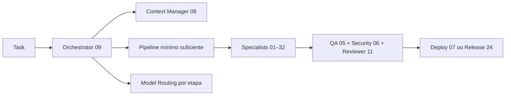

> 🌎 [English version](README.md) · 🇧🇷 Versão em Português

# Dev Team Kit — 73 Skills Especialistas para Coding Agents


> Um time completo de especialistas de software dentro do seu agente de código.  
> Cada task é roteada para o especialista certo, executada no modelo certo, e entregue com qualidade de produção.

### ✨ Novidades

Veja [`CHANGELOG.md`](CHANGELOG.md) para o histórico completo de versões.

**Como usar:** ver [`docs/quickstart.md`](docs/quickstart.md) com os 4 cenários (gerar imagem CLI, swarm com geração automática, bootstrap do template, adapters em runtime).

---

### 📖 Wiki Completa — ponto de partida recomendado

| Idioma | Link |
|---|---|
| 🇧🇷 **Português** | [`docs/WIKI.pt-BR.md`](docs/WIKI.pt-BR.md) |
| 🌎 **English** | [`docs/WIKI.md`](docs/WIKI.md) |

Cada skill, subagent, command, policy, plugin e MCP tool documentado — no formato do post [aihero.dev "5 Agent Skills I Use Every Day"](https://www.aihero.dev/5-agent-skills-i-use-every-day).

---

### 📊 Bench de Qualidade — resultados medidos, sem marketing

Testamos cada skill e subagent com rubrica publicada. 53 cenários de isolamento + 3 testes end-to-end. Mesmo modelo, mesmo prompt — com e sem o kit. Números medidos, código real, resultados auditáveis.

| Idioma | Link | Destaques |
|---|---|---|
| 🇧🇷 **Português** | [`analyze-doc/index.pt-BR.html`](analyze-doc/index.pt-BR.html) | 92.6% pass rate · +1.84 delta médio · 53/53 E2E verdes |
| 🌎 **English** | [`analyze-doc/index.en.html`](analyze-doc/index.en.html) | Same report in English |

Inclui before/after com texto completo dos outputs, scores delta por skill, resultados dos testes process-based, e verificação dos fixes da v2.10.1. Metodologia em [`eval-bench/`](eval-bench/).

---

## Por Que Isso Importa (Para Qualquer Pessoa)

Se você usa IA pra construir produto — seja um dev experiente, um indie hacker fazendo SaaS, ou alguém que só sabe descrever o que quer — esse kit muda o jogo. Em linguagem simples, o que ele faz:

### 💰 Economiza sua conta de API (até 70%)
A IA adora ler tudo: o output inteiro de um `npm install`, stack traces repetidos, listas enormes de arquivos. Tudo isso vira token, que vira dinheiro. O kit **comprime automaticamente** esse ruído antes de mandar pro modelo — você paga só pelo que importa.

### 🧠 Entende o que você quer antes de sair fazendo
Em vez de um agente genérico que "chuta" a implementação, o kit tem um **orquestrador** que lê seu pedido, classifica a complexidade, e monta o pipeline mínimo necessário. Se você for vago, ele pergunta. Se for claro, ele executa. Nunca sai inventando.

### 🗂️ Memória persistente entre sessões
A maioria dos agentes esquecem tudo quando você fecha a janela. Esse aqui **lembra**: o que você decidiu, quais arquivos são importantes, que padrões o seu projeto segue, que bugs apareceram antes. Resultado: menos retrabalho, menos token gasto recontextualizando, e respostas muito mais assertivas a cada sessão.

### 🤖 Modo autônomo — manda e esquece
Dá uma task complexa com `/auto` ou `/loop` e vai tomar um café. O agente executa, testa, corrige, valida e **só para quando está pronto, funcional e testado**. Tem circuito de segurança: se travar no mesmo erro 3x, detecta e avisa — não fica queimando API à toa.

### 🖼️ Geração de imagem profissional, sem placeholder
Landing page com caixinha cinza "imagem aqui"? Nunca mais. O kit integra **fal.ai** com prompts escritos por um especialista em IA generativa — você descreve a cena, o sistema traduz em prompt técnico, e entrega imagens prontas pra produção. Ilustrações, hero images, ícones, mockups, todos consistentes com a sua marca.

### 🔒 Segurança antes do deploy, não depois do vazamento
Um **auditor de segurança** pensa como atacante e revisa o código antes dele chegar em produção. Findings críticos vêm com prova de conceito. Nada de descobrir vulnerabilidade na conta do cliente.

### 🧪 Testes que realmente provam que funciona
Um **engenheiro de QA** que segue o princípio "prove-it": se você disse que funciona, me prove com um teste. Nada de "parece ok". Cobre cenários de sucesso, falha, edge cases e regressão.

### 🎨 Design e copy que vendem
- **Designer** com análise competitiva: olha os concorrentes e recomenda o que converte
- **Copywriter** especialista em marketing: texto pronto pra landing, email, anúncio
- **SEO** que otimiza antes do Google indexar — seu site nasce achável

### 🚀 Do zero ao deploy sem contratar 5 freelancers
Backend, frontend, mobile (Tauri), observability, analytics, acessibilidade (WCAG), refatoração, release, documentação — **37 especialistas no total**. Cada task vai pro profissional certo, com o modelo de IA certo (Haiku pro simples, Sonnet pro médio, Opus pra arquitetura) — você não paga Opus pra gerar boilerplate.

### 🔌 Funciona em tudo que você já usa
Plugin nativo do **Claude Code** + MCP server universal que roda em **Cursor, Windsurf, Copilot, Gemini CLI** e qualquer agente compatível com MCP. **Zero vendor lock-in.** Trocou de ferramenta? Seu time vai junto.

### 🆓 Grátis, Apache-2.0, open source
Sem mensalidade. Sem trial. Sem tier premium escondido. Clona, instala, usa pra sempre — inclusive em projeto comercial. Apache-2.0 com arquivo `NOTICE` força atribuição rio abaixo: quem reempacotar o kit é obrigado a manter o crédito de quem moldou as ideias dentro dele.

---

## O Que É

O **Dev Team Kit** é um conjunto de 73 skills especializadas que transforma qualquer agente de coding compatível em um time completo de desenvolvimento — com orchestrator, backend, frontend, QA, security, deploy, design, copy, SEO, observability e mais.

**O que você ganha:**

- **Pipeline estruturado** — cada task passa pelas etapas certas, na ordem certa, sem improvisar
- **QA, Security e Reviewer obrigatórios** — nenhuma entrega sai sem validação
- **Model routing automático** — haiku para boilerplate, sonnet para implementação, opus para arquitetura
- **Lifecycle hooks** — o agente detecta contexto vago, re-lê arquivos antes de editar, monitora custo de tokens
- **MCP server próprio** — 38 tools expostas para qualquer cliente MCP
- **Memória persistente** — working set, context pack, learned skills com confidence scoring acumuladas por projeto
- **Instalação multi-plataforma** — Claude Code, Cursor, Windsurf, Copilot, Gemini CLI e mais

### Construído sobre princípios de Context Engineering

A arquitetura do kit se mapeia para a [hierarquia de engenharia de contexto](https://github.com/davidkimai/Context-Engineering): skills individuais são **átomos**, templates são **moléculas**, learned-skills + working-set são **células**, subagents despachados são **órgãos**, e programs compostos por protocol shells são a **camada de campo emergente**. Novidade na v1.1: protocol shells tipados em 3 subagents piloto, schemas de I/O em `schemas/skill-io/`, scoring de iteração no circuit breaker do auto-loop, e definições declarativas em `programs/`. Veja `docs/WIKI.md → Context Engineering Stack`.

> **Tour de 5 min:** [`docs/SKILLS-OVERVIEW.md`](docs/SKILLS-OVERVIEW.md) — toda skill, modo, subagent e policy em uma página navegável (formato aihero.dev).

---

## Instalação Rápida

### Modo 1 — Plugin Global (Claude Code)

Instala as 73 skills e hooks globalmente. Funciona em qualquer projeto sem configuração adicional.

```bash
# Via Claude Code CLI
claude plugin install https://github.com/felvieira/claude-skills-fv
```

O que é instalado globalmente: skills, hooks, commands (`/audit-repo`, `/devkit-install-fv`, `/plan-feature`, `/review-release`, `/inventory-assets`).

### Modo 2 — Kit Completo por Repo (via comando)

Com o plugin instalado, rode dentro do repo que quer configurar:

```
/devkit-install-fv
```

Isso instala `.bot/` completo: MCP server, policies, templates, docs, hooks, learned-skills e configs multi-plataforma.

### Modo 3 — Bash Direto

```bash
git clone https://github.com/felvieira/claude-skills-fv /tmp/dev-team-kit
bash /tmp/dev-team-kit/setup/install.sh /caminho/do/projeto
```

Se o kit já estiver em `.bot/`, você também pode rodar diretamente do repo instalado:

```bash
bash .bot/setup/install.sh
```

O instalador inclui `setup/` e todos os diretórios do kit em `.bot/`. Suporta flags de perfil não-interativo:
- `--profile lean` — instala sem MCP e sem scripts pesados
- `--no-input` — sem prompts, usa defaults
- `--yes` — aceita tudo automaticamente

Na tabela abaixo, considere o `dev-team-kit` como 38 tools apoiadas pelas 73 skills (73 diretórios de skill instalados; o ID 16 é reservado).
O MCP expoe 38 tools apoiadas pelas skills instaladas.

### Comparativo dos Modos

| O que é instalado | Plugin Global | /devkit-install-fv | Bash direto |
|---|:---:|:---:|:---:|
| 73 skills | ✅ | ✅ | ✅ |
| Hooks (lifecycle) | ✅ | ✅ | ✅ |
| Slash commands | ✅ | ✅ | ✅ |
| Policies | ❌ | ✅ | ✅ |
| MCP server (38 tools) | ❌ | ✅ | ✅ |
| Templates de handoff | ❌ | ✅ | ✅ |
| Docs + repo-audit | ❌ | ✅ | ✅ |
| Configs multi-plataforma | ❌ | ✅ | ✅ |
| Learned skills por projeto | ❌ | ✅ | ✅ |

---

## Plataformas Compatíveis

| Plataforma | Skills | Hooks | MCP | Slash Commands | Notas |
|---|:---:|:---:|:---:|:---:|---|
| **Claude Code** | ✅ | ✅ | ✅ | ✅ | suporte completo — plugin nativo |
| **Cursor** | ✅ via `.bot/` | ❌ | ✅ | ❌ | skills via AGENTS.md, MCP via config |
| **Windsurf** | ✅ via `.bot/` | ❌ | ✅ | ❌ | skills via rules, MCP via `.windsurf/mcp.json` |
| **GitHub Copilot** | ✅ via `.bot/` | ❌ | ❌ | ❌ | skills via `.github/copilot-instructions.md` |
| **Gemini CLI** | ✅ via `.bot/` | ❌ | ✅ | ❌ | skills via GEMINI.md, MCP via `.gemini/settings.json` |
| **OpenCode** | ✅ via `.bot/` | ❌ | ✅ | ❌ | skills via AGENTS.md |
| **Antigravity** | ✅ via `.bot/` | ❌ | ✅ | ❌ | skills via config local |

> Para plataformas sem hooks nativos, as mesmas regras estão em `policies/hooks.md` — o agente as aplica manualmente.

---

## Os 73 Especialistas

### Gestao e Coordenacao

| # | Skill | O que faz |
|---|---|---|
| 08 | **Context Manager** | rastreia foco, tasks abertas, arquivos quentes e handoffs entre sessões |
| 09 | **Orchestrator** | define o pipeline mínimo suficiente, delega para specialists, adapta em caso de rejeição |
| 10 | **Documenter** | registra decisões, contratos de API, operações e impactos em docs vivos |
| 11 | **Reviewer** | valida o delta final antes de liberar — qualidade, escopo e risco |
| 17 | **Image Generator** | gera e adapta assets visuais via fal.ai com suporte a t2i, i2i, rembg e ícones Tauri |
| 18 | **Repo Auditor** | fotografia completa do repo — stack, convenções, riscos, entry points e dívida técnica |
| 19 | **Asset Librarian** | inventaria logos, ícones, fontes, tokens visuais e assets reutilizáveis |
| 20 | **Observability SRE** | define logs estruturados, métricas, tracing, alertas e plano de rollback |
| 21 | **Data Analytics** | define eventos de tracking, naming, funis e KPIs de produto |
| 22 | **Accessibility Specialist** | revisa WCAG 2.2, navegação por teclado, semântica HTML e motion reduction |
| 23 | **Migration & Refactor Specialist** | conduz migrações incrementais, feature flags e rollback seguro |
| 24 | **Release Manager** | organiza changelog, release notes, versionamento e rollout gradual |
| 25 | **AI Integration Architect** | projeta adapters de IA, gateways, streaming, fallbacks e custo de inferência |
| 26 | **Prompt Engineer** | cria e itera prompts, templates reutilizáveis e estratégias de few-shot |
| 27 | **Video Integration Specialist** | integra vídeo generativo com foco em UX, latência e formatos de output |
| 28 | **CLAUDE.md Generator** | gera `CLAUDE.md` inteligente para projetos consumidores do kit |
| 30 | **Cost Tracker** | rastreia custo de tokens e API calls por sessão, por skill e por tier de modelo |
| 31 | **Session Summary** | consolida resumo de sessão para handoff limpo entre sessões longas |
| 32 | **Smart Suggestions** | sugere a próxima ação mais impactante baseado no estado real do projeto |
| 33 | **Detective Spec** | engenharia reversa de specs executáveis a partir de código legado — módulos, regras de negócio, fluxos, ADRs retroativos, zero writes fora de `_detective_sdd/` |
| 35 | **Skill Author** | meta-skill para criar, editar, avaliar e otimizar as próprias skills do kit — sustenta o kit conforme cresce além de 37 especialistas |
| 38 | **Architecture Deepener** | encontra deepening opportunities (deletion test, deep modules) usando glossário de domínio + vocabulário arquitetural; pareia com skill 23 (Migration & Refactor) para execução |
| 39 | **Program Router** | decide qual pipeline de `programs/*.yml` rodar a partir da classificação da task — trabalha junto do orchestrator (ad-hoc) e do hook intent-classifier (sugestão) |
| 40 | **Parallel Dispatcher** | despacha N slices/reviews independentes pra subagents corretamente, evitando a armadilha skill-vs-agent; scatter-gather com isolamento via worktree |
| 44 | **Zoom Out** | constrói mapa de módulos e topologia do codebase — complementa smart-suggestions com visão estrutural de cima |
| 45 | **Handoff Context** | pacote prospectivo de handoff entre sessões/agentes — empacota o que a próxima sessão precisa pra continuar sem re-derivar contexto |
| 65 | **Using Git Worktrees** | isolamento de workspace via git worktree — detecta isolamento existente, prefere ferramenta nativa (`EnterWorktree`/`ExitWorktree` ou o dispatcher `/worktree` do kit) antes de `git worktree add` cru, baseline de testes obrigatória antes de liberar a task |

### Produto e Design

| # | Skill | O que faz |
|---|---|---|
| 01 | **PO** | escreve spec, histórias de usuário, critérios de aceitação e define prioridade |
| 02 | **UI/UX Designer** | define layout, sistema de tokens, responsividade e heurísticas de uso |
| 29 | **Design Intelligence** | pesquisa concorrentes, captura screenshots, analisa tendências visuais e entrega dossier estratégico para UI/UX |
| 36 | **Web Asset Generator** | favicons (multi-size), PWA icons (incl. maskable), Open Graph e Twitter card images, manifest e snippets de meta tags — derivados de logo ou texto da marca |
| 56 | **Responsive Conversion** | converte UI desktop-first em mobile, corrige layout quebrado (por que filho de flex/grid não pega 100%, `dvh` vs `vh`, safe area, scroll horizontal) e é dona dos padrões de modal/bottom sheet e confirmação destrutiva |
| 57 | **Mobile UX Foundations** | ergonomia da zona do polegar (onde a navegação pode morar), fisiologia do dark mode (`#121212`, nunca preto puro), performance percebida (skeleton vs. spinner por faixa de duração) e UX de auth/onboarding/permissão (passkeys, regras NIST de senha, permission priming) |
| 58 | **i18n & Localization** | prepara o produto para outro idioma, região ou direção de escrita *antes* de existir tradutor: externalização de string, plural via API da plataforma, formatters por locale, +30% de expansão de texto, RTL com propriedades lógicas, e pseudolocale/RTL como teste de regressão |
| 59 | **Closed-Loop Revenue** | fecha a cadeia do clique pago até a margem: identidade (GCLID/UTM/`transaction_id`/CRM), backend como fonte de verdade da receita, reconciliação com tolerância declarada, break-even ROAS derivado da margem de contribuição real, e conversão offline para o bidding de lead gen aprender com venda fechada, não com formulário preenchido |
| 51 | **UX Research** | discovery qualitativo — roteiro de entrevista com usuário, persona baseada em pesquisa, journey mapping (momento de verdade, dor, oportunidade), arquitetura de informação (card sort, tree test) e teste de usabilidade (score SUS, taxa de sucesso de tarefa) |
| 64 | **Scroll Storytelling** | arquitetura completa de página scrollytelling — onde o scroll é a timeline narrativa, não uma lista de seções com fade. No mínimo 4 famílias de device, mundo visual fotográfico por padrão, sem corrente contínua de câmera salvo pedido explícito. Inclui motor de runtime vanilla JS/CSS zero-dependência |
| 73 | **SaaS Conversion Playbook** | audita e desenha o funil de conversão de assinatura de um SaaS/app — classificação playbook A (consumer/resultado pessoal) vs. B (ferramenta B2B/PLG), telas de onboarding, evento de ativação, paywall completo, gatilhos in-app e lifecycle de e-mail, com métricas-alvo de benchmark real (R/1K, TTV, trial-to-paid por modelo comercial) em vez de achismo |

### Desenvolvimento

| # | Skill | O que faz |
|---|---|---|
| 03 | **Backend Engineer** | APIs REST/GraphQL, contratos, auth, validação, banco de dados e integrações |
| 04 | **Frontend Engineer** | React/Next.js, estado, chamadas de API, performance e experiência do app |
| 12 | **Motion Designer** | animações, transições, micro-interações e comportamento visual coeso |
| 15 | **Mobile / Tauri** | extensão opcional para apps desktop e mobile com Tauri + React Native |
| 74 | **Web3D Scene Runtime** | scene description estruturada (câmera, luzes, slots de GLB, materiais, partículas) → cena 3D real e interativa no browser: WebGPURenderer com fallback WebGL2 automático, câmera navegável + raycasting, orçamento medido (Draco/KTX2, LOD, dispose, reduced-motion, fallback estático). Fecha o handoff que as skills 68/69 nunca tiveram — um `.glb` certificado que só chegava no Unity/Unreal, nunca numa página |
| 60 | **App Reference Architecture** | molde para apps novos que precisam de login + pagamento + push + web app + APK Android a partir de um único código-fonte Next.js + Tauri — auth dual, pagamento dual (Stripe + Google Play IAP), push dual, script de build estático, Docker/CI-CD, destilado de 3 apps reais em produção |
| 47 | **Pattern Conformity** | detecta e codifica as convenções de código de um projeto existente (naming, estrutura, error handling, testing, async, DI, API design) em `memory/patterns.md`, pra código novo bater com o estilo da casa |
| 52 | **UI Polish** | os detalhes pequenos que fazem uma UI parecer refinada em vez de "ok" — border radius concêntrico, alinhamento óptico, sombra vs. borda, tabular numbers, scale-on-press, hit area, stagger em animação de entrada/saída |

### Conteudo e Descoberta

| # | Skill | O que faz |
|---|---|---|
| 13 | **Marketing Copy** | copy de produto, CTAs, landing pages, brand voice e mensagens de conversão |
| 14 | **SEO Specialist** | metadata, schema.org, Core Web Vitals, sitemap e discoverability |
| 48 | **Research Prep** | pesquisa técnica multi-fonte antes de escrever docs/PRDs/ADRs/artigos — docs oficiais + GitHub + Stack Overflow + papers, ranqueados por autoridade, output em `memory/research/<slug>.md`; alimenta as skills 10, 01, 26, 41 |
| 49 | **Context Budget** | audita o peso de contexto carregado na sessão (skills, agents, MCP descriptions, rules, CLAUDE.md) — estima tokens por componente, headroom disponível e alertas de overflow. Distinto da skill 30 (cost-tracker), que rastreia custo de completions em runtime |
| 50 | **Direct Response Copy** | copy de direct response — headlines com gatilho mental, anúncios, e-mails de venda, legendas de Instagram, roteiro de VSL e páginas de venda construídas sobre frameworks consagrados (AIDA, PAS, 4 Ps), distinta da copy mais ampla de marca/landing da skill 13 |
| 54 | **Video Analysis** | analisa conteúdo de vídeo existente — baixa, extrai frames, transcreve áudio e responde perguntas sobre o que acontece na tela, sem gerar nada novo |
| 55 | **Marketing Reporting & Analytics** | marketing analytics ops — relatório de campanha, setup técnico de GA4/GTM, auditoria de infraestrutura de dados de marketing, montagem de dashboard entre plataformas de anúncio e CRM |
| 61 | **Content Growth Engine** | conteúdo como sistema de aquisição, não calendário de publicação: intenção de busca extraída de call de vendas e ticket de suporte (nunca só do volume), clusters ordenados por intenção comercial, baseline de citação em IA medido contra um conjunto fixo de prompts, cadência dimensionada contra capacidade real, cota de refresh para o acervo não apodrecer, objeção de vendas virando página de fundo de funil, e sucesso medido em pipeline — não em sessão |

### Qualidade e Entrega

| # | Skill | O que faz |
|---|---|---|
| 63 | **Mobile Paywall & Checkout** | UI/UX de seleção de plano e checkout de pagamento em apps mobile — decisão de arquitetura de cobrança (Play Billing vs. PSP externo, não é decisão puramente visual), fluxo periodicidade → plano → cupão → pagar → autenticar → confirmar, hierarquia de plano-alvo sem manipulação, estados de pagamento com a regra de que "voltou do 3DS" não é sinônimo de aprovado nem de recusado, e campo de cupão collapsed por padrão — campo visível sinaliza que existe preço melhor e manda usuário sem código caçar um |
| 62 | **Persona-Driven Issue Audit** | audita em massa um produto existente via personas simuladas ponta a ponta até PR, e roda mesmo sem nenhuma persona pré-escrita: infere proto-personas do próprio repositório (rotas, formulário, texto de erro), oferece janela de confirmação humana sem bloquear, depois testador com contexto fresco por persona, dedup de issue por rota + causa raiz (nunca título), agente de análise de solução que comenta causa e trade-offs sem corrigir, frota de até 10 agentes cada um pegando uma issue e abrindo PR (confiança alta) ou comentando `wontfix`/`needs-human` com motivo específico, review com a mesma régua de qualquer PR, e triagem humana leve para o que sobra — sem merge automático |
| 05 | **QA Engineer** | testes unitários, integração, E2E, cobertura e edge cases críticos |
| 06 | **Security Reviewer** | OWASP Top 10, headers, CORS, CSRF, XSS, injeção e exposição de dados |
| 34 | **Static Analysis** | scan automatizado de segurança e bugs via Semgrep + CodeQL com output SARIF, triagem de severidade e integração CI — alimenta findings na skill 06 |
| 37 | **TDD Engineer** | red-green-refactor enforced; combate anti-padrão horizontal slicing (escrever todos os testes antes de toda impl); 1 teste → 1 impl → repete. Pareia com skill 38 para deep modules |
| 53 | **Doubt-Driven Review** | revisão adversarial em tempo real — submete toda decisão não-trivial a um revisor de contexto fresco, viesado a REFUTAR, complementando a skill 11 (gate final), não substituindo |
| 07 | **Deploy Engineer** | containerização, CI/CD, rollout blue-green, rollback e infra como código |

### Publicação e Automação (v2.11.0+)

| # | Skill | O que faz |
|---|---|---|
| 41 | **Blog Publisher** | skill compositora — recebe texto/assunto → escreve post HTML → gera imagens (via skill 17 fal.ai ou skill 42 Playwright) → commita/publica no repo do blog → retorna URL pública. Multi-usuário via `~/.dev-team-kit/blog-config.json` |
| 42 | **Blog Screenshot** | captura via Playwright pra posts: viewports por destino (cover/hero/mobile), remoção de cookie banner, prevenção de FOUT, convenção de nome compatível com a skill 41 |
| 43 | **Canary Deployment** | rollout gradual (1%/10%/50%/100%) + monitoramento de 7 métricas + rollback automático. 3 estratégias (traffic-based, feature flag, blue-green). Fica entre skill 24 (release-manager) e skill 07 (deploy-docker) |
| 46 | **Post-Deploy Canary Monitor** | monitoramento contínuo pós-100% depois de um canary completar — observa error budget, latência e sinais de anomalia, abre gatilho de postmortem em regressão |

### Desenvolvimento de Jogos (v2.68.0+)

| # | Skill | O que faz |
|---|---|---|
| 66 | **Game Architecture Design** | arquitetura, design review e balanceamento numérico de jogos — a camada de decisão antes de código de engine. Seleção de paradigma (entidade rica vs. data-driven vs. protótipo), design de sistema de combate/skill/IA/narrativa/UI/PCG, crítica de GDD/mecânica/nível baseada em evidência |
| 67 | **Game Engine Development** | implementação real de código de engine — Unity C# e Unreal C++: MonoBehaviour, ScriptableObject, object pooling, state machines, ECS, componentes Actor/UPROPERTY/UFUNCTION, otimização de performance e networking multiplayer |

### Pipeline de Personagem 3D/2D (v2.69.0+)

| # | Skill | O que faz |
|---|---|---|
| 68 | **Character Animation 3D** | pipeline de conteúdo/asset para animação de personagem 3D humanoide via AccuRIG + Blender headless + IA de motion — rigging, CLI `bpy` como "compilador de animação", retargeting via delta de quaternion relativo à rest pose, e mapa comparativo de 10 tecnologias de IA de motion |
| 69 | **Character Pipeline 2D** | pipeline de personagem 2D e orquestração character-to-runtime — as cinco estratégias de produção de sprite/animação 2D, o contrato `MotionPlan.json` (LLM como diretor de intenção/timing, nunca gerador de rotação de bone), geração 2D nativa, e seleção de ferramenta de rig 2D esqueletal |

### Produção de Campanha (v2.71.0+)

| # | Skill | O que faz |
|---|---|---|
| 70 | **Campaign Research Strategy** | pesquisa mercado, concorrentes, público e voz do consumidor pra formar base estratégica verificável antes de copy ou direção visual — produz evidence ledger, claims autorizados, oportunidades priorizadas e guardrails |
| 71 | **Campaign Copywriting** | transforma uma estratégia de pesquisa com evidence ledger em rotas de copy rastreáveis, distintas e adequadas ao canal — nunca repesquisa, nunca inventa claim |
| 72 | **Campaign Visual Direction** | converte estratégia e copy aprovadas em conceito visual, bíblia de continuidade, papéis de referência e shot intents estruturados — separa referência de identidade de referência de linguagem, reserva texto/UI pra overlays determinísticos |

---

## Pipeline Principal



### Pipelines Comuns

| Tipo de tarefa | Pipeline |
|---|---|
| Feature completa | `PO → UI/UX → Backend → Frontend → Motion → Copy → SEO → QA → Security → Reviewer → Deploy` |
| Bug fix | `Backend → QA → Security → Reviewer → Deploy` |
| Hotfix crítico | `Backend → Security → Reviewer → Deploy` |
| Melhoria de UI | `UI/UX → Frontend → Motion → QA → Security → Reviewer → Deploy` |
| Landing page | `Copy → Design Intelligence → UI/UX → Frontend → SEO → QA → Reviewer` |
| Integração de IA | `Repo Auditor → AI Architect → Prompt Engineer → Backend → Observability → QA → Security → Reviewer` |
| Release formal | `Reviewer → Observability SRE → Release Manager → Deploy` |

---

## Model Routing — Modelo Certo para Cada Etapa

| Tier | Modelo | Quando usar |
|---|---|---|
| Fast | haiku | boilerplate, rename, microcopy, templates, formatação |
| Balanced | sonnet | implementação, testes, debug, integração, design |
| Deep | opus | arquitetura, security review, orquestração, decisões críticas |

**Enforcement automático (Claude Code):**
- `EnterPlanMode` → hook sugere `/model opus`
- `ExitPlanMode` → hook sugere `/model sonnet`
- Subagent sem `model` explícito → hook alerta e sugere tier por keywords

**Em outros ambientes:** seguir `policies/model-routing.md` manualmente.

---

## Hook System — Inteligência em Lifecycle Events

| Hook | Evento | O que faz | Perfil |
|------|--------|-----------|--------|
| `pre-execution-gate` | UserPromptSubmit | detecta prompt vago e confirma antes de agir | standard, strict |
| `keyword-detector` | UserPromptSubmit | injeta skill ou learned skill relevante automaticamente | standard, strict |
| `context-guard-stop` | Stop | avisa em 50% (não-bloqueante) e bloqueia em 75% com resumo inteligente | todos |
| `persistent-mode` | Stop | bloqueia stop quando pipeline está ativo | todos |
| `pre-tool-enforcer` | PreToolUse | re-lê antes de editar, sugere code intelligence tools | todos |
| `investigate-first-guard` | PreToolUse | intercepta `AskUserQuestion`, bloqueia pergunta auto-descobrível (user do github, branch, package manager, porta…) e manda rodar o comando primeiro | standard, strict |
| `session-start` | SessionStart | restaura estado da sessão anterior e injeta skill-discovery | standard, strict |
| `post-tool-verifier` | PostToolUse | detecta debugging patterns, sugere extração de learned skill | standard, strict |
| `model-routing-hook` | PreToolUse | sugere troca de modelo em plan mode e valida subagent spawns | standard, strict |
| `simplify-ignore` | PreToolUse + PostToolUse | Protege blocos `simplify-ignore-start/end` de simplificação automática | standard, strict |

### Perfis de Hook

Controlados pela variável de ambiente `DEVKIT_HOOK_PROFILE` (padrão: `standard`):

| Perfil | Hooks ativos |
|--------|-------------|
| `minimal` | `context-guard-stop`, `persistent-mode`, `pre-tool-enforcer` |
| `standard` | todos |
| `strict` | todos |

- **`DEVKIT_HOOK_PROFILE`** — define o perfil ativo (`minimal`, `standard` ou `strict`)
- **`DEVKIT_DISABLED_HOOKS`** — lista separada por vírgula de hookIds a desativar independente do perfil

### Context Guard — Strategic Compact

O hook `context-guard-stop` opera em dois níveis:
- **50%** — aviso não-bloqueante: sugere `/compact` enquanto ainda há margem
- **75%** — bloqueio inteligente: exibe hint da task atual, arquivos editados na sessão e decisões do working set antes de bloquear

---

## Subagents — Especialistas Despacháveis via `Task` Tool

O kit inclui 16 subagents Claude Code em `.claude/agents/`, prontos para despachar com a `Task` tool ou invocar pelo prompt.

### Core (5)
| Subagent | Quando usar | Tools |
|---|---|---|
| `code-reviewer` | Review de PR, feature concluída ou qualquer código antes de merge | Read, Grep, Glob, Bash |
| `security-auditor` | Auth flows, input handling, deps, CORS, headers, pré-deploy | Read, Grep, Glob, Bash |
| `test-engineer` | Escrever testes, preencher gaps de cobertura, validar regressão | Read, Grep, Glob, Bash, Edit, Write |
| `orchestrator` | Classificar task complexa, montar pipeline, resolver overlap de skills | todas |
| `debugger` | Bug, comportamento inesperado, falha que você não consegue explicar — usa Evidence Ledger + tabela anti-rationalization | Read, Grep, Glob, Bash, Edit |

### Detective Spec (4) — fases do `/detective-spec`
| Subagent | Quando usar | Tools |
|---|---|---|
| `detective-contracts` | Fase 2: extrai contratos de módulo (API, deps, invariantes, consumidores) de código legado — read-only | Read, Grep, Glob, Bash |
| `detective-business-rules` | Fase 3: extrai regras de negócio escondidas em validações, constantes mágicas, transições de estado, testes — read-only | Read, Grep, Glob, Bash |
| `detective-flows` | Fase 4: reconstrói fluxos end-to-end (entry → side effects) com edge cases e estado mutado — read-only | Read, Grep, Glob, Bash |
| `detective-adrs` | Fase 5: infere ADRs retroativos e sintetiza overview + traceability — read-only | Read, Grep, Glob, Bash |

### Static Analysis (5) — pipeline da skill 34
| Subagent | Quando usar | Tools |
|---|---|---|
| `semgrep-scanner` | Repo multi-linguagem: scans Semgrep em paralelo por categoria de linguagem, agrega SARIF | Read, Grep, Glob, Bash |
| `semgrep-triager` | Batch >20 findings: classifica TP/FP/needs-investigation lendo contexto fonte, propõe fixes | Read, Grep, Glob, Write |
| `codeql-runner` | Bug precisa taint tracking interprocedural: orquestra build de database CodeQL + queries | Read, Grep, Glob, Bash |
| `sarif-parsing` | Múltiplas fontes SARIF: parse, dedup, agrega em relatório único (Semgrep + CodeQL + outros) | Read, Glob, Bash, Write |
| `variant-analysis` | Bug confirmado → caça variantes do mesmo padrão, gera custom rule reusável para CI | Read, Grep, Glob, Bash, Write |

### Conteúdo (1)
| Subagent | Quando usar | Tools |
|---|---|---|
| `anti-ai-writing` | Review de prosa nova entrando no repo: detecta os 29 padrões de AI-generated writing em docs, PRDs, copy, changelogs | Read, Grep, Glob, Write |

### Qualidade (1)
| Subagent | Quando usar | Tools |
|---|---|---|
| `silent-failure-hunter` | Review-only: caça falhas silenciosas — `catch{}` vazio, `.catch(() => [])`, stack trace perdido, fallback que esconde falha, rollback faltando | Read, Grep, Glob, Bash |

**Exemplo de invocação:**

```
Despache o subagent code-reviewer para revisar as mudanças em src/auth/login.ts
```

```
Use o subagent debugger para investigar o crash em TypeError: Cannot read properties of undefined em api/users.ts
```

Os subagents são copiados para `.claude/agents/` do repo consumidor pelo `install.sh`.
Ver `docs/skill-guides/subagents.md` para guia completo de quando usar cada um.

---

## MCP Server — 36 Tools para Qualquer Cliente MCP

```json
{
  "mcpServers": {
    "dev-team-kit": {
      "command": "node",
      "args": [".bot/mcp-server/dist/index.js"],
      "env": {
        "FAL_KEY": "fal-...",
        "BRAVE_SEARCH_KEY": "BSA...",
        "FIRECRAWL_KEY": "fc-..."
      }
    }
  }
}
```

Funciona no Claude Code, Windsurf, Gemini CLI, Cursor e qualquer cliente MCP.

| Bloco | Tools | Exemplos |
|-------|-------|----------|
| **Knowledge** | 14 | classifica task, monta pipeline, resume diff, monta context pack |
| **Execution** | 6 | busca concorrentes (Brave), scraping (Playwright/Firecrawl), gera imagens (fal.ai) |
| **Persistence** | 12 | salva contexto, working set, custo, learned skills e guardrails de sessão |
| **Session Intelligence** | 4 | comprime output verboso, lê log JSONL da sessão, lista arquivos/erros vistos |

Ver `mcp-server/README.md` para documentação completa das tools.

---

## API Keys Necessárias

| Key | Para que serve | Onde obter |
|-----|---------------|-----------|
| `FAL_KEY` | geração de imagens (skill 17, MCP moodboards) | fal.ai/dashboard/keys |
| `BRAVE_SEARCH_KEY` | pesquisa de concorrentes (skill 29, MCP) | brave.com/search/api |
| `FIRECRAWL_KEY` | scraping avançado (opcional) | firecrawl.dev |

O instalador solicita cada key e salva em `.env.local` do projeto.

---

## Ergonomia Diaria

- leia `docs/quickstart.md` para entrar rápido no fluxo
- reutilize `docs/repo-audit/current.md` antes de explorar o repo
- use `devkit_context_pack` para iniciar task sem reler metade do repo
- use `devkit_diff_brief` para retomar trabalho ou preparar review
- use `devkit_working_set` para persistir arquivos quentes e próximos passos
- use `commands/` como atalhos operacionais
- consulte `docs/skill-call-matrix.md` quando houver overlap entre skills
- consulte `docs/skill-guides/` apenas sob demanda
- consulte `docs/skill-guides/ideation-frameworks.md` — SCAMPER, HMW, First Principles, JTBD para fase de ideação
- consulte `docs/skill-guides/skill-discovery.md` — decision tree para escolher skill certa por tipo de task
- consulte `docs/skill-guides/context-engineering.md` — hierarquia de contexto, trust levels e packing strategies
- consulte `docs/skill-guides/autonomous-loop.md` — protocolo do `/auto` para execução autônoma

---

## Slash Commands — Atalhos por Fase de Desenvolvimento

| Command | O que faz | Skills ativadas |
|---------|-----------|-----------------|
| `/spec` | Especificar feature com critérios de aceitação | PO (01) |
| `/plan` | Classificar task e montar pipeline | Orchestrator (09) |
| `/build` | Implementar com stack do projeto | Backend (03) + Frontend (04) |
| `/test` | Escrever e rodar testes | QA (05) |
| `/review` | Review final + security audit | Reviewer (11) + Security (06) |
| `/simplify` | Simplificar e refatorar código | Migration & Refactor (23) |
| `/ship` | Release e deploy | Release Manager (24) + Deploy (07) |
| `/pipeline` | Pipeline completo end-to-end | Orchestrator (09) → todas |
| `/best` | Auditoria de boas práticas, clean code e DRY | Reviewer (11) + Security (06) + QA (05) |
| `/auto` | Agente autônomo — executa task completa sem intervenção | Todas as necessárias + circuit breaker |
| `/loop` | Orquestrador autônomo multi-agente (auto-loop v2) — claude + codex, paralelo via worktree, polishing pass | `scripts/auto-loop/` |
| `/worktree` | Cria git worktree isolado, copia `.env*`, valida ambiente em background | — |
| `/detective-spec` | Engenharia reversa de specs em legado — extrai contratos sem modificar o código | Detective Spec (33) |
| `/catalog-project` | Sintetiza repo-audit + detective-spec + narrativa de produto (resumo/planos/FAQ) + histórico de sessões + dados operacionais (envs/endereços/métricas) em `.project-memory/manifest.yaml` — alimenta o catálogo cross-repo `project-brain` | Repo Auditor (18) + Detective Spec (33) |
| `/grill-me` | Interrogatório relentless de uma ideia/plano — uma pergunta + resposta sugerida por turno | PO (01) Deep Interview |
| `/to-prd` | Converte conversa atual em PRD publicado no issue tracker (label `needs-triage`) | PO (01) modo PRD |
| `/to-issues` | Quebra PRD em N issues independentes (vertical slices) e publica no tracker | Orchestrator (09) + vertical-slices |
| `/pipeline-discovery` | Fluxo COMPLETO de discovery: grill-me → to-prd → to-issues → loop+TDD → ship | Orchestrator (09) coordenando, todas as skills |
| `/constitution` | Bootstrap/update de `memory/constitution.md` com princípios governantes (Code Quality, Testing, UX, Performance, Security) — autoridade hierárquica sobre PRD/plan/ADRs | PO (01) modo governance |
| `/checklist` | Gera checklist contextual por feature ("unit tests for English") — Completeness, Clarity, Consistency, Coverage, Edge Cases | PO (01) + validation |
| `/analyze` | Cross-artifact consistency check (read-only) — constituição → specs → plan → issues. Findings classificados CRITICAL/HIGH/MEDIUM/LOW | Reviewer (11) modo auditoria |
| `/humanize` | Remove 29 padrões AI de qualquer prosa (docs, PRDs, copy, changelogs). Auto-auditoria antes da versão final. | Documenter (10) modo editor |
| `/consolidate-memory` | Janitor do vault de memória — merge duplicatas, archive stale, prune índice. Workflow snapshot-first. | Context Manager (08) modo janitor |
| `/run-program` | Executa pipeline YAML declarativo (programs/*.yml) com gates humanos, parallel/conditional steps, variable substitution | Orchestrator (09) modo executor |
| `/swarm` | **AUTONOMIA TOTAL**: prompt → PR mergeable. Worktree isolado + Ralph loop (fresh context per story) + 4 agentes paralelos de review + self-fix CRITICAL/HIGH + auto PR. v2.0.0 | Todas as skills coordenadas |
| `/constitution` | Bootstrap/update de `memory/constitution.md` com princípios governantes (Code Quality, Testing, UX, Performance, Security) — autoridade hierárquica sobre PRD/plan/ADRs | PO (01) modo governance |
| `/checklist` | Gera checklist contextual por feature ("unit tests for English") — Completeness, Clarity, Consistency, Coverage, Edge Cases | PO (01) + validation |
| `/analyze` | Cross-artifact consistency check (read-only) — constituição → specs → plan → issues. Findings classificados CRITICAL/HIGH/MEDIUM/LOW | Reviewer (11) modo auditoria |

### `/loop` — Auto-Loop v2 (Multi-Agente Orquestrador)

`scripts/auto-loop/` é um orquestrador autônomo que entrega tasks **prontas, funcionais, bonitas e testadas**. Roda de noite, acorda com PR pronto pra merge.

```bash
# Uso básico (single run, agente claude)
node scripts/auto-loop "sua task aqui"

# Escolher agente
node scripts/auto-loop "task" --agent codex
node scripts/auto-loop "task" --agent claude

# Worktree isolado + paralelo (3 tasks em 3 worktrees)
node scripts/auto-loop --worktree --parallel 3 -- "task A" -- "task B" -- "task C"

# Polishing pass configurável (default: standard)
node scripts/auto-loop "task" --polish=full

# Controle fino
node scripts/auto-loop "task" --max-tokens 200000 --stop-when "tests cover the new endpoint"
```

**Recursos v2:**

| Recurso | Detalhe |
|---------|---------|
| Multi-agente | adapters para `claude --print` e `codex exec`, interface comum, troca via `--agent` |
| Worktree integrado | cria `<repo>-auto-worktrees/<slug>/` em branch `auto/<slug>`, preserva se commitado |
| Modo paralelo | `--worktree --parallel N` roda N runners isolados, agrega logs por run-id |
| Polishing pass | `--polish=none\|light\|standard\|full` — `simplify` + `review` (+ `security-review` + `test` no `full`) antes do commit |
| Prevent-sleep cross-OS | macOS `caffeinate`, Linux `systemd-inhibit`, Windows `SetThreadExecutionState` |
| JSONL debug log | `.auto/runs/<run-id>/debug.jsonl` com `error.cause` chain completo |
| Backoff classificado | `permanent` aborta, `retryable` exponencial (60s→600s, 5x), `agent-reported` retry imediato |
| Graceful interrupt | 1× Ctrl+C = termina iteração e sai limpo, 2× = SIGKILL com rollback |
| Resume robusto | `session.json` com prompt/model/agent/branch — rerun pergunta update/new branch/quit |
| Token cap | `--max-tokens N` aborta mid-run com commit limpo se válido |
| Stop-when | `--stop-when "<condição>"` — agente reporta `STOP_WHEN_MET: true|false` por iter |

**Circuit breaker:** mesmo erro 3x, stall (3 iter sem `git diff`), budget estourado, ou task bloqueada — para automaticamente.

**Exit codes:** `0` ok / `1` uso / `2` erro permanente / `3` retry esgotado / `4` breaker tripped / `5` stall / `6` token cap / `7` polish incompleto / `130` interrompido / `99` fatal.

**Pronto para produção:**
- 21 smoke tests em `scripts/tests/auto-loop/`, todos verdes. Rodar: `node scripts/tests/auto-loop/run-all.mjs`.
- Cross-platform (macOS, Linux, **Windows**) — adapters usam shell no Windows para resolver launchers `.cmd` instalados via `npm`.
- Cada run grava `.auto/runs/<runId>/status.json` com `{iterations, commits, exitCode, worktreePath, ...}` para o parent paralelo e ferramentas externas consumirem.
- Smoke real-LLM opt-in: `node scripts/tests/auto-loop/smoke-real.mjs` (manual, custa tokens).

**O que mudou de 2026-04-30 → 2026-05-01:**
- Release v2 inicial em 30/04: multi-agente (claude + codex), worktree integrado, modo paralelo, polishing pass, flags inspiradas no gnhf (`--max-tokens`, `--stop-when`, prevent-sleep, JSONL log, backoff classificado, Ctrl+C 2-estágios, resume robusto), docs bilíngues.
- Gap fixes em 01/05: teste E2E do codex com shim fake (zero tokens), verificação de skill paths do polish + teste de retry, teste de integração runner+worktree, `status.json` consumido pelo summary do paralelo (antes mostrava `-`), fixes de portabilidade Windows (`gitDiffSinceBaseline` não usa mais sintaxe POSIX-only; adapters resolvem launchers `.cmd`/`.bat`).
- Testes: 17 → 21, todos passando. Comandos e exit codes inalterados.

---

## Governanca Global

- `GLOBAL.md` é a camada mais alta de instrução
- `policies/` padroniza execução, risco, persistência, qualidade e avaliação
- `templates/` reduz variação de handoff, plano, review e rejeição
- `policies/tool-safety.md` — uso seguro de escrita, rede, MCP e ações externas
- `policies/model-routing.md` — tiers de modelo, enforcement e integração com cost-tracker
- `policies/evals.md` — evidência mínima para mudanças estruturais no kit
- `policies/search-first.md` — pesquisa obrigatória antes de implementar (feature, bugfix, integração, refactor)
- `policies/iterative-retrieval.md` — retrieval progressivo em 3 rounds para subagents e skills delegadas
- `policies/anti-rationalization.md` — tabelas de racionalizações comuns + rebuttals por skill crítica
- `policies/source-driven.md` — hierarquia de fontes obrigatória para decisões de framework/lib
- `policies/confusion-management.md` — protocolo STOP-NAME-OPTIONS-WAIT para confusão detectada
- `policies/context-engineering.md` — hierarquia de contexto em 5 níveis e 3 trust levels

### Hierarquia de Instrucoes

1. `GLOBAL.md`
2. `policies/*.md`
3. `skills/*/SKILL.md`
4. `templates/*.md`

---

## Estrutura Real Deste Repo

```text
.
├── .claude/              ← slash commands (/spec, /plan, /build, /test, /review, /simplify, /ship, /pipeline, /best, /auto, /loop)
│   └── commands/
├── .claude-plugin/       ← manifesto do plugin Claude Code
│   └── plugin.json
├── .github/              ← CI workflows (validate-plugin, validate)
│   └── workflows/
├── AGENTS.md
├── CLAUDE.md
├── GLOBAL.md
├── README.md
├── commands/             ← slash commands (/audit-repo, /devkit-install-fv, ...)
├── docs/
│   ├── quickstart.md
│   ├── repo-audit/
│   ├── skill-guides/
│   └── skill-call-matrix.md
├── evals/
├── hooks/                ← lifecycle hooks para Claude Code
│   ├── hooks.json
│   ├── config.json
│   └── scripts/
├── mcp-server/           ← MCP server com 38 tools
├── patterns/ai-integration/
├── personas/             ← agent personas (code-reviewer, security-auditor, test-engineer)
├── policies/             ← model-routing, tool-safety, cost-optimization, evals
├── scripts/              ← generate-image.py e utilitários
├── setup/                ← install.sh multi-plataforma
├── skills/               ← 37 specialists (*/SKILL.md)
├── src/                  ← hooks, stores, components e middleware reutilizáveis
└── templates/            ← handoff, plano, review, rejeição
```

---

## Estrutura Instalada no Repo Consumidor

Quando instalado via `/devkit-install-fv` ou `setup/install.sh`:

```text
repo-consumidor/
├── AGENTS.md
├── CLAUDE.md
├── GEMINI.md
├── .claude/settings.json         ← hooks + MCP registrados
├── .claude/commands/             ← slash commands (/spec, /plan, /build, /loop, ...)
├── .claude/agents/               ← subagents despacháveis via Task tool
├── .github/copilot-instructions.md
├── .windsurf/rules/dev-team-kit.md
├── .windsurf/mcp.json
├── .gemini/settings.json
└── .bot/
    ├── GLOBAL.md
    ├── commands/                 ← comandos operacionais (/audit-repo, /devkit-install-fv, ...)
    ├── docs/                     ← skill-guides, repo-audit, quickstart
    ├── evals/
    ├── hooks/                    ← lifecycle hooks
    ├── learned-skills/           ← conhecimento acumulado do projeto (score 0-1, decay semanal, auto-arquivado em .archive/ abaixo de 0.3)
    ├── mcp-server/               ← compilado e pronto
    ├── patterns/ai-integration/
    ├── personas/                 ← code-reviewer, security-auditor, test-engineer
    ├── policies/
    ├── scripts/
    ├── setup/
    ├── skills/
    └── templates/
```

O repo consumidor também recebe `.claude/commands/` (45 slash commands) na raiz, instalado pelo `setup/install.sh`.


---

## Validacao Rapida

```bash
pytest scripts/tests -q
node scripts/check-consistency.mjs
cd mcp-server && npm run build
bash scripts/smoke-install.sh
```

### Checkers de design — rode no repo consumidor

Verificam as regras de design em vez de só enunciá-las. Aponte para o app que você está construindo, não para este kit:

```bash
node scripts/check-design-generic.mjs src/    # indigo default, system-ui, gradiente AI, preto puro, 100vh
node scripts/check-contrast.mjs src/          # ratio WCAG calculado, nos DOIS temas
node bench/ab/score-design.mjs <dirs...>      # score 0–100 por braço, pra comparar entre versões do kit
```

Ambos saem com `1` em caso de falha (`--warn` só reporta, `--json` para uso programático). O hook `design-anchor-guard` aplica o primeiro conjunto no momento da escrita e **bloqueia** arquivo visual com a assinatura do default estatístico — escape hatch é o comentário `design-anchor: allow` no arquivo.

Ressalva que vale saber: o `check-contrast` lê tokens em `#hex` e `rgb()`. Cores declaradas em `hsl()`, `oklch()` ou `var()` são puladas e ainda exigem verificação manual.

---

## Contribuindo

Quer adicionar uma skill, corrigir um bug ou propor uma melhoria? Veja o guia completo em **[CONTRIBUTING.pt-BR.md](./CONTRIBUTING.pt-BR.md)**.

**Resumo rápido:**
1. Crie a skill em `skills/NN-nome/SKILL.md` e registre no `plugin.json`
2. Para slash commands, adicione em `.claude/commands/` e registre no `plugin.json`
3. Rode `node scripts/check-consistency.mjs` antes de commitar
4. Abra um PR com entry no `CHANGELOG.md`

---

## Changelog

Histórico completo em **[CHANGELOG.md](./CHANGELOG.md)**.

---

## `/swarm` — Autonomia Total (v2.0.0+)

O **único comando que vai do prompt ao PR mergeable sem intervenção humana.**

```
/swarm "implementar auth social com Google + GitHub"
```

O kit:
1. Cria worktree git isolado
2. Gera PRD + quebra em stories
3. **Ralph loop:** implementa cada story com contexto fresco (zero contaminação)
4. **4 agentes paralelos de review:** code + security + tests + anti-AI-writing
5. **Synthesize** findings com decision matrix de severity
6. **Auto-fix** CRITICAL/HIGH automaticamente
7. **Cria PR** com synthesis no comment, rebased em main

Você volta pra um PR pronto pra review.

### Quando usar vs outros comandos

| Command | Worktree | Fresh ctx per story | Multi-agent review | Self-fix | Auto-PR | Use case |
|---|:-:|:-:|:-:|:-:|:-:|---|
| `/auto` | opcional | ❌ | ❌ | ❌ | ❌ | Task pequena |
| `/loop` | opcional | ❌ | ❌ | ❌ | ❌ | Task média |
| `/run-program X` | depende | ❌ | depende | ❌ | ❌ | Pipeline declarativo |
| **`/swarm`** | **sempre** | **✅** | **✅** | **✅** | **✅** | **Autonomia total: prompt → PR** |

### Inputs

```bash
/swarm "implementar feature X"          # texto livre
/swarm fix #142                          # issue GitHub
/swarm --prd docs/prd/auth.md            # PRD existente
/swarm --resume <run-id>                 # retoma run que parou
```

### Autonomous + /swarm = manda e esquece

Em `~/.claude/dev-team-kit-config.json` setar `intent_classifier.autonomous: true`:
- Hook detecta intent de feature → auto-sugere `/swarm`
- Claude auto-executa (gates não pausam)
- Você volta pra um PR pronto

### Cleanup

Worktree NUNCA é deletado automático. Após PR mergeado:
```bash
git worktree remove .swarm/<run-id>/workspace
rm -rf .swarm/<run-id>
```

Protocolo completo: [`policies/swarm-protocol.md`](policies/swarm-protocol.md).

---

## Auto-Orchestration (v1.8.0+)

O kit detecta intent do seu prompt e **sugere o program apropriado automaticamente** — você não precisa lembrar de invocar `/run-program` manualmente.

```
Você diz: "preciso adicionar autenticação social no app"
   ↓
[hook intent-classifier]
   → detecta padrão de feature → emite: /run-program spec-driven-development
   ↓
[Claude] invoca skill 39 (program-router)
   → pergunta via AskUserQuestion: dry-run / direto / ad-hoc / cancelar
   ↓
Você escolhe → program executa com gates humanos onde definido
```

### 4 níveis de autonomia

| Nível | Comportamento | Quando usar |
|---|---|---|
| **0 — Manual** | Hook desabilitado. Você invoca `/run-program <nome>` manualmente. | Controle total, exploração |
| **1 — Passive** | Hook sugere. Claude mostra e espera. Nada auto-executa. | Quer só sugestão, decide tudo manualmente |
| **2 — Active (DEFAULT desde v1.9.0)** | Hook sugere + Claude auto-roda `--dry-run` (mostra plano). **Gates humanos no program ainda pausam.** | Default: menos fricção, segurança preservada via gates |
| **3 — Autonomous** | Hook sugere + Claude auto-roda com `--auto-yes` (gates auto-aprovam). | **CI / cron only.** Risco alto se program tem `bash:` destrutivo. |

**Active vs Autonomous — diferença chave:**
- **Active** = "mostre o plano automaticamente, mas pause nos gates pra eu aprovar durante a execução"
- **Autonomous** = "execute tudo sem me perguntar nada"

A diferença real é se **gates humanos durante a execução continuam ativos**.

### Configure seu nível

```jsonc
// hook config (via /update-config ou settings.json)
{
  "intent_classifier": {
    "enabled": true,         // false = Nível 0 (manual)
    "auto_dry_run": true,    // DEFAULT v1.9.0+ — Nível 2 Active
    "autonomous": false,     // true = Nível 3 (autonomous, só CI)
    "suppress": []           // ids de programs para nunca sugerir
  }
}
```

Edite `~/.claude/settings.json` (Windows: `C:\Users\<user>\.claude\settings.json`), salve, e **restarte o Claude Code**.

### Configurar Nível 3 (Autonomous) — só sua máquina (user-wide)

⚠ **Zero confirmações humanas.** Use só em contextos não-interativos (CI, scheduled tasks).
**Recomendado:** coloque isso no user-wide config para o default do repo continuar Active (mais seguro). Arquivo: `~/.claude/dev-team-kit-config.json`


```jsonc
{
  "intent_classifier": {
    "enabled": true,
    "autonomous": true,
    "suppress": [
      "adversarial-dev",       // tem bash que mexe em $ARTIFACTS_DIR/app
      "comprehensive-review"   // postaria em PR sem revisão humana
    ]
  }
}
```

**Checklist pré-voo antes de ativar Autonomous:**
- [ ] Backup do repo / working tree limpa
- [ ] Programs perigosos no `suppress`
- [ ] CI/cron tem timeout (ex: máx 30min)
- [ ] Logs persistentes em `.run-program/*.log.json` acessíveis pra debug pós-mortem
- [ ] `git push --force` proibido (ver `policies/tool-safety.md`)
- [ ] Notification webhook em caso de falha

### Configurar Nível 0 (Manual) — desabilitar completamente

```jsonc
{
  "intent_classifier": {
    "enabled": false
  }
}
```

### Override temporário via env var

```bash
# bash/zsh — uma sessão só
export DEVKIT_INTENT_CLASSIFIER_AUTONOMOUS=true
claude

# powershell
$env:DEVKIT_INTENT_CLASSIFIER_AUTONOMOUS="true"; claude
```

Referência completa: [`policies/auto-orchestration.md`](policies/auto-orchestration.md).

### 6 intent patterns detectados

| Seu prompt menciona... | Program sugerido |
|---|---|
| "criar feature", "spec-driven", "constitution" | `spec-driven-development` |
| "ideia vaga", "discovery", "preciso de PRD" | `pipeline-discovery` |
| "review crítico", "5-agent", "comprehensive review" | `comprehensive-review` |
| "from scratch", "greenfield", "do zero" | `adversarial-dev` |
| "legacy", "legado", "reverse engineering" | `detective-spec` |
| "auto-loop", "autônomo", "fire and forget" | `loop-polishing` |

Skip automático: prompts informacionais ("o que é..."), triviais ("fix typo"), ou já começando com `/`.

---

## Acknowledgements

Este kit é resultado de olhar muita prior art e reimplementar as ideias que fazem sentido no nosso modelo de skill kit. Nada aqui é código copiado — cada item abaixo foi reimaginado como policy, skill ou script zero-dep nas convenções do kit. Os links apontam para os projetos upstream que serviram de inspiração para cada direção.

A atribuição completa (licença + escopo) está em [`NOTICE`](./NOTICE), preservada conforme Apache-2.0 §4(d).

| Projeto | Feature neste kit | Versão |
|---|---|---|
| [github/spec-kit](https://github.com/github/spec-kit) | Inspirou os comandos `/constitution`, `/analyze`, `/checklist` e o workflow spec-driven | v1.3.0+ |
| [anombyte93/prd-taskmaster](https://github.com/anombyte93/prd-taskmaster) | Inspirou a taxonomia de validação de PRD com 13 checks | v1.2.1 |
| [algorithmicsuperintelligence/optillm](https://github.com/algorithmicsuperintelligence/optillm) | Inspirou a doc de inference-time compute (MoA, Self-Consistency, BoN, PlanSearch, SPL, RTO) | v1.3.0 |
| [mattpocock/skills](https://github.com/mattpocock/skills) | Inspirou os comandos `/grill-me`, `/to-prd`, `/to-issues` | v1.4.0+ |
| [davidkimai/Context-Engineering](https://github.com/davidkimai/Context-Engineering) | Inspirou protocol shells (Pareto-lang), taxonomia atom→field e a camada de programs | v1.1.0 |
| [rohitg00/agentmemory](https://github.com/rohitg00/agentmemory) | Inspirou o modelo de consolidação de memória 4-tier e o filtro de privacy | v1.2.0 |
| [ClickUp Agent Prompting Guide](https://clickup.com/blog/agent-prompting-guide/) | Inspirou o framework dos Five Building Blocks e o layering A→B→C | v1.2.0 |
| [sandeco/reversa](https://github.com/sandeco/reversa) | Inspirou o pipeline Detective Spec (skill 33) | v1.6.0 |
| [aihero.dev](https://www.aihero.dev/5-agent-skills-i-use-every-day) | Inspirou o formato de documentação usado em WIKI / SKILLS-OVERVIEW | v1.5.0 |
| Anthropic Skills (`anthropic-skills:*`) | Inspiraram `policies/mcp-builder-patterns.md`, `policies/memory-consolidation.md`, `/consolidate-memory` | v1.5.0 |
| Superpowers (`superpowers:*`) | Inspiraram `policies/verification-before-completion.md`, `policies/receiving-code-review.md` e o framing de paralelização | v1.5.0 |
| Claude Code Setup | Inspirou o modo `--recommend-automation` na skill Repo Auditor | v1.5.0 |
| Claude MD Management | Inspirou o modo `audit` na skill CLAUDE.md generator | v1.5.0 |
| [blader/humanizer](https://github.com/blader/humanizer) + [Wikipedia: Signs of AI writing](https://en.wikipedia.org/wiki/Wikipedia:Signs_of_AI_writing) | Inspiraram os 29 padrões anti-AI writing e o comando `/humanize` | v1.4.1, v2.12 |
| [coleam00/archon](https://github.com/coleam00/archon) | Inspirou os primitives do program engine + os patterns `adversarial-dev` e `comprehensive-review` | v1.7.0 |
| [claudioemmanuel/squeez](https://github.com/claudioemmanuel/squeez) | Inspirou a abordagem de cross-call output dedup (MinHash + Jaccard) e a metodologia de benchmark público | v2.9.0 |
| [bytedance/deer-flow](https://github.com/bytedance/deer-flow) | Inspirou três convenções: observability trace tags, skill manifest frontmatter v2 e o framing de progressive skill loading | v2.10.0 |
| [multica-ai/andrej-karpathy-skills](https://github.com/multica-ai/andrej-karpathy-skills) | Inspirou o pilar "Goal-Driven Execution" (o 4º princípio que faltava no set de policies) | v2.10.2 |
| [anthropics/skills/frontend-design](https://github.com/anthropics/skills/tree/main/skills/frontend-design) | Inspirou o framework de aesthetic anchors e a regra "ban generic fonts" da skill UI/UX | v2.12.0 |
| [AgriciDaniel/claude-seo](https://github.com/AgriciDaniel/claude-seo) | Inspirou a seção GEO/AEO da skill SEO (Generative/Answer Engine Optimization) | v2.12.0 |
| [garrytan/gstack](https://github.com/garrytan/gstack) | Inspirou a skill `/canary` (3 estratégias, 7 métricas, rollback automático) | v2.12.0 |
| [obra/superpowers](https://github.com/obra/superpowers) | Inspirou o framing "Iron Law" e a tabela de rationalization prevention | v2.12.0 |
| [anthropics/financial-services](https://github.com/anthropics/financial-services) | Inspirou o pattern arquitetural de vertical-plugin (documentado para adoção futura) | v2.12.0 |
| [openai/codex-plugin-cc](https://github.com/openai/codex-plugin-cc) | Inspirou o guia de integração Codex (não reimplementamos — usuários instalam o plugin direto) | v2.12.0 |
| [alirezarezvani/claude-skills](https://github.com/alirezarezvani/claude-skills) | Inspirou o programmatic skill quality scoring e o formato de trigger eval | v2.12.0 |
| [Tencent/TencentDB-Agent-Memory](https://github.com/Tencent/TencentDB-Agent-Memory) | Inspirou as policies `symbolic-memory` (Mermaid canvas + node_id drill-down) e `memory-pyramid` (L0→L3) | v2.14.0 |
| [bojieli/ai-agent-book](https://github.com/bojieli/ai-agent-book) | Inspirou KV-cache-aware prompt construction, o risco de prompt injection via memória persistente + sidecar tool-call validation, handoff cross-vendor com trajetória portável, roteamento de sinal de aprendizado em 4 destinos, taxonomia de falha agêntica por camada, e a taxonomia MAST + teste de "informação nova" antes de paralelizar | não lançado |
| [Hanako — Loops and Graphs](https://x.com/hanakoxbt/status/2091515787366306154) | Inspirou a regra de aresta falsa no validador ("and then" não é dependência), o envelope de retorno com SCOPE (retornar a unidade, não o lote), `split_by` em blocos paralelos, a lane fechada na permission ladder, e o destino de fix `bad_plan` | não lançado |
| Birgitta Böckeler (Thoughtworks) — [Harness Engineering: Build a Reliable AI Agent in 6 Layers](https://x.com/iiiichigo_chan/status/2093765205276713218) | Segunda peça da mesma autora já citada por harness-categories; após análise de gap contra o kit, inspirou o schema de task contract, a resposta estruturada de tool + permission ladder nomeada, a taxonomia de falha por destino-de-fix, e a métrica-alvo "accepted outputs / human review minutes" | não lançado |

Toda inspiração acima é em nível de **ideia**. Não empacotamos código desses projetos; nossas implementações são independentes e alinhadas às convenções do kit (zero runtime deps, markdown-first). Quando a abordagem de um projeto não se encaixava (LangGraph runtime, servidores proxy, CLIs Python, etc.), registramos isso em [`NOTICE`](./NOTICE).

---

> 🌎 [Read this in English](README.md)
