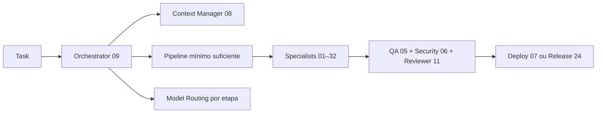

> 🌎 [English version](README.md) · 🇧🇷 Versão em Português

# Dev Team Kit — 71 Skills Especialistas para Coding Agents


> Um time completo de especialistas de software dentro do seu agente de código.  
> Cada task é roteada para o especialista certo, executada no modelo certo, e entregue com qualidade de produção.

### ✨ Novidades

| Versão | Destaque | Onde |
|---|---|---|
| **não lançado** | **Seis conceitos absorvidos de [bojieli/ai-agent-book](https://github.com/bojieli/ai-agent-book), cada um pousando no arquivo já responsável por aquele assunto em vez de virar skill/policy nova.** KV-cache-aware prompt construction (o prefixo do system prompt nunca muda, conteúdo dinâmico sempre entra no final da trajetória); o risco de prompt injection ficar dormente dentro da memória persistente até uma sessão futura reler aquilo como contexto confiável, mais um sidecar validation pattern (um modelo barato que vê só os campos estruturados `{name, args}` da tool-call, nunca o texto livre que poderia carregar o payload) para ferramentas de alto risco; handoff cross-vendor separando a trajetória portável (prosa + tool-calls reduzidas) das credenciais não-portáveis (tokens de sessão, IDs de conversa do provider original) que nunca devem atravessar a troca de vendor; uma tabela de roteamento em 4 destinos pra qualquer "sinal de aprendizado" (KB de experiência / prompt-skill / harness / pesos do modelo) mais um gate de boundary-set + retention-set antes de aceitar edição de skill; uma taxonomia de falha por camada (API/Tool/Context/Control-flow) pra debugar sistemas agênticos (`/loop`, `/swarm`, subagents); e um teste de "informação nova" mais a taxonomia MAST de falha multi-agente pra decidir quando vale a pena paralelizar. | [`policies/context-engineering.md`](policies/context-engineering.md), [`skills/06-security-review/SKILL.md`](skills/06-security-review/SKILL.md), [`skills/45-handoff-context/SKILL.md`](skills/45-handoff-context/SKILL.md), [`policies/memory-consolidation.md`](policies/memory-consolidation.md), [`agents/debugger.md`](agents/debugger.md), [`skills/40-parallel-dispatcher/SKILL.md`](skills/40-parallel-dispatcher/SKILL.md) |
| **v2.73.0** | **O backend de memória ganha suas próprias abas no dashboard, e dois bugs reais foram corrigidos no processo.** O backend `ai-memory` chegou na versão anterior sem nenhuma superfície visual própria além da web UI genérica do servidor de terceiros — sem busca funcional, timeline ou grafo. `scripts/dashboard-server.mjs` é novo: um servidor `node:http` pequeno (sem framework) que faz proxy de `POST /api/memory/*` pro transporte MCP-sobre-HTTP do `ai-memory` via `@modelcontextprotocol/sdk` (resolvido de `mcp-server/node_modules`, já dependência do kit) — o navegador nunca fala MCP diretamente. Ele também serve o `docs/preview/dashboard.html` existente (6 abas: Graph/Bench/Savings/Drift/Skill Quality/Trigger Eval, sem mudança, ainda gerado por `scripts/build-dashboard.mjs`), agora consolidado com 4 abas novas de memória na mesma navegação: **Busca** (busca híbrida ao vivo), **Timeline** (contagens de sessão/observação via `memory_briefing`), **Grafo**, e **Página** (leitor de markdown renderizado). A aba Grafo revelou que o `ai-memory` não tem nenhuma API de grafo estruturado — o "graph RRF" dele é uma técnica interna de ranking de busca, não um endpoint — e uma primeira tentativa de derivar arestas por tags compartilhadas de frontmatter deu zero sinal contra dados reais (logs migrados carregam só 2 tags universais mais uma tag de data única por página). A aba em vez disso deriva um grafo por co-ocorrência no próprio motor de busca híbrida: páginas que aparecem juntas nos resultados da mesma busca ganham uma aresta ponderada por proximidade de rank — uma aproximação, mas construída inteiramente de comportamento real de busca, sem relação inventada. A mesma investigação descartou ler o conteúdo de handoffs numa UI de "espiar": a única ferramenta de leitura, `memory_handoff_accept`, é single-use e marca o handoff como consumido, então o conceito de Handoffs foi reduzido a uma contagem segura e somente-leitura via `memory_briefing`, em vez de arriscar uma visualização de dashboard consumir silenciosamente o handoff pendente de um agente real. Dois bugs não relacionados apareceram e foram corrigidos no caminho: a aba Graph existente carregava `cytoscape-fcose@2.2.0` via CDN e deixava `cytoscapeFcose` undefined silenciosamente (`Cannot read properties of undefined (reading 'layoutBase')`) porque o build UMD dele espera globals `window.coseBase`/`window.layoutBase` que um `<script>` puro nunca fornece — corrigido carregando `layout-base` e `cose-base` antes dele, nessa ordem (isso presumivelmente nunca renderizou um grafo em nenhuma máquina que abriu o dashboard via CDN puro, já que a cadeia de dependências nunca foi satisfeita); e o canvas novo do grafo de memória renderizava com tamanho zero porque o CSS de dimensionamento do `#cy` era um seletor de ID, não compartilhado com o novo container `#mem-cy`. Os 8 scripts CDN externos (cytoscape, cytoscape-fcose, layout-base, cose-base, marked) agora carregam atributos SRI `integrity`/`crossorigin`. | [`scripts/dashboard-server.mjs`](scripts/dashboard-server.mjs), [`docs/preview/dashboard.html`](docs/preview/dashboard.html) |
| **v2.72.0** | **Backend `ai-memory` opcional, plugado automaticamente na instalação quando o Docker está disponível.** A memória nativa do kit (vault Zettelkasten + `memory-curator.mjs` autônomo, zero dependência externa) continua o padrão e o único backend em máquinas sem Docker. Quando o Docker existe, `scripts/ai-memory-setup.mjs` sobe sozinho o [akitaonrails/ai-memory](https://github.com/akitaonrails/ai-memory) (servidor Rust, MCP + hooks nativos, busca FTS5/híbrida, wiki OKF v0.2 versionada em git, continuidade cross-agent entre Claude Code/Codex/Cursor/Gemini CLI) e registra os hooks/MCP dele — sem perguntar nada, mesmo padrão que o kit já usa pros MCPs via npx. Os dois backends são mutuamente exclusivos por máquina: `hooks/scripts/utils.mjs` expõe `isAiMemoryActive()`, consultado por `session-start.mjs` (não dispara mais o curador nativo nem injeta `.curator-pending.md` quando ai-memory está ativo) e por `memory-curator.mjs` (recusa rodar, a menos que `--force` seja passado explicitamente) — rodar os dois em paralelo duplicaria captura e curadoria da mesma história, o bug real que motivou esse guard durante a migração de um vault de produção. A escolha do usuário é explícita e em camadas: `--memory-backend native|ai-memory` no instalador, variável de ambiente `DEVKIT_MEMORY_BACKEND=native`, ou `node scripts/ai-memory-setup.mjs --skip`; `--profile lean`/`--no-input` sempre caem no nativo (uma instalação não-interativa nunca deve baixar uma imagem Docker de ~200MB silenciosamente). A nova [`policies/memory-backends.md`](policies/memory-backends.md) documenta os dois lado a lado, incluindo o anti-padrão explícito citado na própria doc do ai-memory: o provider de LLM `anthropic-oauth` é sinalizado lá como não-oficial e contra os termos de uso da Anthropic — por isso a recomendação do kit é `openai` (API key) ou `openai-oauth` (assinatura ChatGPT, suportada oficialmente) como LLM provider, e `embedding_provider = local` (zero custo, zero chave) pra embeddings. | [`scripts/ai-memory-setup.mjs`](scripts/ai-memory-setup.mjs), [`policies/memory-backends.md`](policies/memory-backends.md), [`hooks/scripts/utils.mjs`](hooks/scripts/utils.mjs) |
| **v2.71.1** | **Hooks do Codex funcionando de verdade no Windows, e o kit instalável como plugin no Codex.** Todo hook do kit reportava `Failed` dentro do Codex enquanto passava rodado à mão. Ler o `command_runner.rs` do próprio Codex resolveu: `commandWindows` roda pelo *shell configurado* do usuário (PowerShell aqui), não pelo cmd — então o truque `for /f %G in ('git rev-parse …')` era parseado como PowerShell e morria com `"git rev-parse --show-toplevel" was unexpected at this time`. `commandWindows` agora é só `node hooks/scripts/runtime-dispatcher.mjs <Evento>`, válido nos dois shells; verificado 5/5 eventos `Completed` num `codex exec` real. Segundo fix: o Codex rejeita a entrada `{"source": "github"}` do marketplace no formato Claude, então um `.agents/plugins/marketplace.json` mínimo (primeiro path que o Codex procura) com `source: "./"` torna `dev-team-kit-fv@claude-skills-fv` instalável. O guia agora documenta como o Codex realmente executa hooks (shell, cwd, env, confiança por hash, a armadilha do BOM do PowerShell) e a receita de diagnóstico com `--dangerously-bypass-hook-trust`. | [`.codex/hooks.json`](.codex/hooks.json), [`.agents/plugins/marketplace.json`](.agents/plugins/marketplace.json), [`docs/skill-guides/codex-plugin-integration.md`](docs/skill-guides/codex-plugin-integration.md) |
| **v2.71.0** | **Três skills de campanha orientadas por evidência.** A skill 70 cria pesquisa e estratégia com fontes; a 71 transforma isso em rotas de copy distintas e seguras; a 72 entrega continuidade, papéis de referência, shot intents e overlays determinísticos. | [`skills/70-campaign-research-strategy/`](skills/70-campaign-research-strategy/), [`skills/71-campaign-copywriting/`](skills/71-campaign-copywriting/), [`skills/72-campaign-visual-direction/`](skills/72-campaign-visual-direction/) |
| **v2.70.0** | **Hooks portáveis entre Claude Code e Codex.** Um dispatcher compartilhado (`hooks/scripts/runtime-dispatcher.mjs`) normaliza o vocabulário de eventos e tools de cada runtime e roda os mesmos sensores canônicos do kit nos dois — o Claude Code continua com `hooks/hooks.json`, o Codex ganha `.codex/hooks.json`, ambos apontando pro mesmo dispatcher. Cobertura Codex completa de `SessionStart`, `UserPromptSubmit`, `PreToolUse`, `PostToolUse` e `Stop`, com fail-open por sensor: um sensor opcional quebrado vai pro `.auto/hook-errors.jsonl` em vez de derrubar a chamada da tool. Stop hooks agora sempre devolvem JSON válido pro runtime consumidor. | [`hooks/scripts/runtime-dispatcher.mjs`](hooks/scripts/runtime-dispatcher.mjs), [`.codex/hooks.json`](.codex/hooks.json), [`docs/skill-guides/codex-plugin-integration.md`](docs/skill-guides/codex-plugin-integration.md) |
| **v2.69.0** | **Duas skills novas pro pipeline completo 3D/2D de personagem (AccuRIG, Blender, IA de motion, MotionPlan, ComfyUI), a partir de whitepapers próprios do usuário.** O usuário forneceu 2 documentos técnicos originais (não são conteúdo de terceiro, ainda que ambos citem ferramentas de terceiro com licenças variadas, preservadas por completo sem esconder as restritivas). **Skill 68 (character-animation-3d)** trata o AccuRIG como fronteira de certificação do rig em vez de uma API headless que não existe, cobre o Blender como compilador CLI headless (`bpy`, `--background --python`), retargeting via delta de quaternion relativo à rest pose, e um mapa comparativo de 10 tecnologias de IA de motion — incluindo a distinção crítica entre o AI Deep Search do próprio AccuRIG (busca semântica sobre 4500+ motions já existentes) e um modelo de síntese de verdade. Todo script `bpy` de referência do documento fonte foi preservado literalmente, não resumido. **Skill 69 (character-pipeline-2d)** assume que o pipeline 3D da skill 68 já existe e cobre o `MotionPlan.json` como contrato — a LLM age como *diretora* (intenção/timing/fases/eventos), nunca como animadora produzindo rotação de bone crua, o que também fecha uma superfície de prompt injection —, as cinco estratégias de produção 2D, geração 2D nativa via Qwen-Image-Layered/Qwen-Image-Edit com tratamento de occlusion completion, Wan-Animate estritamente como motion reference/previs (um anti-padrão explícito avisa contra shipar vídeo gerado como frame final), ComfyUI como servidor de inferência headless, escolha de ferramenta de rig 2D esqueletal, o CLI unificado `assetctl`, e uma arquitetura de teste/CI em 5 grupos com cache de build content-addressed. Uma nota de processo: a skill 69 ficou pela metade numa rodada anterior quando o agente construtor bateu o limite de sessão da API logo depois de terminar o `SKILL.md`, mas antes dos 3 arquivos de referência — um agente novo retomou, tratando o `SKILL.md` já pronto como sua própria especificação, e terminou só o que faltava. | [`skills/68-character-animation-3d/`](skills/68-character-animation-3d/), [`skills/69-character-pipeline-2d/`](skills/69-character-pipeline-2d/) |
| **v2.68.0** | **Skill 40 ganha mecanismo de arbitragem para quando agentes paralelos discordam, mais um gate fail-closed.** Continuação da varredura do skills.sh — desta vez o topic `agent-workflows` e uma busca de infra (Kubernetes/Terraform). A maior parte já estava coberta com mais profundidade pela orquestração própria do kit (skill 09/40/programs) e pelo stack de deploy (skill 07/20/43/46), mas surgiu um gap conceitual real: **arbitragem por discordância** entre reviewers, com um **gate fail-closed** — o kit já faz fan-out de N reviewers em paralelo (skill 40, review de 4 agentes do `/swarm`) mas não tinha uma etapa formal pra quando eles chegam a vereditos incompatíveis sobre o mesmo achado. A fonte que revelou o padrão não tem licença declarada, então nada foi copiado — o mecanismo foi reimplementado do zero como ideia geral de design multi-agente, sem atribuição a essa fonte. Um terceiro agente agora arbitra sem saber qual reviewer disse o quê primeiro (evita viés de ancoragem), e a etapa seguinte do pipeline fica bloqueada até resolução — nunca prossegue silenciosamente com o achado mais otimista. Também confirmado como gap real, construção adiada a pedido do usuário: React Native/Expo (Tauri é WebView empacotada; React Native é bridge nativo — arquiteturas incompatíveis, não um superconjunto). | [`skills/40-parallel-dispatcher/references/arbitration-disagreement.md`](skills/40-parallel-dispatcher/references/arbitration-disagreement.md), [`policies/quality-gates.md`](policies/quality-gates.md), [`policies/swarm-protocol.md`](policies/swarm-protocol.md) |
| **v2.67.0** | **Varredura ampla do skills.sh em 4 categorias, confirmando principalmente que o kit já é bem completo.** Depois do usuário perguntar se tinha ficado faltando algo relevante, 4 agentes rodaram em paralelo cobrindo categorias ainda não checadas: backend/API/database, testing/security, frontend/React, e docs/devops/escrita técnica. Resultado desigual por design: **backend** achou 2 gaps reais e cirúrgicos, ambos absorvidos na skill 03 — idempotência (derivar a chave da *intenção* da operação em vez de um UUID por tentativa, claim atômico via unique constraint em vez de check-then-act, guard contra payload divergente, e 3 estratégias pra requisição duplicada em voo) de [addyosmani/agent-skills](https://github.com/addyosmani/agent-skills) (MIT), e recursos avançados específicos de Postgres — Row-Level Security via `CREATE POLICY`, `EXCLUDE USING gist` pra prevenir overlap de intervalo — de [wshobson/agents](https://github.com/wshobson/agents) (MIT). **Testing/security** não achou nada de novo além de um playbook de Playwright patterns (skill 05) — o kit já é forte nessa área. **Frontend/React** só trouxe a View Transition API nativa (skill 12) como adição pontual e opcional. **Docs/devops/writing** bateu num bloqueio real: a busca por termo (`?q=`) do site exige um token OIDC que a sessão não tem, e não existe rota de categoria pra esses termos — o agente recusou inventar candidatas a partir de um resultado sem filtro real em vez de forçar recomendação. Nenhuma skill nova nesta leva — só enriquecimento cirúrgico de 3 já existentes, confirmando que as duas rodadas anteriores já tinham capturado a maior parte do que o registro tinha de valioso. | [`skills/03-backend-api/references/idempotencia-e-postgres-avancado.md`](skills/03-backend-api/references/idempotencia-e-postgres-avancado.md), [`skills/05-qa-testing/references/playwright-patterns.md`](skills/05-qa-testing/references/playwright-patterns.md), [`skills/12-motion-design/references/view-transitions-api.md`](skills/12-motion-design/references/view-transitions-api.md) |
| **v2.66.0** | **Duas skills novas de game dev (66, 67), com tratamentos de licença opostos; skill 12 ganha gate de decisão e checklist de review de animação.** Fecha as duas investigações que a v2.65.0 tinha deixado pendentes. **Skill 66 (game-architecture-design)**, nova, cobre arquitetura de sistemas de jogo, design review e balanceamento numérico — o gap foi identificado lendo [Yuki001/game-dev-skills](https://github.com/Yuki001/game-dev-skills) (denso, profundidade real, mas **sem licença declarada**), então o conteúdo da skill é escrita inteiramente original: nenhuma frase portada ou parafraseada de perto da fonte, porque a licença dela não permite reuso de texto. **Skill 67 (game-engine-development)** cobre implementação real em Unity C# e Unreal C++ (ECS, otimização de performance, networking multiplayer) — código portado quase verbatim de [Jeffallan/claude-skills](https://github.com/Jeffallan/claude-skills) (MIT, 11k stars, a única fonte candidata com cobertura real de engine), com atribuição explícita. Ela avisa diretamente que Godot não tem profundidade real em nenhuma das fontes avaliadas, em vez de fingir paridade entre os 3 motores. **Skill 12** ganha `references/decision-gate-and-review.md`, combinando 3 fontes reais de [emilkowalski/skills](https://github.com/emilkowalski/skills) (MIT) achadas numa busca "animation" no skills.sh: gate de decisão de 4 perguntas mais varredura por 6 categorias de seam (de `find-animation-opportunities`), glossário reverso de ~30 termos de vocabulário de motion (de `animation-vocabulary`), e checklist de review com hierarquia de remediação em cascata — deletar → reduzir → easing → origem → interrompibilidade → GPU → timing assimétrico → polish → acessibilidade, incluindo o teto de 300ms pra UI e o anti-padrão `scale(0)` (de `review-animations`). | [`skills/66-game-architecture-design/`](skills/66-game-architecture-design/), [`skills/67-game-engine-development/`](skills/67-game-engine-development/), [`skills/12-motion-design/references/decision-gate-and-review.md`](skills/12-motion-design/references/decision-gate-and-review.md) |
| **v2.65.0** | **Duas skills novas (64, 65), skill 02 ganha dupla avaliação cega adversarial, skill 12 ganha o laboratório GSAP de 16 padrões do próprio usuário.** Leva completa de curadoria de fontes depois de investigar 13 candidatas do `skills.sh` (registro oficial da Vercel) mais 2 links trazidos direto pelo usuário, despachados como 6 agentes em paralelo. **Skill 64 (scroll-storytelling)**, nova do zero, adaptada de [nateherkai/scroll-craft](https://github.com/nateherkai/scroll-craft) (MIT): entrevista obrigatória de 8 perguntas antes de gerar qualquer coisa, 4 regras duras contra scrollytelling genérico (nunca repetir o mesmo "device" duas vezes seguidas, mundo fotográfico como default em vez do clichê "diorama de argila", sem câmera contínua a menos que o brief peça literalmente "uma jornada contínua", estrutura de página como eixo separado do estilo visual), 8 gramáticas de página mutuamente exclusivas, kit de 10 devices de scroll, e o motor vanilla JS/CSS zero-dependência copiado — cross-linkada com skill 12 (motion genérico) e skill 02 (decisão estética) sem duplicar nenhuma das duas. **Skill 65 (using-git-worktrees)** eleva o dispatcher enxuto `commands/worktree.md` do kit ao protocolo completo de [obra/superpowers](https://github.com/obra/superpowers) (MIT): detecção de isolamento existente com guard de submodule (evita worktree aninhado), preferência por ferramenta nativa — a investigação descobriu que `EnterWorktree`/`ExitWorktree` do próprio harness é exatamente o caso que o protocolo manda preferir em vez de `git worktree add` cru — e baseline de testes obrigatória antes de liberar a task ("uma baseline suja torna toda falha futura ambígua"), testado de verdade criando e detectando um worktree aninhado real. **Skill 02** ganha mecanismo de dupla avaliação cega (duas sub-avaliações isoladas — uma leitura de design, uma checagem de evidência determinística — que nunca veem o output uma da outra) mais um "veredito de especificidade de design", portado de [pbakaus/impeccable](https://github.com/pbakaus/impeccable) — **Apache-2.0, não MIT**, diferente do padrão recente MIT do kit, sinalizado explicitamente na entrada de Fontes. **Skill 12** ganha o laboratório de 16 microinterações GSAP do próprio usuário (modal, drawer, dropdown, accordion, tabs, chat com optimistic UI, busca com skeleton, toast, transição de rota, CRUD de lista sem teleporte, botão async, shake de validação, like com partículas, progresso) — material dele, sem risco de licença (diferente da entrada naocodei.com da v2.64.0), copiado como arquivo HTML navegável em vez de code-dump no `SKILL.md`. Duas investigações fechadas sem absorção ainda: **skills de game dev** ([Yuki001/game-dev-skills](https://github.com/Yuki001/game-dev-skills) se revelou raso em código de engine de verdade e sem licença; um artigo da Snyk revelou [Jeffallan/claude-skills](https://github.com/Jeffallan/claude-skills), MIT, 11k stars, que cobre Unity/Unreal/Godot de verdade — game dev fica candidato a várias skills focadas, não uma genérica, aguardando decisão do usuário) e **busca "animation" no skills.sh** (3 candidatas reais de [emilkowalski/skills](https://github.com/emilkowalski/skills) — gate de decisão de 4 perguntas, glossário de vocabulário de motion, checklist de review com hierarquia de escalação — mas a skill 12 já está no teto de 25KB, então qualquer uma exigiria um `references/` novo, também pendente). | [`skills/64-scroll-storytelling/`](skills/64-scroll-storytelling/), [`skills/65-using-git-worktrees/SKILL.md`](skills/65-using-git-worktrees/SKILL.md), [`skills/02-ui-ux-design/references/audit-framework.md`](skills/02-ui-ux-design/references/audit-framework.md), [`skills/12-motion-design/references/ui-motion-lab-gsap.html`](skills/12-motion-design/references/ui-motion-lab-gsap.html) |
| **v2.64.0** | **Skill 12 (motion-design) ganha 5 efeitos JS puro sem framework, com um risco de licença que o usuário assumiu conscientemente.** O usuário trouxe 3 links pra "fugir do genérico": `naocodei.com/free-code/`, `pinstack.app/components`, `motionsites.ai`. Um agente dedicado descartou os dois últimos — clones de UI de marcas reais atrás de paywall, e um infoproduto vendendo prompt sem código real, respectivamente — sobrando `naocodei.com` como o único com substância: ~66 animações vanilla JS/CSS funcionais, mas **sem licença declarada em lugar nenhum do site**. Alertei sobre o risco de redistribuição (código de terceiro sem autorização clara, dentro de um repo público MIT) antes de tocar em qualquer coisa; a resposta do usuário foi explícita: "copia mesmo assim, eu assumo o risco." Decisão dele, registrada como tal, não recomendação minha. 5 efeitos foram extraídos direto do runtime do site (`window.CODIGOS`, não um resumo reescrito) — cartões que empilham, rolagem com inércia, partículas em canvas, scramble de texto, fundo com shader WebGL fluido — indo pra um `references/naocodei-vanilla-effects.md` novo com o aviso de proveniência logo no topo, mais uma entrada em Fontes deixando claro que esta, diferente das outras citadas ali, não tem licença confirmada. Efeito colateral: a adição bruta levou a skill 12 a 36KB por um instante, zerando a nota de tamanho no gate de qualidade — essa skill não é um "hub" como a skill 02, só tinha acumulado código bruto demais no arquivo principal, então a correção foi mover o conteúdo denso pra `references/` em vez de adicionar mais uma exceção de tamanho. | [`skills/12-motion-design/SKILL.md`](skills/12-motion-design/SKILL.md), [`skills/12-motion-design/references/naocodei-vanilla-effects.md`](skills/12-motion-design/references/naocodei-vanilla-effects.md) |
| **v2.63.0** | **Corrigida a seção Beautiful UI na skill 25 (v2.62.0): erro meu de digitação, não instabilidade do site.** O usuário já tinha passado a URL correta na sessão anterior, mas toda tentativa de `WebFetch` continuava falhando com erro de DNS — documentei isso como "o site está instável", conclusão errada. O usuário apontou o erro direto: eu estava digitando a URL errada a cada nova tentativa (`www.beautifuil.dev` e variações próprias), não batendo num domínio realmente fora do ar. Confirmado ao vivo assim que copiei o valor exato: 20 componentes em 6 categorias (Loading & States, Text & Input, Cards & Feedback, Data Display, Navigation & Organization, Code & Advanced), licença MIT no rodapé, sem link de repositório/pacote/CLI publicado no site (isso continua genuinamente não confirmado). A ressalva da skill agora reflete o motivo real em vez de generalizar meu erro como se fosse uma afirmação sobre o produto de terceiro. | [`skills/25-ai-integration-architect/SKILL.md`](skills/25-ai-integration-architect/SKILL.md) |
| **v2.62.0** | **5 fontes externas curadas em 5 skills, via subagents em paralelo.** No meio da sessão, o usuário mandou 6 links pra usar "sempre que" o tipo de tarefa correspondente aparecesse — um agente de reconhecimento checou as 6 antes de qualquer edição e confirmou 5 gaps reais (medidos por grep) e 1 sem gap (um gerador de skeleton loading que duplicaria um padrão manual que a skill 04 já tem). [extend-hq/ui](https://github.com/extend-hq/ui) (MIT — viewers de PDF/DOCX/XLSX, e-signature, bounding-box citations) e [franciscop/brownies](https://github.com/franciscop/brownies) (MIT — storage unificado cookie/local/session/db com `subscribe()`) entraram na skill 04 em duas seções isoladas, editadas por dois agentes no mesmo arquivo sem colisão. [cathrynlavery/diagram-design](https://github.com/cathrynlavery/diagram-design) (MIT, 25k stars, gates de verificação geométrica testados adversarialmente) entrou na skill 10 como catálogo curado de tipos de diagrama — o princípio de verificação foi reescrito como checklist manual em vez de portar um script que o kit não roda. [guillermolg00/morphicons](https://github.com/guillermolg00/morphicons) (MIT, morph de ícone via spring physics) entrou na skill 12 pra trocas de estado reconhecíveis (play/pause, hambúrguer/X), com ressalva porque a lib ignora `prefers-reduced-motion` por default, divergindo da regra dura que a skill já tinha. [facebook/astryx](https://github.com/facebook/astryx) (MIT, design system oficial do Meta, 12k stars) entrou na skill 02 como opção de biblioteca de componente pronto — deliberadamente **não** integrado ao motor BM25 que v2.61.0 tinha acabado de portar, são camadas diferentes (decisão de estilo vs. componente pronto). Beautiful UI (`beautifui.dev`) entrou na skill 25 com ressalva honesta: o site ficou fora do ar com erro de DNS em várias tentativas (minhas e do agente), então a seção cita só o que um reconhecimento prévio confirmou, marcado explicitamente como não re-verificado ao vivo. Pego só ao validar depois: `skills/02-ui-ux-design/SKILL.md` já estava em 43KB **antes** desta sessão (dívida de absorções anteriores, não regressão nova), zerando a nota de tamanho no gate de qualidade e derrubando o score abaixo do mínimo bloqueante — em vez de fatiar às pressas mais conteúdo pra `references/` (que já tem 5 arquivos), `scripts/skill-quality-score.mjs` ganhou uma allowlist pequena e explícita de skills "hub" isentas do teto de tamanho por natureza. | [`skills/04-frontend-integration/SKILL.md`](skills/04-frontend-integration/SKILL.md), [`skills/10-documenter/SKILL.md`](skills/10-documenter/SKILL.md), [`skills/12-motion-design/SKILL.md`](skills/12-motion-design/SKILL.md), [`skills/02-ui-ux-design/SKILL.md`](skills/02-ui-ux-design/SKILL.md), [`skills/25-ai-integration-architect/SKILL.md`](skills/25-ai-integration-architect/SKILL.md) |
| **v2.61.0** | **Skill 02 (UI/UX) ganha motor de busca BM25 + 15 catálogos de decisão de design**, portados de [nextlevelbuilder/ui-ux-pro-max-skill](https://github.com/nextlevelbuilder/ui-ux-pro-max-skill) (MIT) — o kit já tinha absorvido uma fatia pequena desse repo em julho (só os anti-padrões por indústria), mas o projeto de origem cresceu bastante desde então: 84 estilos, 192 paletas, 74 pares de tipografia, 119 guidelines de UX/a11y com exemplo de código, 25 tipos de gráfico, 21 stacks. `design_search_core.py` porta o motor BM25 original quase inalterado (stdlib puro, já testado, calibração de score por domínio); `design_search.py` é um wrapper CLI mais enxuto que o original — deliberadamente não porta `--design-system`/`--persist`/os dials de intensidade (o gerador de design system completo deles), já que essa decisão já é papel da skill 02 em prosa, guiada por contexto real do projeto — portar o gerador daria ao kit duas formas de tomar a mesma decisão. Testado com queries reais em todo domínio (style, chart, ux, typography, stack, auto-detecção, `--json`) antes de commitar; resultado zero-match devolve aviso explícito de "não bateu neste índice local" em vez de cair silenciosamente no julgamento genérico. 2.12MB de dados reais (fontes do Google + ícones Phosphor redistribuídos sob licença aberta, não gerados). | [`skills/02-ui-ux-design/scripts/design_search.py`](skills/02-ui-ux-design/scripts/design_search.py), [`skills/02-ui-ux-design/data/`](skills/02-ui-ux-design/data/) |
| **v2.60.0** | **Checklist de estilo pra output publicado (landing, app, blog), fundida em `anti-ai-writing.md`.** Usuário trouxe uma instrução de estilo SHOULD/AVOID com lista nomeada de ~50 palavras banidas, usada em outro workflow de escrita, e pediu pra virar "skill humanizer". O kit já tinha `policies/anti-ai-writing.md` (29 padrões catalogados) e `/humanize` maduros — checado o overlap antes de decidir: boa parte já existia (em dash, hedging, conclusões genéricas, listas com cabeçalho). Só o que era genuinamente novo entrou, em vez de duplicar skill: banimento total de em dash/ponto-e-vírgula/markdown/asteriscos/hashtags, mas **escopado a contexto plain-text** (copy de landing, texto de app, script de vídeo) — não docs técnicos, onde markdown é o formato esperado; a lista nomeada como checklist de grep literal; regras explícitas de variação estrutural (parágrafos/frases do mesmo tamanho, listas com bullets idênticos, múltiplos parágrafos com a mesma abertura gramatical); e transições conversacionais falsas ("here's the thing", "let that sink in") como extensão do signposting já catalogado. `/humanize` ganhou flag `--plain` pro modo output publicado. O hook `ai-writing-detector` ganhou 2 padrões novos (transição falsa, vocabulário de marketing banido), testados contra falso positivo em texto técnico limpo antes de landar — as palavras mais genéricas da lista (can, may, just, that...) ficaram fora do regex de propósito (alto volume de falso positivo em prosa legítima) e continuam como checklist manual. Skills 13 (marketing-copy) e 41 (blog-publisher) tiveram o gate atualizado pra citar a nova seção explicitamente. | [`policies/anti-ai-writing.md`](policies/anti-ai-writing.md), [`commands/humanize.md`](commands/humanize.md), [`hooks/scripts/ai-writing-detector.mjs`](hooks/scripts/ai-writing-detector.mjs) |
| **v2.59.0** | **Taxonomia de citação em IA na skill 61 e 2 gaps do Ahrefs na skill 14.** Usuário trouxe 3 artigos perguntando se davam pra aplicar — gap medido por grep antes de tocar em qualquer coisa; a maior parte do artigo do Ahrefs (37 táticas) era ferramenta específica sem princípio reutilizável, 2 gaps sobreviveram à triagem. Do Backlinko: o protocolo de baseline de citação em IA (skill 61, §1.5) agora roda 4 tipos distintos de prompt (avaliação/reputação/comparação/lacuna — evita que o conjunto vire só um tipo por ser mais fácil de escrever), 2-3 execuções por prompt por sessão (resposta de LLM varia entre rodadas — uma única passada mede ruído, não sinal), e o conceito de **"ghost ranking"** — a marca é citada como fonte mas o concorrente é recomendado, pior que não aparecer porque passa como número bom na planilha enquanto a decisão de compra vai pro concorrente do mesmo jeito; cadência trocada de mensal para **medir semanalmente, agir mensalmente com 4 semanas de tendência** (agir sobre uma semana ruidosa isolada era o próprio modo de falha). Do Ahrefs: a skill 14 ganhou um **fan-out query mapper** (decompor a keyword alvo nas sub-perguntas que o leitor — ou o fan-out de busca de um LLM — precisaria resolver, comparar contra o que já foi publicado, tratar toda sub-pergunta sem resposta como buraco de cobertura) e um **bloco de FAQ pós-artigo com perguntas reais do leitor** (Backlinko documentou 32% de lift de tráfego num experimento controlado com 21 posts), ligado ao schema `FAQPage` que a skill já tinha como template. O padrão de um terceiro artigo (still-antes-de-animar pra vídeo) foi aplicado por engano mais cedo na mesma sessão, fora do que o usuário de fato havia selecionado, e revertido antes deste commit assim que percebido. | [`skills/61-content-growth-engine/SKILL.md`](skills/61-content-growth-engine/SKILL.md), [`skills/14-seo-specialist/SKILL.md`](skills/14-seo-specialist/SKILL.md) |
| **v2.58.0** | **Fix de fronteira de palavra no matcher do roteador de plugins** — auto-auditoria buscando melhoria pro kit achou mais 2 instâncias de uma classe de bug recorrente: trigger curto de uma palavra só (`"ui"`, `"ux"`) casando por substring dentro de palavra sem relação — `"a **equi**pe pediu suporte"` e "entender esse **flu**xo" puxavam design-quality indevidamente. Mesma família de bug achada 4 vezes antes (`"nda"` em "cale**nda**rio", `"cac"` em "**cac**he"), corrigida cada vez com patch pontual de `when_none` — whack-a-mole que deixava a classe viva pra próxima palavra nova. Desta vez corrigido na raiz: `scripts/lib/plugin-catalog.mjs` e `mcp-server/src/lib/plugin-router.ts` (mantidos em paridade — mesma lógica, JS e TS) agora aplicam **fronteira de palavra** (`\b...\b`) a qualquer trigger de uma palavra só; trigger multi-palavra (`"um nda"`, `"auditar essa tela"`) mantém substring puro, já é específico o bastante. Validado contra as funções reais `routeTask()`/`routePluginComposition()`, não uma sonda reimplementada: os dois falsos positivos somem com **zero** edição de `when_none`, os casos legítimos (`"preciso de ajuda com UI"`, `"assinar NDA"`) continuam casando, 23/23 routing evals e 25/25 testes da fixture de paridade CLI↔MCP (incluindo o teste dedicado "CLI and MCP route contract stay in parity") passam sem alteração. | [`scripts/lib/plugin-catalog.mjs`](scripts/lib/plugin-catalog.mjs), [`mcp-server/src/lib/plugin-router.ts`](mcp-server/src/lib/plugin-router.ts) |
| **v2.57.0** | **`policies/readiness-gate.md`** — usuário perguntou se valia aplicar o BMAD-METHOD (o real, github.com/bmad-code-org, 52k★ — não confundir com um conceito pessoal de mesma sigla vindo de um post LinkedIn/Medium sem relação, checado e descartado explicitamente) ao kit. Mapeei os 5 agentes nomeados deles (Analyst, PM, UX, Architect, Dev) contra as skills 01/02/38/03-05/09 do kit — **~80% já coberto** com outro nome. Três gaps reais confirmados por grep, zero ocorrência cada: um veredito de prontidão nomeado e persistido antes de qualquer slice chegar em implementação; um artefato de status vivo, relido antes de cada novo slice — não um relatório escrito uma vez e esquecido; e `correct-course` como processo nomeado pra mudança de escopo no meio do slice, em vez de retrabalho silencioso. Policy nova: **veredito de três estados — PASS / CONCERNS / FAIL**, nunca dois (dois estados escondem o caso real mais comum: "pronto pra começar, mas com uma ressalva conhecida que não pode ser esquecida"). Referenciada nas skills 09 (o gate fica entre UI/UX e Backend/Frontend no pipeline), 01 (critério de aceitação não-testável reprova o gate), 38 (decisão de arquitetura pendente reprova) e `policies/vertical-slices.md` (dependência de slice não resolvida é um dos critérios de reprovação) — em vez de duplicada em cada uma. `docs/context/sprint-status.yaml` é o artefato vivo; `correct-course` pausa um slice em andamento, registra a mudança de estado, e roda o gate de novo em vez de retrabalhar em cima de uma premissa que já mudou. | [`policies/readiness-gate.md`](policies/readiness-gate.md) |
| **v2.56.0** | **`policies/visual-diff-precision.md`** — o usuário relatou que comparar dois screenshots pra achar diferença fina (poucos pixels de deslocamento, espaçamento levemente diferente, cor sutilmente diferente) só faz a IA reconhecer "padrão enorme". Confirmado como limite estrutural documentado, não problema de prompt: a própria doc de visão da Anthropic afirma que o raciocínio espacial é limitado e coordenadas de localização são aproximadas; a mitigação validada é uma **ferramenta de crop/zoom**, não um prompt melhor escrito — uma passada sobre a imagem inteira é limitada pela resolução fixa do encoder, que nenhuma instrução de "olhe com mais cuidado" recupera. Policy nova: protocolo de 4 passes — decompor por região **e** por dimensão (posição/espaçamento/cor/tipografia nunca pedidos juntos), listar hipóteses com coordenada em pixel absoluto (nunca afirmadas como fato), dar zoom/crop em cada região hipotetizada, depois confirmar ou descartar cada uma isoladamente contra o crop ampliado — a mesma disciplina de verificação que `claim-verification.md` já aplica a saída de comando, agora aplicada a visão. Referenciada nas skills 02 (modo auditoria), 56 (validação de correção de layout antes/depois) e 62 (bug visual achado por persona) em vez de duplicada em cada uma. Achado de passagem: `check-consistency` não validava a contagem de policies em lugar nenhum, então tinha derrapado em silêncio pra "59 policies" com 60 reais — adicionado o mesmo padrão de guarda usado no badge de contagem de skills. | [`policies/visual-diff-precision.md`](policies/visual-diff-precision.md) |
| **v2.55.0** | **Skill 63 `mobile-paywall-checkout`** — UI/UX de seleção de plano e checkout de pagamento em apps mobile, destilada do design doc próprio do usuário sobre pricing/checkout Android (estado das fontes: 15/08/2026). Buraco medido antes de escrever: 13 de 16 conceitos-chave — `Play Billing`, `PaymentIntent`, `idempotency key`, `3DS`, `Mercado Pago`, `Checkout Bricks`, `purchase token`, `cupão`, `promo code`, `base plan`, `billing period`, `entitlement`, `Google Pay` — tinham **zero** ocorrência no kit inteiro. A skill 60 já era dona do modelo de dados de backend pra pagamento (tabela `Subscription` unificada, RTDN, reconciliação), mas nada era dono do **lado de UI**: a tela do paywall, o campo de cupão, os estados de pagamento. A decisão central da skill, herdada do documento original: ajudar o usuário a *escolher* um plano antes de pedir que *resolva* o pagamento — o plano-alvo pode ter mais peso visual, mas preço, periodicidade, renovação e alternativas nunca podem ser ocultados ou apresentados de forma enganosa. É dona da decisão de arquitetura de cobrança logo de cara (funcionalidade digital vendida dentro de um APK distribuído pela Play geralmente exige Play Billing — mostrar `[ Pagar com Stripe ]` ali não é decisão puramente visual, é risco de política de plataforma), do modelo de 4 entidades (tier/periodicidade/oferta/método de pagamento nunca fundidos num único card), do **cupão collapsed por padrão** (campo visível sinaliza que existe preço melhor e manda usuário sem código caçar um — pesquisa de checkout da Baymard), e da distinção entre promo code do Play (concede teste grátis, nunca motor genérico de "25% off") e cupão de comerciante — mostrar "25% aplicado" na UI quando o purchase sheet vai cobrar o preço cheio quebra confiança e viola a exigência de consistência de preço do Play. Guia dividido em 8 arquivos em `docs/skill-guides/mobile-paywall-checkout/` (decisão de billing, wireframes de seleção de plano, UX de cupão, estados de pagamento/3DS, acessibilidade, experimentação/métricas, QA/timeline), preservando os wireframes e tabelas de decisão do documento original em vez de resumi-los. | [`skills/63-mobile-paywall-checkout/SKILL.md`](skills/63-mobile-paywall-checkout/SKILL.md) |
| **v2.54.0** | **Modo dual auditoria/implementação na skill 02.** O usuário trouxe um protocolo próprio de auditoria UI/UX (fluxo de 9 passos, 7 arquivos de referência modulares, classificação de achado, tabela de 8 colunas) e pediu para avaliar se valia incorporar — não para aplicar cegamente. Um agente de pesquisa checou as 8 peças contra as skills 02/11/22/56/57 com evidência de arquivo+linha antes de qualquer decisão: **6 peças não existiam** em lugar nenhum do kit, e as outras 2 (dark patterns, estados de componente) estavam fragmentadas em 3-4 skills sem ponto de consolidação. A skill 02 tinha um modo só: desenhar do zero. Agora tem dois que nunca se misturam — **auditoria** (zero alteração de arquivo, só achados) e **implementação** (edição restrita à causa do achado, só quando autorizada explicitamente); pedido ambíguo é tratado como auditoria e a skill pergunta antes de editar, porque editar num pedido que só pedia análise é o erro mais caro que o protocolo existe para evitar. `references/audit-framework.md` novo traz o fluxo de 9 passos, a classificação de achado em **norma/evidência/heurística/preferência** (preferência nunca vira bloqueador na tabela), hierarquia de 6 níveis de evidência, priorização por **severidade × alcance × frequência × confiança** (4 eixos combinados, não um score único), a tabela de achados de 8 colunas, e definição de pronto com 7 critérios. Mais 3 arquivos de referência cobrem superfície de marketing, produto e formulário/checkout — linkando, não duplicando, as skills 22/56/57/61 já existentes. Achado de passagem: 2 dos 10 prompts do eval de trigger da skill estavam quebrados desde a criação do eval na v2.12.0, sem que ninguém tivesse rodado `eval-triggers` contra a skill 02 até agora. | [`skills/02-ui-ux-design/references/audit-framework.md`](skills/02-ui-ux-design/references/audit-framework.md) |
| **v2.53.0** | **5 gaps de um estudo Figma aplicados à skill 02.** O usuário colou um estudo próprio da biblioteca Design Basics do Figma (18 seções) como material de referência, não como pedido de ação — mesmo padrão das rodadas anteriores com a Blush: medir o gap real antes de aplicar, não transcrever só porque chegou pronto. Um agente de pesquisa checou 5 candidatos a gap contra as skills 02/22/56/57 com evidência de arquivo+linha: **4 gaps reais confirmados**, **1 falso alarme descartado** (o checklist final de 6 categorias do estudo *não* é redundante com Nielsen — Nielsen audita interação de interface pronta; o estudo cobre estratégia/estrutura/validação, que Nielsen não toca — então virou adição, não descarte). Adicionado: **três camadas de token** (primitivo → semântico → componente — o bloco de tokens existente era escala solta sem essa hierarquia, então um rebranding virava busca-e-substituição arriscada em 40 arquivos em vez de trocar uma linha); **divulgação progressiva** nomeada como conceito próprio (antes 5 palavras soterradas na linha de Hick-Hyman); **dark patterns** como categoria nomeada (os itens individuais já existiam espalhados — urgência sem manipulação na skill 13, "manipulação" isolada na skill 02 — sem conceito guarda-chuva); **wireframe baixa vs. alta fidelidade** como estágios distintos (a skill usava "wireframe" genérico em toda parte); e um **checklist de fechamento** para estratégia/estrutura/validação, as pontas que Nielsen não cobre. O trigger `"cancelar assinatura"` foi cogitado e descartado depois da sonda: colidia com trabalho de feature legítimo como "implementar o endpoint de cancelar assinatura" — reescrito para exigir o sinal real de intenção ("dificultar o cancelamento"), verificado nos dois sentidos antes de fechar. | [`skills/02-ui-ux-design/SKILL.md`](skills/02-ui-ux-design/SKILL.md) |
| **v2.52.0** | **Skill 62 `persona-driven-issue-audit`** — auditoria em massa de produto existente via personas simuladas, destilada de um case real: 4 personas, 100 issues abertas com dedup por rota, um agente de análise de solução comentando causa e trade-offs em cada uma sem corrigir nada, uma frota de 10 agentes cada um pegando uma issue e chegando a PR (confiança alta) ou a um `wontfix` específico, um reviewer aprovando 42 de 60 PRs com a mesma régua de qualquer review, e 24 issues objetivas sobrando para triagem humano+IA depois de filtrar falso positivo e duplicata — zero teste quebrado, zero merge automático. O buraco: nada no kit distinguia isso do `/swarm`, que constrói feature *nova* a partir de spec, story a story. Esta skill audita produto *existente*, persona → issue em vez de story, e o que importa não é a contagem bruta de issues — é o funil: cada fase existe para que a próxima receba menos, com mais contexto. Dedup pela **rota + causa raiz, nunca título** (título varia por persona, o mesmo menu quebrado não). Confiança para PR automática exige causa raiz identificada, fix local, cobertura de teste existente ou trivial, e ficar fora de pagamento/auth/dado pessoal — qualquer coisa aquém disso é `wontfix`/`needs-human` com motivo específico, nunca genérico. PR aprovada é explicitamente diferente de PR mergeada — merge continua humano, mesma regra do `--auto-merge` do `/swarm`. | [`skills/62-persona-driven-issue-audit/SKILL.md`](skills/62-persona-driven-issue-audit/SKILL.md) |
| **v2.51.0** | **Skill 61 `content-growth-engine`** — estratégia de conteúdo como sistema de aquisição. O kit já sabia escrever copy (13/50), otimizar uma página (14), publicar um post (41), reportar campanha (55) e ligar clique a receita (59) — mas nada decidia **o que produzir, em que ordem e por quê**. Buraco medido por grep: `intenção de busca`, `topic cluster`, `link interno`, `content refresh`, `share of voice`, `ICP`, `calendário editorial` e `objeção de venda` tinham **zero** ocorrência em todas as skills, policies e templates. A skill inverte os dois defaults que fazem programa de conteúdo falhar: prioriza por **intenção comercial e não por volume de busca** (50 buscas de um diretor de compras valem mais que 5.000 de estudante — volume dimensiona o esforço, intenção decide a ordem), e **começa pelo fundo do funil**, onde 100 visitas convertem o que 10.000 de topo não convertem. Inclui baseline reproduzível de citação em IA (conjunto fixo de prompts, sessão limpa, datado por modelo — mudar os prompts invalida a série histórica), cota reservada de refresh (sem ela o novo sempre ganha e o acervo apodrece), objeções de call de vendas como fonte do conteúdo de fundo de funil, e medição honesta: tráfego de IA é parcialmente cego, então o campo aberto "como nos conheceu" é a única captura de um canal que a analytics não vê. | [`skills/61-content-growth-engine/SKILL.md`](skills/61-content-growth-engine/SKILL.md) |
| **v2.50.0** | **As decisões que vêm *antes* do layout: paleta, leis cognitivas e estado vazio.** A área de design já sabia auditar (Nielsen, checkers) e verificar (v2.49.0) — faltava a camada anterior a existir layout. Buraco medido por grep no kit inteiro, não suposto: `Hick`, `Fitts`, `Gestalt`, `Von Restorff`, `carga cognitiva`, `teoria da cor`, `OKLCH` e todos os esquemas de cor tinham **zero** ocorrência; estado vazio existia em uma única linha de checklist. O sintoma: o bloco de tokens da skill 02 avisa *“NEVER default to Inter/Roboto/Arial without justification”* e logo abaixo entrega uma escala pronta de azul Tailwind **sem nota equivalente** — mandava decidir a fonte e servia a cor decidida, origem exata da UI genérica que a v2.49.0 aprendeu a detectar depois de pronta. A skill 02 ganha três seções: **Derivar a Paleta** (esquema a partir de um hue de marca, escala em **OKLCH e não HSL** — mesma `lightness` em hues diferentes não é mesmo brilho percebido — cor de marca separada de cor semântica, contraste validado *antes* de fechar, 60/30/10); **Leis Cognitivas** (17 leis e vieses nomeados, cada um enunciado como *a decisão que força* e não como definição — complementa Nielsen em vez de duplicar: Nielsen audita o que está pronto, estas decidem a estrutura antes de desenhar); e **Estado Vazio** (6 tipos que não se resolvem com a mesma mensagem, cada um precisando de *o que aconteceu + ação clicável* — sem CTA é tela morta, e ilustração não substitui ação). O checker ganha `raw-hex-sprawl`, testada contra arquivo ruim, bom e real antes de entrar. | [`skills/02-ui-ux-design/SKILL.md`](skills/02-ui-ux-design/SKILL.md), [`scripts/check-design-generic.mjs`](scripts/check-design-generic.mjs) |
| **v2.49.0** | **Qualidade de design vira verificação, não descrição.** O kit tinha 8 skills de design e conteúdo bom, mas nada *provava* nada: zero eval para as cinco skills que produzem pixel, `rules/frontend/ui-design.md` proibindo indigo genérico em prosa, e `pre-build-gate` saindo com `process.exit(0)` — sempre passa. A própria rule documenta um bench onde 3 agentes produziram 3 UIs indigo quase idênticas; a correção foi escrever a regra, e ninguém rodou o bench de novo pra provar que mudou algo. Agora: **`check-design-generic.mjs`** detecta a assinatura do default estatístico (indigo `#4f46e5`/`#6366f1`, `system-ui` como fonte declarada, gradiente roxo→rosa "AI SaaS", preto puro como superfície, `100vh` sem `dvh`), cada achado com *por que* e *o que fazer*; **`check-contrast.mjs`** computa o ratio WCAG real por par texto/superfície **nos dois temas**, pareando superfície semântica só com texto da mesma família pra não afogar em falso positivo; **`design-anchor-guard`** (PreToolUse) **bloqueia** escrita de arquivo visual com sinal inequívoco de default, com escape hatch `design-anchor: allow`; **5 evals** para as skills 02/12/22/56/57, cada um com seção "Reprova Se"; e **`bench/ab/score-design.mjs`** pontua cada braço 0–100 pra "a regra funcionou?" ter número. A primeira captura do checker foi `#6366f1` no template de blog do próprio kit — ele pregava "decida o accent" entregando exatamente a cor que o modelo escolhe quando não decidiu nada. | [`scripts/check-design-generic.mjs`](scripts/check-design-generic.mjs), [`scripts/check-contrast.mjs`](scripts/check-contrast.mjs), [`hooks/scripts/design-anchor-guard.mjs`](hooks/scripts/design-anchor-guard.mjs) |
| **v2.48.0** | **Skill 60 `app-reference-architecture`** — extraída por engenharia reversa de 3 apps reais em produção do autor (Next.js + Tauri v2, web + APK Android) num molde reutilizável, pra um app novo nascer em estrutura já testada em vez de rederivar tudo do zero. Cobre auth dual (cookie de sessão pra web, Bearer JWT ou token Supabase pro app Tauri, resolvido por uma única função central por rota de API — nunca duplicada rota a rota), o problema do build estático (script que renomeia — nunca deleta — Server Actions e layouts com `getServerSession()` antes do `next build --output export`, restaura tudo num `finally`), pagamento dual (Stripe + Google Play Billing, obrigatório pela política da Play Store pra assinatura digital dentro de APK, convergindo numa única tabela `Subscription` com `platform`/`status`, RTDN reconciliado por cron diário já que push não garante entrega), push dual (Web Push/VAPID + FCM via credencial base64 em env var), e uma tabela de decisão (JWT vs Supabase, Prisma vs `pg` puro, single-app vs monorepo, assinatura vs ledger de créditos, síncrono vs worker BullMQ) que transforma as divergências dos 3 apps de origem em escolha consciente em vez de copy-paste. Referência completa dividida em 10 arquivos (`docs/skill-guides/app-reference-architecture/`). | [`skills/60-app-reference-architecture/SKILL.md`](skills/60-app-reference-architecture/SKILL.md), [`docs/skill-guides/app-reference-architecture.md`](docs/skill-guides/app-reference-architecture.md) |
| **v2.47.0** | **Skill 59 `closed-loop-revenue`** + profundidade de motion na skill 12. O kit sabia reportar campanha (skill 55) e instrumentar evento de produto (skill 21), mas nada ligava clique pago ao dinheiro que de fato entrou: `GCLID`, `measurement plan`, `margem de contribuição`, `conversão offline` e `smart bidding` tinham **zero** cobertura. A skill 59 é dona dessa cadeia — identidade (GCLID/UTM/`transaction_id`/CRM, cada um com uma função e não intercambiáveis), backend como fonte de verdade da receita (o `purchase` client-side perde pagamento assíncrono, dispara duas vezes no refresh e morre com bloqueador), reconciliação com **tolerância declarada** que bloqueia escala de mídia quando estourada, e a conta que muda decisão: break-even ROAS = 1 / margem de contribuição, então com margem de 40% um ROAS de 2,0 aparece verde no painel e destrói valor. Para lead gen, enviar de volta a venda fechada — não o formulário preenchido. A skill 12 ganha continuidade de objeto (shared element/FLIP), feedback multimodal com regra de redundância (nenhum sinal crítico pode existir *só* em som ou háptico), limite de flash da WCAG 2.3.1 (risco de convulsão — antes sem cobertura) e segurança vestibular, mais uma seção explícita de **quando não animar**. | [`skills/59-closed-loop-revenue/SKILL.md`](skills/59-closed-loop-revenue/SKILL.md), [`skills/12-motion-design/SKILL.md`](skills/12-motion-design/SKILL.md) |
| **v2.46.0** | **Skill 58 `i18n-localization`** — o buraco mais surpreendente do kit: i18n aparecia exatamente **uma vez** em todas as skills, policies e rules (como o item de checklist "locales suportados"), com zero cobertura de pseudolocale, RTL, expansão de texto ou formatters por locale. i18n é trabalho de arquitetura, não de tradutor — frase concatenada, botão de largura fixa, data montada à mão e `margin-left` quebram no contato com outro idioma, e nenhum tradutor conserta isso. Cobre externalização com chave semântica, plural via API da plataforma (2 formas funciona em pt/en e quebra em russo/árabe), formatters com armazenamento canônico, +30% de expansão como piso de teste, propriedades lógicas para RTL (com a lista do que **não** espelha: números, logo, ícone de mídia), e pseudolocale/RTL como regressão em vez de verificação manual única. Também: skill 02 ganha tabela de adoção de design system (Carbon/Fluent/M3/HIG/primitivas, escolhido por tipo de produto — a âncora estética e o design system são decisões separadas) e matriz de componente de feedback por gravidade (erro que exige ação nunca é toast: some e leva a informação junto). | [`skills/58-i18n-localization/SKILL.md`](skills/58-i18n-localization/SKILL.md), [`docs/skill-guides/i18n-localization.md`](docs/skill-guides/i18n-localization.md) |
| **v2.45.0** | **Skill 57 `mobile-ux-foundations`** — as decisões que antecedem o layout, cada uma ancorada em dado biométrico, fisiológico ou comportamental, não em gosto. **Zona do polegar**: ~75% navegam com o polegar e ~49% com uma mão só, com precisão caindo para ~61% no terço superior — por isso a navegação primária mora embaixo, e por isso uma ação destrutiva no canto difícil é recurso, não defeito. **Fisiologia do dark mode**: `#000000` puro é erro (halation contra astigmatismo, smearing OLED no scroll, e mata elevação porque sombra precisa de luz residual), então `#121212` é a superfície base e elevação se expressa por superfícies *mais claras*. **Performance percebida**: os limiares 100ms/1s/10s, por que skeleton vence spinner entre 1–10s, e por que loader abaixo de 1s é pior que nada. **UX de auth/onboarding**: passkeys em primeiro plano com bootstrap key e warm handover de ~30 dias, NIST SP 800-63B contra regras draconianas de senha (sem "confirmar senha", colagem permitida), label flutuante em vez de placeholder, validação inline no blur, e permission priming antes de todo diálogo nativo. | [`skills/57-mobile-ux-foundations/SKILL.md`](skills/57-mobile-ux-foundations/SKILL.md), [`docs/skill-guides/mobile-ux-foundations.md`](docs/skill-guides/mobile-ux-foundations.md) |
| **v2.44.0** | **Skill 56 `responsive-conversion`** — converte UI pensada pra desktop em UI que funciona de verdade no mobile, e é dona dos padrões de interação que a conversão expõe. Preenche um buraco real: responsividade eram 9 linhas na skill 02, e modal/confirmação existiam só como pergunta do checklist de Nielsen. Inclui catálogo sintoma→causa raiz→fix (`min-width: auto` como o motivo real de um filho de flex/grid "não pegar 100%", `dvh` vs `vh`, `env(safe-area-inset-*)` pro notch e barra de gestos, caça a scroll horizontal), protocolo de auditoria em 4 fases testado em 320/390/768px, tabela de decisão modal vs. bottom sheet com requisitos não-negociáveis (focus trap, retorno de foco, scroll lock que funciona no iOS), e padrões de ação destrutiva por reversibilidade (preferir Desfazer a Confirmar; confirmação por digitação em ação catastrófica). | [`skills/56-responsive-conversion/SKILL.md`](skills/56-responsive-conversion/SKILL.md), [`docs/skill-guides/responsive-conversion.md`](docs/skill-guides/responsive-conversion.md) |
| **v2.43.0** | `/catalog-project` agora sintetiza `product`, `sessions` e `operations` no manifesto, alimentando o app companheiro `project-brain` (catálogo cross-repo). Confere `git remote -v` antes de gravar valor real de secret. | [`commands/catalog-project.md`](commands/catalog-project.md) |
| **v2.42.0** | **Skill 55 `marketing-reporting-analytics`** — operações de marketing analytics, distinta do escopo de tracking de produto da skill 21: estrutura de relatório de performance de Ads/GA4 (fórmulas de ROAS/CPA/CTR, seções adaptadas por audiência), checklist técnico de setup GA4+GTM em 4 fases ("configurado" só após validação da Fase 4, não apenas instalação da tag), auditoria de infraestrutura de dados de marketing em 8 categorias com PASS/FAIL/PARTIAL + severidade, e calculadoras financeiras de CAC-payback/ROI/ROAS (custo totalmente carregado, payback ajustado por churn). | [`skills/55-marketing-reporting-analytics/SKILL.md`](skills/55-marketing-reporting-analytics/SKILL.md) |
| **v2.41.0** | **Catálogo de roteamento de plugins** — `plugins/catalog/*.json` agrupa as 53 skills em 9 composições orientadas a tarefa (development, design-quality, product-marketing, release-ops, core-discovery, ai-integration, mais 3 plugins externos/alto-risco: finance, legal, Context7 docs). `node scripts/route-task.mjs "<tarefa>"` (e a tool MCP `devkit_route_task`) retornam a menor composição útil, com nível de risco e flag de revisão humana pra recomendações externas — roteadores CLI e MCP verificados em paridade via suite de fixtures compartilhada. Feedback estruturado de roteamento (`accepted`/`overridden`/`rejected`) alimenta `/insights` e `/savings`, com rotação por tamanho pra o log não crescer sem fim. Também: gerador de config MCP pro Kimi Code, transporte HTTP opcional do Context7 (junto do stdio padrão), um boot check real via JSON-RPC stdio do MCP server plugado no `devkit doctor` + CI (os evals de roteamento checam *o que* é recomendado; isso checa se o *recomendador* de fato sobe), correção de path do installer no Windows/Git Bash, e skills de design/SEO expandidas (dials numéricos de intensidade + anti-padrões por indústria na skill 02, biblioteca copy-paste `templates/transitions.css`, e seções de local/e-commerce/internacional na skill 14). | [`plugins/catalog/`](plugins/catalog/), [`policies/plugin-catalog.md`](policies/plugin-catalog.md), [`scripts/route-task.mjs`](scripts/route-task.mjs) |
| **v2.40.0** | **Skill 53 `doubt-driven-review`** — absorvida de [addyosmani/agent-skills](https://github.com/addyosmani/agent-skills) (MIT, 76.7k stars). Revisão adversarial EM VOO — diferente do gate pós-hoc de PR da skill 11 — pra decisão não-trivial enquanto corrigir rota ainda é barato: CLAIM (nomear a decisão) → EXTRACT (menor unidade revisável, sem o raciocínio) → DÚVIDA (revisor de contexto fresco, prompt adversarial, viesado a refutar) → RECONCILIA (classificar findings: contrato mal-lido / acionável / trade-off / ruído) → PARA (limitado a 3 ciclos). Referência cruzada na skill 11 (reviewer). Também apertou o protocolo de Deep Interview da skill 01 (`templates/deep-interview.md`) com a disciplina `interview-me` do mesmo repo: pergunta com palpite anexado, sonda "want vs. should-want", linha "fora de escopo" obrigatória no restate, e gate de confirmação explícito mais rígido. | [`skills/53-doubt-driven-review/SKILL.md`](skills/53-doubt-driven-review/SKILL.md), [`templates/deep-interview.md`](templates/deep-interview.md) |
| **v2.39.0** | **Absorção de ideias (não código) de ponytail + repowise + paper COMPILOT** — a escada de 7 degraus do ponytail antes de gerar código (YAGNI → já existe no codebase → stdlib → feature nativa → dependência instalada → one-liner → só então código novo), como policy + hook PreToolUse, mais modo delete-list pro `/simplify` e skill 23; deduções ponderadas por risco na skill 18 (harnessability score), risk banding qualitativo no `/diff-impact` e skill 11, e o padrão de truncamento reversível `_meta.omitted` documentado em `mcp-builder-patterns.md`, todos do repowise (só conceitos — o repowise em si é AGPL); a taxonomia de anti-parada-prematura e feedback categorizado do paper COMPILOT PACT 2025 aplicada ao `/loop` e `/swarm`. | [`policies/`](policies/), [`hooks/scripts/pre-code-ladder-guard.mjs`](hooks/scripts/pre-code-ladder-guard.mjs) |
| **v2.38.0** | **Skill 52 `ui-polish`** — absorvida do agent skill externo [jakubkrehel/make-interfaces-feel-better](https://github.com/jakubkrehel/make-interfaces-feel-better) (MIT). 16 princípios de acabamento visual: border radius concêntrico, alinhamento óptico, sombra em vez de borda, animações interrompíveis, split/stagger de entrada, saída sutil, animação contextual de ícone (valores exatos: scale 0.25→1, blur 4px→0, spring bounce 0), font smoothing, tabular numbers, text wrapping (balance/pretty), image outline (preto/branco puro, nunca tintado), scale on press (0.96), skip animation on load, proibição de `transition: all`, `will-change` moderado, hit area mínima de 40×40px. Referência cruzada nas skills 12 (motion-design, dona do sistema de tokens) e 02 (ui-ux-design, checklist pós-Frontend). | [`skills/52-ui-polish/SKILL.md`](skills/52-ui-polish/SKILL.md), [`docs/skill-guides/ui-polish.md`](docs/skill-guides/ui-polish.md) |
| **v2.37.0** | **Absorção de 7 ebooks (Casa do Código)** — só o gap real virou skill nova: **skill 51 `ux-research`** (discovery qualitativo — entrevista com usuário, persona baseada em pesquisa, journey map, teste de usabilidade, arquitetura de informação; fica *antes* do PO 01 e do UI/UX 02). O resto virou incremento cirúrgico: 3 policies de XP (`pair-programming`, `continuous-integration`, `sustainable-pace`, ligadas à skill 37); skill 01 ganha **Fundamento de Negócio** (validação de hipótese, MVP, monetização, AARRR, product-market fit — do *Guia da Startup*); skill 14 ganha **Keyword Research** (KEI, intent, cauda longa) + **Off-Page/Link Building**; skill 07 ganha **Infrastructure as Code** (provisionamento declarativo, idempotência, drift — princípios de DevOps mapeados pra Terraform/Ansible); skill 38 ganha lentes de coesão/acoplamento, seam distribuído (REST/async/RPC, HATEOAS) e camadas. Jogos HTML5 Canvas descartado (nicho <2%). | [`skills/51-ux-research/SKILL.md`](skills/51-ux-research/SKILL.md), [`policies/pair-programming.md`](policies/pair-programming.md) |
| **v2.36.0** | **Skill 50 `direct-response-copy`** — copy de direct response destilada de 3 ebooks clássicos de copy PT-BR: biblioteca de fórmulas de headline em 20 categorias de gatilho (357 modelos destilados em fórmulas parametrizadas), os 8 gatilhos mentais + estrutura de storytelling de venda, copy de Instagram (legenda/engajamento). Gate de integridade obrigatório: sem claim não-verificável, sem depoimento fabricado, escassez só real. Complementa a skill 13 (copy de produto) — 13 cobre landing/microcopy/brand voice, 50 cobre ads/página de vendas/e-mail/social. | [`skills/50-direct-response-copy/SKILL.md`](skills/50-direct-response-copy/SKILL.md), [`skills/50-direct-response-copy/references/headline-formulas.md`](skills/50-direct-response-copy/references/headline-formulas.md) |
| **v2.27.0** | **Investigate-first guard** — princípio com enforcement ativo: a IA nunca deve perguntar ao usuário algo que ela mesma pode descobrir. Hook PreToolUse intercepta `AskUserQuestion`, detecta pergunta auto-descobrível (user do github, gh logado, branch, package manager, porta, versão de runtime, stack, conta de MCP) e manda rodar o comando primeiro (`gh auth status`, `git config`, Glob lockfile, MCP `whoami`) em vez de interromper. Não bloqueia — educa. Conservador: preferência/intenção/trade-off passam livres. 10/10 padrões descobríveis pegos, 5/5 perguntas legítimas passam. | [`policies/investigate-first.md`](policies/investigate-first.md), [`hooks/scripts/investigate-first-guard.mjs`](hooks/scripts/investigate-first-guard.mjs) |
| **v2.26.0** | **Absorção ECC (rodada 2)** — `silent-failure-hunter` (16º subagent, review-only: caça `catch{}` vazio, erros engolidos, fallbacks perigosos, stack traces perdidos, rollback faltando) + skill 49 `context-budget` (audita peso de contexto carregado por componente, headroom + alertas de overflow; distinto do cost-tracker que mede completions runtime) + comando `/context-budget`. | [`agents/silent-failure-hunter.md`](agents/silent-failure-hunter.md), [`skills/49-context-budget/SKILL.md`](skills/49-context-budget/SKILL.md) |
| **v2.25.0** | **Rules system path-scoped** (`.claude/rules/` com `paths:` glob — o harness anexa um padrão de codificação só quando um arquivo editado casa o glob, layering common+linguagem, inspirado no [ECC](https://github.com/affaan-m/ECC)) + paydown de dívida: corrigido o bug da allowlist de subagents (o 15º subagent `anti-ai-writing` faltava na allowlist enumerada), reconciliado o count drift, e reescritos os 5 skills stub (19/21/22/24/27) com profundidade real. | [`rules/`](rules/), [`policies/rules-system.md`](policies/rules-system.md) |
| **v2.24.0** | Memory curator vira **autônomo** — o agente lapida a própria memória sem pedir permissão. Async no SessionStart, faz decay/archive/dedup em JS puro (zero LLM) e delega só o merge *semântico* ao agente já presente da sessão (sem forkar `claude -p` = sem cobrar 2×). | [`hooks/scripts/memory-curator.mjs`](hooks/scripts/memory-curator.mjs), [`policies/memory-curator.md`](policies/memory-curator.md) |
| **v2.23.0** | Absorção curada de addozhang — skill 48 `research-prep`, playbook de migração Spring Boot 2→3 (skill 23), padrões de memória mem9 no session-start + skill 08. | [`skills/48-research-prep/SKILL.md`](skills/48-research-prep/SKILL.md), [`skills/23-migration-refactor-specialist/playbooks/spring-boot-2-to-3.md`](skills/23-migration-refactor-specialist/playbooks/spring-boot-2-to-3.md) |
| **v2.22.0** | Memory curator (primeira versão) — hook Stop disparado por inatividade que *sugeria* `/consolidate-memory`. Substituído pelo curador autônomo na v2.24.0. | [`policies/memory-curator.md`](policies/memory-curator.md) |
| **v2.21.0** | Context-cost guards — automatiza as 9 táticas de economia de plano. `topic-shift-detector` sugere `/clear` ao mudar de assunto; `session-start` avisa CLAUDE.md gordo (>200 linhas) + MCPs do projeto. Sensores conservadores (precisão > cobertura, falso positivo treina o user a ignorar avisos). | [`hooks/scripts/topic-shift-detector.mjs`](hooks/scripts/topic-shift-detector.mjs), [`policies/token-efficiency.md`](policies/token-efficiency.md) |
| **v2.20.0** | Skill 47 `pattern-conformity` — detecta e codifica padrões de coding do projeto existente (naming, estrutura de arquivos, error handling, testing style, async, DI, API design) em `memory/patterns.md`. Novo código é restringido por esses padrões. 46/46 eval-triggers PASS. | [`skills/47-pattern-conformity/SKILL.md`](skills/47-pattern-conformity/SKILL.md), [`evals/triggers/47-pattern-conformity.json`](evals/triggers/47-pattern-conformity.json) |
| **v2.19.1** | Polish pass: bugs no `skill-health.mjs` (parser YAML multiline), 9 overlaps cross-section refinados, 4 commands ganharam frontmatter. Portfolio limpo: 0 overlaps, 0 dead policies, 100% cobertura de fixture, 45/45 eval-triggers PASS. | [`scripts/skill-health.mjs`](scripts/skill-health.mjs), [`docs/skill-health.md`](docs/skill-health.md) |
| **v2.19.0** | Absorção curada de ECC/gstack/mattpocock/ruflo — 3 skills novas (zoom-out, handoff-context, post-deploy-canary-monitor), 6 commands (instinct-export/import/promote, multi-plan, aside, skill-health), `policies/boil-the-lake.md`, truth-score em verification + stream-chain em programs-schema. | [`docs/plans/2026-05-27-v2.19.0-absorption-plan.md`](docs/plans/2026-05-27-v2.19.0-absorption-plan.md), [`docs/inspiration/ruflo-evaluation.md`](docs/inspiration/ruflo-evaluation.md) |
| **v2.18.0** | Dashboard web interativo: 6 tabs (Graph, Bench, Savings, Drift, Skill Quality, Trigger Eval). Zero-build, zero-dep, single-file HTML + CDN. | [`docs/preview/dashboard.html`](docs/preview/dashboard.html), [`scripts/build-dashboard.mjs`](scripts/build-dashboard.mjs) |
| **v2.17.0** | `/diff-impact` (ripple analysis) + graph auto-update hook (PostToolUse regenera graphify-out após Edit/Write). | [`commands/diff-impact.md`](commands/diff-impact.md), [`scripts/diff-impact.mjs`](scripts/diff-impact.mjs) |

**Como usar:** ver [`docs/quickstart.md`](docs/quickstart.md) com os 4 cenários (gerar imagem CLI, swarm com geração automática, bootstrap do template, adapters em runtime).

---

### 📖 Wiki Completa — ponto de partida recomendado

| Idioma | Link |
|---|---|
| 🇧🇷 **Português** | [`docs/WIKI.pt-BR.md`](docs/WIKI.pt-BR.md) |
| 🌎 **English** | [`docs/WIKI.md`](docs/WIKI.md) |

Cada skill, subagent, command, policy, plugin e MCP tool documentado — no formato do post [aihero.dev "5 Agent Skills I Use Every Day"](https://www.aihero.dev/5-agent-skills-i-use-every-day).

---

### 📊 Bench de Qualidade — resultados medidos, sem marketing

Testamos cada skill e subagent com rubrica publicada. 53 cenários de isolamento + 3 testes end-to-end. Mesmo modelo, mesmo prompt — com e sem o kit. Números medidos, código real, resultados auditáveis.

| Idioma | Link | Destaques |
|---|---|---|
| 🇧🇷 **Português** | [`analyze-doc/index.pt-BR.html`](analyze-doc/index.pt-BR.html) | 92.6% pass rate · +1.84 delta médio · 53/53 E2E verdes |
| 🌎 **English** | [`analyze-doc/index.en.html`](analyze-doc/index.en.html) | Same report in English |

Inclui before/after com texto completo dos outputs, scores delta por skill, resultados dos testes process-based, e verificação dos fixes da v2.10.1. Metodologia em [`eval-bench/`](eval-bench/).

---

## Por Que Isso Importa (Para Qualquer Pessoa)

Se você usa IA pra construir produto — seja um dev experiente, um indie hacker fazendo SaaS, ou alguém que só sabe descrever o que quer — esse kit muda o jogo. Em linguagem simples, o que ele faz:

### 💰 Economiza sua conta de API (até 70%)
A IA adora ler tudo: o output inteiro de um `npm install`, stack traces repetidos, listas enormes de arquivos. Tudo isso vira token, que vira dinheiro. O kit **comprime automaticamente** esse ruído antes de mandar pro modelo — você paga só pelo que importa.

### 🧠 Entende o que você quer antes de sair fazendo
Em vez de um agente genérico que "chuta" a implementação, o kit tem um **orquestrador** que lê seu pedido, classifica a complexidade, e monta o pipeline mínimo necessário. Se você for vago, ele pergunta. Se for claro, ele executa. Nunca sai inventando.

### 🗂️ Memória persistente entre sessões
A maioria dos agentes esquecem tudo quando você fecha a janela. Esse aqui **lembra**: o que você decidiu, quais arquivos são importantes, que padrões o seu projeto segue, que bugs apareceram antes. Resultado: menos retrabalho, menos token gasto recontextualizando, e respostas muito mais assertivas a cada sessão.

### 🤖 Modo autônomo — manda e esquece
Dá uma task complexa com `/auto` ou `/loop` e vai tomar um café. O agente executa, testa, corrige, valida e **só para quando está pronto, funcional e testado**. Tem circuito de segurança: se travar no mesmo erro 3x, detecta e avisa — não fica queimando API à toa.

### 🖼️ Geração de imagem profissional, sem placeholder
Landing page com caixinha cinza "imagem aqui"? Nunca mais. O kit integra **fal.ai** com prompts escritos por um especialista em IA generativa — você descreve a cena, o sistema traduz em prompt técnico, e entrega imagens prontas pra produção. Ilustrações, hero images, ícones, mockups, todos consistentes com a sua marca.

### 🔒 Segurança antes do deploy, não depois do vazamento
Um **auditor de segurança** pensa como atacante e revisa o código antes dele chegar em produção. Findings críticos vêm com prova de conceito. Nada de descobrir vulnerabilidade na conta do cliente.

### 🧪 Testes que realmente provam que funciona
Um **engenheiro de QA** que segue o princípio "prove-it": se você disse que funciona, me prove com um teste. Nada de "parece ok". Cobre cenários de sucesso, falha, edge cases e regressão.

### 🎨 Design e copy que vendem
- **Designer** com análise competitiva: olha os concorrentes e recomenda o que converte
- **Copywriter** especialista em marketing: texto pronto pra landing, email, anúncio
- **SEO** que otimiza antes do Google indexar — seu site nasce achável

### 🚀 Do zero ao deploy sem contratar 5 freelancers
Backend, frontend, mobile (Tauri), observability, analytics, acessibilidade (WCAG), refatoração, release, documentação — **37 especialistas no total**. Cada task vai pro profissional certo, com o modelo de IA certo (Haiku pro simples, Sonnet pro médio, Opus pra arquitetura) — você não paga Opus pra gerar boilerplate.

### 🔌 Funciona em tudo que você já usa
Plugin nativo do **Claude Code** + MCP server universal que roda em **Cursor, Windsurf, Copilot, Gemini CLI** e qualquer agente compatível com MCP. **Zero vendor lock-in.** Trocou de ferramenta? Seu time vai junto.

### 🆓 Grátis, Apache-2.0, open source
Sem mensalidade. Sem trial. Sem tier premium escondido. Clona, instala, usa pra sempre — inclusive em projeto comercial. Apache-2.0 com arquivo `NOTICE` força atribuição rio abaixo: quem reempacotar o kit é obrigado a manter o crédito de quem moldou as ideias dentro dele.

---

## O Que É

O **Dev Team Kit** é um conjunto de 62 skills especializadas que transforma qualquer agente de coding compatível em um time completo de desenvolvimento — com orchestrator, backend, frontend, QA, security, deploy, design, copy, SEO, observability e mais.

**O que você ganha:**

- **Pipeline estruturado** — cada task passa pelas etapas certas, na ordem certa, sem improvisar
- **QA, Security e Reviewer obrigatórios** — nenhuma entrega sai sem validação
- **Model routing automático** — haiku para boilerplate, sonnet para implementação, opus para arquitetura
- **Lifecycle hooks** — o agente detecta contexto vago, re-lê arquivos antes de editar, monitora custo de tokens
- **MCP server próprio** — 37 tools expostas para qualquer cliente MCP
- **Memória persistente** — working set, context pack, learned skills com confidence scoring acumuladas por projeto
- **Instalação multi-plataforma** — Claude Code, Cursor, Windsurf, Copilot, Gemini CLI e mais

### Construído sobre princípios de Context Engineering

A arquitetura do kit se mapeia para a [hierarquia de engenharia de contexto](https://github.com/davidkimai/Context-Engineering): skills individuais são **átomos**, templates são **moléculas**, learned-skills + working-set são **células**, subagents despachados são **órgãos**, e programs compostos por protocol shells são a **camada de campo emergente**. Novidade na v1.1: protocol shells tipados em 3 subagents piloto, schemas de I/O em `schemas/skill-io/`, scoring de iteração no circuit breaker do auto-loop, e definições declarativas em `programs/`. Veja `docs/WIKI.md → Context Engineering Stack`.

> **Tour de 5 min:** [`docs/SKILLS-OVERVIEW.md`](docs/SKILLS-OVERVIEW.md) — toda skill, modo, subagent e policy em uma página navegável (formato aihero.dev).

---

## Instalação Rápida

### Modo 1 — Plugin Global (Claude Code)

Instala as 38 skills e hooks globalmente. Funciona em qualquer projeto sem configuração adicional.

```bash
# Via Claude Code CLI
claude plugin install https://github.com/felvieira/claude-skills-fv
```

O que é instalado globalmente: skills, hooks, commands (`/audit-repo`, `/devkit-install-fv`, `/plan-feature`, `/review-release`, `/inventory-assets`).

### Modo 2 — Kit Completo por Repo (via comando)

Com o plugin instalado, rode dentro do repo que quer configurar:

```
/devkit-install-fv
```

Isso instala `.bot/` completo: MCP server, policies, templates, docs, hooks, learned-skills e configs multi-plataforma.

### Modo 3 — Bash Direto

```bash
git clone https://github.com/felvieira/claude-skills-fv /tmp/dev-team-kit
bash /tmp/dev-team-kit/setup/install.sh /caminho/do/projeto
```

Se o kit já estiver em `.bot/`, você também pode rodar diretamente do repo instalado:

```bash
bash .bot/setup/install.sh
```

O instalador inclui `setup/` e todos os diretórios do kit em `.bot/`. Suporta flags de perfil não-interativo:
- `--profile lean` — instala sem MCP e sem scripts pesados
- `--no-input` — sem prompts, usa defaults
- `--yes` — aceita tudo automaticamente

Na tabela abaixo, considere o `dev-team-kit` como 37 tools apoiadas pelas 38 skills.
O MCP expoe 37 tools apoiadas pelas skills instaladas.

### Comparativo dos Modos

| O que é instalado | Plugin Global | /devkit-install-fv | Bash direto |
|---|:---:|:---:|:---:|
| 62 skills | ✅ | ✅ | ✅ |
| Hooks (lifecycle) | ✅ | ✅ | ✅ |
| Slash commands | ✅ | ✅ | ✅ |
| Policies | ❌ | ✅ | ✅ |
| MCP server (37 tools) | ❌ | ✅ | ✅ |
| Templates de handoff | ❌ | ✅ | ✅ |
| Docs + repo-audit | ❌ | ✅ | ✅ |
| Configs multi-plataforma | ❌ | ✅ | ✅ |
| Learned skills por projeto | ❌ | ✅ | ✅ |

---

## Plataformas Compatíveis

| Plataforma | Skills | Hooks | MCP | Slash Commands | Notas |
|---|:---:|:---:|:---:|:---:|---|
| **Claude Code** | ✅ | ✅ | ✅ | ✅ | suporte completo — plugin nativo |
| **Cursor** | ✅ via `.bot/` | ❌ | ✅ | ❌ | skills via AGENTS.md, MCP via config |
| **Windsurf** | ✅ via `.bot/` | ❌ | ✅ | ❌ | skills via rules, MCP via `.windsurf/mcp.json` |
| **GitHub Copilot** | ✅ via `.bot/` | ❌ | ❌ | ❌ | skills via `.github/copilot-instructions.md` |
| **Gemini CLI** | ✅ via `.bot/` | ❌ | ✅ | ❌ | skills via GEMINI.md, MCP via `.gemini/settings.json` |
| **OpenCode** | ✅ via `.bot/` | ❌ | ✅ | ❌ | skills via AGENTS.md |
| **Antigravity** | ✅ via `.bot/` | ❌ | ✅ | ❌ | skills via config local |

> Para plataformas sem hooks nativos, as mesmas regras estão em `policies/hooks.md` — o agente as aplica manualmente.

---

## Os 62 Especialistas

### Gestao e Coordenacao

| # | Skill | O que faz |
|---|---|---|
| 08 | **Context Manager** | rastreia foco, tasks abertas, arquivos quentes e handoffs entre sessões |
| 09 | **Orchestrator** | define o pipeline mínimo suficiente, delega para specialists, adapta em caso de rejeição |
| 10 | **Documenter** | registra decisões, contratos de API, operações e impactos em docs vivos |
| 11 | **Reviewer** | valida o delta final antes de liberar — qualidade, escopo e risco |
| 17 | **Image Generator** | gera e adapta assets visuais via fal.ai com suporte a t2i, i2i, rembg e ícones Tauri |
| 18 | **Repo Auditor** | fotografia completa do repo — stack, convenções, riscos, entry points e dívida técnica |
| 19 | **Asset Librarian** | inventaria logos, ícones, fontes, tokens visuais e assets reutilizáveis |
| 20 | **Observability SRE** | define logs estruturados, métricas, tracing, alertas e plano de rollback |
| 21 | **Data Analytics** | define eventos de tracking, naming, funis e KPIs de produto |
| 22 | **Accessibility Specialist** | revisa WCAG 2.2, navegação por teclado, semântica HTML e motion reduction |
| 23 | **Migration & Refactor Specialist** | conduz migrações incrementais, feature flags e rollback seguro |
| 24 | **Release Manager** | organiza changelog, release notes, versionamento e rollout gradual |
| 25 | **AI Integration Architect** | projeta adapters de IA, gateways, streaming, fallbacks e custo de inferência |
| 26 | **Prompt Engineer** | cria e itera prompts, templates reutilizáveis e estratégias de few-shot |
| 27 | **Video Integration Specialist** | integra vídeo generativo com foco em UX, latência e formatos de output |
| 28 | **CLAUDE.md Generator** | gera `CLAUDE.md` inteligente para projetos consumidores do kit |
| 30 | **Cost Tracker** | rastreia custo de tokens e API calls por sessão, por skill e por tier de modelo |
| 31 | **Session Summary** | consolida resumo de sessão para handoff limpo entre sessões longas |
| 32 | **Smart Suggestions** | sugere a próxima ação mais impactante baseado no estado real do projeto |
| 33 | **Detective Spec** | engenharia reversa de specs executáveis a partir de código legado — módulos, regras de negócio, fluxos, ADRs retroativos, zero writes fora de `_detective_sdd/` |
| 35 | **Skill Author** | meta-skill para criar, editar, avaliar e otimizar as próprias skills do kit — sustenta o kit conforme cresce além de 37 especialistas |
| 38 | **Architecture Deepener** | encontra deepening opportunities (deletion test, deep modules) usando glossário de domínio + vocabulário arquitetural; pareia com skill 23 (Migration & Refactor) para execução |

### Produto e Design

| # | Skill | O que faz |
|---|---|---|
| 01 | **PO** | escreve spec, histórias de usuário, critérios de aceitação e define prioridade |
| 02 | **UI/UX Designer** | define layout, sistema de tokens, responsividade e heurísticas de uso |
| 29 | **Design Intelligence** | pesquisa concorrentes, captura screenshots, analisa tendências visuais e entrega dossier estratégico para UI/UX |
| 36 | **Web Asset Generator** | favicons (multi-size), PWA icons (incl. maskable), Open Graph e Twitter card images, manifest e snippets de meta tags — derivados de logo ou texto da marca |
| 56 | **Responsive Conversion** | converte UI desktop-first em mobile, corrige layout quebrado (por que filho de flex/grid não pega 100%, `dvh` vs `vh`, safe area, scroll horizontal) e é dona dos padrões de modal/bottom sheet e confirmação destrutiva |
| 57 | **Mobile UX Foundations** | ergonomia da zona do polegar (onde a navegação pode morar), fisiologia do dark mode (`#121212`, nunca preto puro), performance percebida (skeleton vs. spinner por faixa de duração) e UX de auth/onboarding/permissão (passkeys, regras NIST de senha, permission priming) |
| 58 | **i18n & Localization** | prepara o produto para outro idioma, região ou direção de escrita *antes* de existir tradutor: externalização de string, plural via API da plataforma, formatters por locale, +30% de expansão de texto, RTL com propriedades lógicas, e pseudolocale/RTL como teste de regressão |
| 59 | **Closed-Loop Revenue** | fecha a cadeia do clique pago até a margem: identidade (GCLID/UTM/`transaction_id`/CRM), backend como fonte de verdade da receita, reconciliação com tolerância declarada, break-even ROAS derivado da margem de contribuição real, e conversão offline para o bidding de lead gen aprender com venda fechada, não com formulário preenchido |

### Desenvolvimento

| # | Skill | O que faz |
|---|---|---|
| 03 | **Backend Engineer** | APIs REST/GraphQL, contratos, auth, validação, banco de dados e integrações |
| 04 | **Frontend Engineer** | React/Next.js, estado, chamadas de API, performance e experiência do app |
| 12 | **Motion Designer** | animações, transições, micro-interações e comportamento visual coeso |
| 15 | **Mobile / Tauri** | extensão opcional para apps desktop e mobile com Tauri + React Native |
| 60 | **App Reference Architecture** | molde para apps novos que precisam de login + pagamento + push + web app + APK Android a partir de um único código-fonte Next.js + Tauri — auth dual, pagamento dual (Stripe + Google Play IAP), push dual, script de build estático, Docker/CI-CD, destilado de 3 apps reais em produção |

### Conteudo e Descoberta

| # | Skill | O que faz |
|---|---|---|
| 13 | **Marketing Copy** | copy de produto, CTAs, landing pages, brand voice e mensagens de conversão |
| 14 | **SEO Specialist** | metadata, schema.org, Core Web Vitals, sitemap e discoverability |
| 61 | **Content Growth Engine** | conteúdo como sistema de aquisição, não calendário de publicação: intenção de busca extraída de call de vendas e ticket de suporte (nunca só do volume), clusters ordenados por intenção comercial, baseline de citação em IA medido contra um conjunto fixo de prompts, cadência dimensionada contra capacidade real, cota de refresh para o acervo não apodrecer, objeção de vendas virando página de fundo de funil, e sucesso medido em pipeline — não em sessão |

### Qualidade e Entrega

| # | Skill | O que faz |
|---|---|---|
| 63 | **Mobile Paywall & Checkout** | UI/UX de seleção de plano e checkout de pagamento em apps mobile — decisão de arquitetura de cobrança (Play Billing vs. PSP externo, não é decisão puramente visual), fluxo periodicidade → plano → cupão → pagar → autenticar → confirmar, hierarquia de plano-alvo sem manipulação, estados de pagamento com a regra de que "voltou do 3DS" não é sinônimo de aprovado nem de recusado, e campo de cupão collapsed por padrão — campo visível sinaliza que existe preço melhor e manda usuário sem código caçar um |
| 62 | **Persona-Driven Issue Audit** | audita em massa um produto existente via personas simuladas ponta a ponta até PR, e roda mesmo sem nenhuma persona pré-escrita: infere proto-personas do próprio repositório (rotas, formulário, texto de erro), oferece janela de confirmação humana sem bloquear, depois testador com contexto fresco por persona, dedup de issue por rota + causa raiz (nunca título), agente de análise de solução que comenta causa e trade-offs sem corrigir, frota de até 10 agentes cada um pegando uma issue e abrindo PR (confiança alta) ou comentando `wontfix`/`needs-human` com motivo específico, review com a mesma régua de qualquer PR, e triagem humana leve para o que sobra — sem merge automático |
| 05 | **QA Engineer** | testes unitários, integração, E2E, cobertura e edge cases críticos |
| 06 | **Security Reviewer** | OWASP Top 10, headers, CORS, CSRF, XSS, injeção e exposição de dados |
| 34 | **Static Analysis** | scan automatizado de segurança e bugs via Semgrep + CodeQL com output SARIF, triagem de severidade e integração CI — alimenta findings na skill 06 |
| 37 | **TDD Engineer** | red-green-refactor enforced; combate anti-padrão horizontal slicing (escrever todos os testes antes de toda impl); 1 teste → 1 impl → repete. Pareia com skill 38 para deep modules |
| 07 | **Deploy Engineer** | containerização, CI/CD, rollout blue-green, rollback e infra como código |

---

## Pipeline Principal



### Pipelines Comuns

| Tipo de tarefa | Pipeline |
|---|---|
| Feature completa | `PO → UI/UX → Backend → Frontend → Motion → Copy → SEO → QA → Security → Reviewer → Deploy` |
| Bug fix | `Backend → QA → Security → Reviewer → Deploy` |
| Hotfix crítico | `Backend → Security → Reviewer → Deploy` |
| Melhoria de UI | `UI/UX → Frontend → Motion → QA → Security → Reviewer → Deploy` |
| Landing page | `Copy → Design Intelligence → UI/UX → Frontend → SEO → QA → Reviewer` |
| Integração de IA | `Repo Auditor → AI Architect → Prompt Engineer → Backend → Observability → QA → Security → Reviewer` |
| Release formal | `Reviewer → Observability SRE → Release Manager → Deploy` |

---

## Model Routing — Modelo Certo para Cada Etapa

| Tier | Modelo | Quando usar |
|---|---|---|
| Fast | haiku | boilerplate, rename, microcopy, templates, formatação |
| Balanced | sonnet | implementação, testes, debug, integração, design |
| Deep | opus | arquitetura, security review, orquestração, decisões críticas |

**Enforcement automático (Claude Code):**
- `EnterPlanMode` → hook sugere `/model opus`
- `ExitPlanMode` → hook sugere `/model sonnet`
- Subagent sem `model` explícito → hook alerta e sugere tier por keywords

**Em outros ambientes:** seguir `policies/model-routing.md` manualmente.

---

## Hook System — Inteligência em Lifecycle Events

| Hook | Evento | O que faz | Perfil |
|------|--------|-----------|--------|
| `pre-execution-gate` | UserPromptSubmit | detecta prompt vago e confirma antes de agir | standard, strict |
| `keyword-detector` | UserPromptSubmit | injeta skill ou learned skill relevante automaticamente | standard, strict |
| `context-guard-stop` | Stop | avisa em 50% (não-bloqueante) e bloqueia em 75% com resumo inteligente | todos |
| `persistent-mode` | Stop | bloqueia stop quando pipeline está ativo | todos |
| `pre-tool-enforcer` | PreToolUse | re-lê antes de editar, sugere code intelligence tools | todos |
| `investigate-first-guard` | PreToolUse | intercepta `AskUserQuestion`, bloqueia pergunta auto-descobrível (user do github, branch, package manager, porta…) e manda rodar o comando primeiro | standard, strict |
| `session-start` | SessionStart | restaura estado da sessão anterior e injeta skill-discovery | standard, strict |
| `post-tool-verifier` | PostToolUse | detecta debugging patterns, sugere extração de learned skill | standard, strict |
| `model-routing-hook` | PreToolUse | sugere troca de modelo em plan mode e valida subagent spawns | standard, strict |
| `simplify-ignore` | PreToolUse + PostToolUse | Protege blocos `simplify-ignore-start/end` de simplificação automática | standard, strict |

### Perfis de Hook

Controlados pela variável de ambiente `DEVKIT_HOOK_PROFILE` (padrão: `standard`):

| Perfil | Hooks ativos |
|--------|-------------|
| `minimal` | `context-guard-stop`, `persistent-mode`, `pre-tool-enforcer` |
| `standard` | todos |
| `strict` | todos |

- **`DEVKIT_HOOK_PROFILE`** — define o perfil ativo (`minimal`, `standard` ou `strict`)
- **`DEVKIT_DISABLED_HOOKS`** — lista separada por vírgula de hookIds a desativar independente do perfil

### Context Guard — Strategic Compact

O hook `context-guard-stop` opera em dois níveis:
- **50%** — aviso não-bloqueante: sugere `/compact` enquanto ainda há margem
- **75%** — bloqueio inteligente: exibe hint da task atual, arquivos editados na sessão e decisões do working set antes de bloquear

---

## Subagents — Especialistas Despacháveis via `Task` Tool

O kit inclui 16 subagents Claude Code em `.claude/agents/`, prontos para despachar com a `Task` tool ou invocar pelo prompt.

### Core (5)
| Subagent | Quando usar | Tools |
|---|---|---|
| `code-reviewer` | Review de PR, feature concluída ou qualquer código antes de merge | Read, Grep, Glob, Bash |
| `security-auditor` | Auth flows, input handling, deps, CORS, headers, pré-deploy | Read, Grep, Glob, Bash |
| `test-engineer` | Escrever testes, preencher gaps de cobertura, validar regressão | Read, Grep, Glob, Bash, Edit, Write |
| `orchestrator` | Classificar task complexa, montar pipeline, resolver overlap de skills | todas |
| `debugger` | Bug, comportamento inesperado, falha que você não consegue explicar — usa Evidence Ledger + tabela anti-rationalization | Read, Grep, Glob, Bash, Edit |

### Detective Spec (4) — fases do `/detective-spec`
| Subagent | Quando usar | Tools |
|---|---|---|
| `detective-contracts` | Fase 2: extrai contratos de módulo (API, deps, invariantes, consumidores) de código legado — read-only | Read, Grep, Glob, Bash |
| `detective-business-rules` | Fase 3: extrai regras de negócio escondidas em validações, constantes mágicas, transições de estado, testes — read-only | Read, Grep, Glob, Bash |
| `detective-flows` | Fase 4: reconstrói fluxos end-to-end (entry → side effects) com edge cases e estado mutado — read-only | Read, Grep, Glob, Bash |
| `detective-adrs` | Fase 5: infere ADRs retroativos e sintetiza overview + traceability — read-only | Read, Grep, Glob, Bash |

### Static Analysis (5) — pipeline da skill 34
| Subagent | Quando usar | Tools |
|---|---|---|
| `semgrep-scanner` | Repo multi-linguagem: scans Semgrep em paralelo por categoria de linguagem, agrega SARIF | Read, Grep, Glob, Bash |
| `semgrep-triager` | Batch >20 findings: classifica TP/FP/needs-investigation lendo contexto fonte, propõe fixes | Read, Grep, Glob, Write |
| `codeql-runner` | Bug precisa taint tracking interprocedural: orquestra build de database CodeQL + queries | Read, Grep, Glob, Bash |
| `sarif-parsing` | Múltiplas fontes SARIF: parse, dedup, agrega em relatório único (Semgrep + CodeQL + outros) | Read, Glob, Bash, Write |
| `variant-analysis` | Bug confirmado → caça variantes do mesmo padrão, gera custom rule reusável para CI | Read, Grep, Glob, Bash, Write |

### Conteúdo (1)
| Subagent | Quando usar | Tools |
|---|---|---|
| `anti-ai-writing` | Review de prosa nova entrando no repo: detecta os 29 padrões de AI-generated writing em docs, PRDs, copy, changelogs | Read, Grep, Glob, Write |

### Qualidade (1)
| Subagent | Quando usar | Tools |
|---|---|---|
| `silent-failure-hunter` | Review-only: caça falhas silenciosas — `catch{}` vazio, `.catch(() => [])`, stack trace perdido, fallback que esconde falha, rollback faltando | Read, Grep, Glob, Bash |

**Exemplo de invocação:**

```
Despache o subagent code-reviewer para revisar as mudanças em src/auth/login.ts
```

```
Use o subagent debugger para investigar o crash em TypeError: Cannot read properties of undefined em api/users.ts
```

Os subagents são copiados para `.claude/agents/` do repo consumidor pelo `install.sh`.
Ver `docs/skill-guides/subagents.md` para guia completo de quando usar cada um.

---

## MCP Server — 36 Tools para Qualquer Cliente MCP

```json
{
  "mcpServers": {
    "dev-team-kit": {
      "command": "node",
      "args": [".bot/mcp-server/dist/index.js"],
      "env": {
        "FAL_KEY": "fal-...",
        "BRAVE_SEARCH_KEY": "BSA...",
        "FIRECRAWL_KEY": "fc-..."
      }
    }
  }
}
```

Funciona no Claude Code, Windsurf, Gemini CLI, Cursor e qualquer cliente MCP.

| Bloco | Tools | Exemplos |
|-------|-------|----------|
| **Knowledge** | 14 | classifica task, monta pipeline, resume diff, monta context pack |
| **Execution** | 6 | busca concorrentes (Brave), scraping (Playwright/Firecrawl), gera imagens (fal.ai) |
| **Persistence** | 12 | salva contexto, working set, custo, learned skills e guardrails de sessão |
| **Session Intelligence** | 4 | comprime output verboso, lê log JSONL da sessão, lista arquivos/erros vistos |

Ver `mcp-server/README.md` para documentação completa das tools.

---

## API Keys Necessárias

| Key | Para que serve | Onde obter |
|-----|---------------|-----------|
| `FAL_KEY` | geração de imagens (skill 17, MCP moodboards) | fal.ai/dashboard/keys |
| `BRAVE_SEARCH_KEY` | pesquisa de concorrentes (skill 29, MCP) | brave.com/search/api |
| `FIRECRAWL_KEY` | scraping avançado (opcional) | firecrawl.dev |

O instalador solicita cada key e salva em `.env.local` do projeto.

---

## Ergonomia Diaria

- leia `docs/quickstart.md` para entrar rápido no fluxo
- reutilize `docs/repo-audit/current.md` antes de explorar o repo
- use `devkit_context_pack` para iniciar task sem reler metade do repo
- use `devkit_diff_brief` para retomar trabalho ou preparar review
- use `devkit_working_set` para persistir arquivos quentes e próximos passos
- use `commands/` como atalhos operacionais
- consulte `docs/skill-call-matrix.md` quando houver overlap entre skills
- consulte `docs/skill-guides/` apenas sob demanda
- consulte `docs/skill-guides/ideation-frameworks.md` — SCAMPER, HMW, First Principles, JTBD para fase de ideação
- consulte `docs/skill-guides/skill-discovery.md` — decision tree para escolher skill certa por tipo de task
- consulte `docs/skill-guides/context-engineering.md` — hierarquia de contexto, trust levels e packing strategies
- consulte `docs/skill-guides/autonomous-loop.md` — protocolo do `/auto` para execução autônoma

---

## Slash Commands — Atalhos por Fase de Desenvolvimento

| Command | O que faz | Skills ativadas |
|---------|-----------|-----------------|
| `/spec` | Especificar feature com critérios de aceitação | PO (01) |
| `/plan` | Classificar task e montar pipeline | Orchestrator (09) |
| `/build` | Implementar com stack do projeto | Backend (03) + Frontend (04) |
| `/test` | Escrever e rodar testes | QA (05) |
| `/review` | Review final + security audit | Reviewer (11) + Security (06) |
| `/simplify` | Simplificar e refatorar código | Migration & Refactor (23) |
| `/ship` | Release e deploy | Release Manager (24) + Deploy (07) |
| `/pipeline` | Pipeline completo end-to-end | Orchestrator (09) → todas |
| `/best` | Auditoria de boas práticas, clean code e DRY | Reviewer (11) + Security (06) + QA (05) |
| `/auto` | Agente autônomo — executa task completa sem intervenção | Todas as necessárias + circuit breaker |
| `/loop` | Orquestrador autônomo multi-agente (auto-loop v2) — claude + codex, paralelo via worktree, polishing pass | `scripts/auto-loop/` |
| `/worktree` | Cria git worktree isolado, copia `.env*`, valida ambiente em background | — |
| `/detective-spec` | Engenharia reversa de specs em legado — extrai contratos sem modificar o código | Detective Spec (33) |
| `/catalog-project` | Sintetiza repo-audit + detective-spec + narrativa de produto (resumo/planos/FAQ) + histórico de sessões + dados operacionais (envs/endereços/métricas) em `.project-memory/manifest.yaml` — alimenta o catálogo cross-repo `project-brain` | Repo Auditor (18) + Detective Spec (33) |
| `/grill-me` | Interrogatório relentless de uma ideia/plano — uma pergunta + resposta sugerida por turno | PO (01) Deep Interview |
| `/to-prd` | Converte conversa atual em PRD publicado no issue tracker (label `needs-triage`) | PO (01) modo PRD |
| `/to-issues` | Quebra PRD em N issues independentes (vertical slices) e publica no tracker | Orchestrator (09) + vertical-slices |
| `/pipeline-discovery` | Fluxo COMPLETO de discovery: grill-me → to-prd → to-issues → loop+TDD → ship | Orchestrator (09) coordenando, todas as skills |
| `/constitution` | Bootstrap/update de `memory/constitution.md` com princípios governantes (Code Quality, Testing, UX, Performance, Security) — autoridade hierárquica sobre PRD/plan/ADRs | PO (01) modo governance |
| `/checklist` | Gera checklist contextual por feature ("unit tests for English") — Completeness, Clarity, Consistency, Coverage, Edge Cases | PO (01) + validation |
| `/analyze` | Cross-artifact consistency check (read-only) — constituição → specs → plan → issues. Findings classificados CRITICAL/HIGH/MEDIUM/LOW | Reviewer (11) modo auditoria |
| `/humanize` | Remove 29 padrões AI de qualquer prosa (docs, PRDs, copy, changelogs). Auto-auditoria antes da versão final. | Documenter (10) modo editor |
| `/consolidate-memory` | Janitor do vault de memória — merge duplicatas, archive stale, prune índice. Workflow snapshot-first. | Context Manager (08) modo janitor |
| `/run-program` | Executa pipeline YAML declarativo (programs/*.yml) com gates humanos, parallel/conditional steps, variable substitution | Orchestrator (09) modo executor |
| `/swarm` | **AUTONOMIA TOTAL**: prompt → PR mergeable. Worktree isolado + Ralph loop (fresh context per story) + 4 agentes paralelos de review + self-fix CRITICAL/HIGH + auto PR. v2.0.0 | Todas as skills coordenadas |
| `/constitution` | Bootstrap/update de `memory/constitution.md` com princípios governantes (Code Quality, Testing, UX, Performance, Security) — autoridade hierárquica sobre PRD/plan/ADRs | PO (01) modo governance |
| `/checklist` | Gera checklist contextual por feature ("unit tests for English") — Completeness, Clarity, Consistency, Coverage, Edge Cases | PO (01) + validation |
| `/analyze` | Cross-artifact consistency check (read-only) — constituição → specs → plan → issues. Findings classificados CRITICAL/HIGH/MEDIUM/LOW | Reviewer (11) modo auditoria |

### `/loop` — Auto-Loop v2 (Multi-Agente Orquestrador)

`scripts/auto-loop/` é um orquestrador autônomo que entrega tasks **prontas, funcionais, bonitas e testadas**. Roda de noite, acorda com PR pronto pra merge.

```bash
# Uso básico (single run, agente claude)
node scripts/auto-loop "sua task aqui"

# Escolher agente
node scripts/auto-loop "task" --agent codex
node scripts/auto-loop "task" --agent claude

# Worktree isolado + paralelo (3 tasks em 3 worktrees)
node scripts/auto-loop --worktree --parallel 3 -- "task A" -- "task B" -- "task C"

# Polishing pass configurável (default: standard)
node scripts/auto-loop "task" --polish=full

# Controle fino
node scripts/auto-loop "task" --max-tokens 200000 --stop-when "tests cover the new endpoint"
```

**Recursos v2:**

| Recurso | Detalhe |
|---------|---------|
| Multi-agente | adapters para `claude --print` e `codex exec`, interface comum, troca via `--agent` |
| Worktree integrado | cria `<repo>-auto-worktrees/<slug>/` em branch `auto/<slug>`, preserva se commitado |
| Modo paralelo | `--worktree --parallel N` roda N runners isolados, agrega logs por run-id |
| Polishing pass | `--polish=none\|light\|standard\|full` — `simplify` + `review` (+ `security-review` + `test` no `full`) antes do commit |
| Prevent-sleep cross-OS | macOS `caffeinate`, Linux `systemd-inhibit`, Windows `SetThreadExecutionState` |
| JSONL debug log | `.auto/runs/<run-id>/debug.jsonl` com `error.cause` chain completo |
| Backoff classificado | `permanent` aborta, `retryable` exponencial (60s→600s, 5x), `agent-reported` retry imediato |
| Graceful interrupt | 1× Ctrl+C = termina iteração e sai limpo, 2× = SIGKILL com rollback |
| Resume robusto | `session.json` com prompt/model/agent/branch — rerun pergunta update/new branch/quit |
| Token cap | `--max-tokens N` aborta mid-run com commit limpo se válido |
| Stop-when | `--stop-when "<condição>"` — agente reporta `STOP_WHEN_MET: true|false` por iter |

**Circuit breaker:** mesmo erro 3x, stall (3 iter sem `git diff`), budget estourado, ou task bloqueada — para automaticamente.

**Exit codes:** `0` ok / `1` uso / `2` erro permanente / `3` retry esgotado / `4` breaker tripped / `5` stall / `6` token cap / `7` polish incompleto / `130` interrompido / `99` fatal.

**Pronto para produção:**
- 21 smoke tests em `scripts/tests/auto-loop/`, todos verdes. Rodar: `node scripts/tests/auto-loop/run-all.mjs`.
- Cross-platform (macOS, Linux, **Windows**) — adapters usam shell no Windows para resolver launchers `.cmd` instalados via `npm`.
- Cada run grava `.auto/runs/<runId>/status.json` com `{iterations, commits, exitCode, worktreePath, ...}` para o parent paralelo e ferramentas externas consumirem.
- Smoke real-LLM opt-in: `node scripts/tests/auto-loop/smoke-real.mjs` (manual, custa tokens).

**O que mudou de 2026-04-30 → 2026-05-01:**
- Release v2 inicial em 30/04: multi-agente (claude + codex), worktree integrado, modo paralelo, polishing pass, flags inspiradas no gnhf (`--max-tokens`, `--stop-when`, prevent-sleep, JSONL log, backoff classificado, Ctrl+C 2-estágios, resume robusto), docs bilíngues.
- Gap fixes em 01/05: teste E2E do codex com shim fake (zero tokens), verificação de skill paths do polish + teste de retry, teste de integração runner+worktree, `status.json` consumido pelo summary do paralelo (antes mostrava `-`), fixes de portabilidade Windows (`gitDiffSinceBaseline` não usa mais sintaxe POSIX-only; adapters resolvem launchers `.cmd`/`.bat`).
- Testes: 17 → 21, todos passando. Comandos e exit codes inalterados.

---

## Governanca Global

- `GLOBAL.md` é a camada mais alta de instrução
- `policies/` padroniza execução, risco, persistência, qualidade e avaliação
- `templates/` reduz variação de handoff, plano, review e rejeição
- `policies/tool-safety.md` — uso seguro de escrita, rede, MCP e ações externas
- `policies/model-routing.md` — tiers de modelo, enforcement e integração com cost-tracker
- `policies/evals.md` — evidência mínima para mudanças estruturais no kit
- `policies/search-first.md` — pesquisa obrigatória antes de implementar (feature, bugfix, integração, refactor)
- `policies/iterative-retrieval.md` — retrieval progressivo em 3 rounds para subagents e skills delegadas
- `policies/anti-rationalization.md` — tabelas de racionalizações comuns + rebuttals por skill crítica
- `policies/source-driven.md` — hierarquia de fontes obrigatória para decisões de framework/lib
- `policies/confusion-management.md` — protocolo STOP-NAME-OPTIONS-WAIT para confusão detectada
- `policies/context-engineering.md` — hierarquia de contexto em 5 níveis e 3 trust levels

### Hierarquia de Instrucoes

1. `GLOBAL.md`
2. `policies/*.md`
3. `skills/*/SKILL.md`
4. `templates/*.md`

---

## Estrutura Real Deste Repo

```text
.
├── .claude/              ← slash commands (/spec, /plan, /build, /test, /review, /simplify, /ship, /pipeline, /best, /auto, /loop)
│   └── commands/
├── .claude-plugin/       ← manifesto do plugin Claude Code
│   └── plugin.json
├── .github/              ← CI workflows (validate-plugin, validate)
│   └── workflows/
├── AGENTS.md
├── CLAUDE.md
├── GLOBAL.md
├── README.md
├── commands/             ← slash commands (/audit-repo, /devkit-install-fv, ...)
├── docs/
│   ├── quickstart.md
│   ├── repo-audit/
│   ├── skill-guides/
│   └── skill-call-matrix.md
├── evals/
├── hooks/                ← lifecycle hooks para Claude Code
│   ├── hooks.json
│   ├── config.json
│   └── scripts/
├── mcp-server/           ← MCP server com 37 tools
├── patterns/ai-integration/
├── personas/             ← agent personas (code-reviewer, security-auditor, test-engineer)
├── policies/             ← model-routing, tool-safety, cost-optimization, evals
├── scripts/              ← generate-image.py e utilitários
├── setup/                ← install.sh multi-plataforma
├── skills/               ← 37 specialists (*/SKILL.md)
├── src/                  ← hooks, stores, components e middleware reutilizáveis
└── templates/            ← handoff, plano, review, rejeição
```

---

## Estrutura Instalada no Repo Consumidor

Quando instalado via `/devkit-install-fv` ou `setup/install.sh`:

```text
repo-consumidor/
├── AGENTS.md
├── CLAUDE.md
├── GEMINI.md
├── .claude/settings.json         ← hooks + MCP registrados
├── .claude/commands/             ← slash commands (/spec, /plan, /build, /loop, ...)
├── .claude/agents/               ← subagents despacháveis via Task tool
├── .github/copilot-instructions.md
├── .windsurf/rules/dev-team-kit.md
├── .windsurf/mcp.json
├── .gemini/settings.json
└── .bot/
    ├── GLOBAL.md
    ├── commands/                 ← comandos operacionais (/audit-repo, /devkit-install-fv, ...)
    ├── docs/                     ← skill-guides, repo-audit, quickstart
    ├── evals/
    ├── hooks/                    ← lifecycle hooks
    ├── learned-skills/           ← conhecimento acumulado do projeto (score 0-1, decay semanal, auto-arquivado em .archive/ abaixo de 0.3)
    ├── mcp-server/               ← compilado e pronto
    ├── patterns/ai-integration/
    ├── personas/                 ← code-reviewer, security-auditor, test-engineer
    ├── policies/
    ├── scripts/
    ├── setup/
    ├── skills/
    └── templates/
```

O repo consumidor também recebe `.claude/commands/` (10 slash commands) na raiz, instalado pelo `setup/install.sh`.


---

## Validacao Rapida

```bash
pytest scripts/tests -q
node scripts/check-consistency.mjs
cd mcp-server && npm run build
bash scripts/smoke-install.sh
```

### Checkers de design — rode no repo consumidor

Verificam as regras de design em vez de só enunciá-las. Aponte para o app que você está construindo, não para este kit:

```bash
node scripts/check-design-generic.mjs src/    # indigo default, system-ui, gradiente AI, preto puro, 100vh
node scripts/check-contrast.mjs src/          # ratio WCAG calculado, nos DOIS temas
node bench/ab/score-design.mjs <dirs...>      # score 0–100 por braço, pra comparar entre versões do kit
```

Ambos saem com `1` em caso de falha (`--warn` só reporta, `--json` para uso programático). O hook `design-anchor-guard` aplica o primeiro conjunto no momento da escrita e **bloqueia** arquivo visual com a assinatura do default estatístico — escape hatch é o comentário `design-anchor: allow` no arquivo.

Ressalva que vale saber: o `check-contrast` lê tokens em `#hex` e `rgb()`. Cores declaradas em `hsl()`, `oklch()` ou `var()` são puladas e ainda exigem verificação manual.

---

## Contribuindo

Quer adicionar uma skill, corrigir um bug ou propor uma melhoria? Veja o guia completo em **[CONTRIBUTING.pt-BR.md](./CONTRIBUTING.pt-BR.md)**.

**Resumo rápido:**
1. Crie a skill em `skills/NN-nome/SKILL.md` e registre no `plugin.json`
2. Para slash commands, adicione em `.claude/commands/` e registre no `plugin.json`
3. Rode `node scripts/check-consistency.mjs` antes de commitar
4. Abra um PR com entry no `CHANGELOG.md`

---

## Changelog

Histórico completo em **[CHANGELOG.md](./CHANGELOG.md)**.

| Versão | Data | Destaques |
|---|---|---|
| **v2.50.0** | 2026-08-09 | **Derivação de paleta, leis cognitivas e estado vazio na skill 02.** Buraco medido por grep, não suposto: `Hick`, `Fitts`, `Gestalt`, `Von Restorff`, `carga cognitiva`, `teoria da cor` e `OKLCH` tinham zero ocorrência no kit; estado vazio era uma linha de checklist. Derivar a paleta (esquema a partir de um hue de marca, OKLCH em vez de HSL, cor de marca separada de cor semântica, contraste validado antes de fechar, 60/30/10); 17 leis cognitivas nomeadas, cada uma enunciada como a decisão que força; 6 tipos de estado vazio, cada um precisando de o que aconteceu + ação clicável. Checker ganha `raw-hex-sprawl`; 3 capabilities novas de roteamento, cada trigger sondado contra 6 prompts de controle. |
| **v2.43.0** | 2026-08-06 | `/catalog-project` agora sintetiza `product` (resumo/planos/FAQ), `sessions` (a partir de `docs/context/session-*.md`) e `operations` (envs, endereços, métricas) no manifesto — alimenta o app companheiro `project-brain`, catálogo cross-repo. Confere `git remote -v` antes de gravar valor real de secret e avisa se o repo tem remote configurado |
| **v2.1.0** | 2026-05-20 | **Smart routing**: hook intent-classifier v2 (regex expandido + LLM Haiku opcional), 9 patterns novos (bug/issue/refactor/test/spike/etc), telemetry em .swarm/classifier.jsonl. Novo program `refactor-safely` com baseline tests + behavior preservation. `docs/USE-CASES.md` mapeia 17 cenarios |
| **v2.0.0** | 2026-05-20 | **MAJOR: modo `/swarm`** — autonomia total: prompt → PR mergeable. Worktree isolado + Ralph loop (fresh context per story) + 4 agentes paralelos de review + self-fix CRITICAL/HIGH + auto PR. Em modo Autonomous, intent-classifier roteia prompts de feature pra /swarm. Inspirado em Ralph/fix-issue/comprehensive-review do coleam00/archon |
| **v1.9.0** | 2026-05-20 | **Active mode agora é default**. Hook auto-roda `--dry-run` mostrando plano, gates dentro do program ainda pausam. Tutorial de setup do Nível 3 (Autonomous) adicionado ao README com checklist de segurança |
| **v1.8.0** | 2026-05-20 | **Auto-orchestration** — hook `intent-classifier` sugere program adequado baseado em intent do prompt (sem usuário invocar slash); skill 39 nova (program-router); 4 níveis de autonomia configuráveis |
| **v1.7.0** | 2026-05-20 | **Program Engine v2** — 6 primitives novos (`prompt`/`bash`/`loop`/`context: fresh`/`provider+model`/`trigger_rule`) + 2 programs avançados (`adversarial-dev` GAN-inspired, `comprehensive-review` 5-agent paralelo). Absorvido de [coleam00/archon](https://github.com/coleam00/archon) |
| **v1.6.0** | 2026-05-18 | Pipelines YAML executáveis: comando `/run-program` + 4 programs (`pipeline-discovery`, `spec-driven-development`, `loop-polishing`, `detective-spec`); schema com gates/parallel/conditional/vars; scripts validator + planner. Adaptado de [github/spec-kit workflows/](https://github.com/github/spec-kit/tree/main/workflows) com extensões |
| **v1.5.2** | 2026-05-16 | Layout do plugin pra autodiscovery do Claude Code 2.x: `.claude/commands/` → `commands/`, `.claude/agents/` → `agents/`, hooks/hooks.json convertido, `.mcp.json` adicionado |
| **v1.5.1** | 2026-05-15 | Gaps de docs do v1.5.0: tabela de versões, Acknowledgements (5 fontes novas), checklist de policy no CONTRIBUTING |
| **v1.5.0** | 2026-05-15 | Absorve 6 padrões de skills externas no kit: MCP builder patterns, verification-before-completion, receiving-code-review, memory consolidation; comando `/consolidate-memory`; skill 18 modo `--recommend-automation`; skill 28 modo `audit` |
| **v1.4.2** | 2026-05-15 | Gaps do humanize: evals para `/humanize`, assert no consistency check, gate de prosa no quality-gates, nota no skill-author |
| **v1.4.1** | 2026-05-15 | Comando `/humanize` + `policies/anti-ai-writing.md` (29 padrões) + hook opt-in; gates nas skills 10/13/14. De [blader/humanizer](https://github.com/blader/humanizer) |
| **v1.4.0** | 2026-05-15 | Release hygiene: docs alinhados, Acknowledgements, quality-gates, hook constitution-watcher, evals migrados, tags + releases |
| **v1.3.x** | 2026-05-15 | **Spec-driven development**: `/constitution` (princípios governantes, 5 eixos), `/checklist` (unit tests for English), `/analyze` (cross-artifact consistency); 4 skills críticas consultam constituição; pipeline canônico em handoffs.md; `programs/spec-driven-development.md`; patterns de inference-time-compute do optillm |
| **v1.2.x** | 2026-05-13 | Validação de PRD com 13 checks (desacoplado de Taskmaster); padrões de agent prompting (layering A→B→C, template agent-spec, policy no-drift); modelo 4-tier de memória; token budget no hook SessionStart |
| **v1.1.0** | 2026-05-09 | Adoção Context Engineering: protocol shells (Pareto-lang), schemas I/O de skills, scoring de iteração, camada programs/, 3 subagents piloto migrados |
| **v1.0.0** | 2026-04-30 | Auto-loop v2: multi-agente (claude + codex), worktrees paralelos, polishing pass, circuit breaker, 21 smoke tests |

---

## `/swarm` — Autonomia Total (v2.0.0+)

O **único comando que vai do prompt ao PR mergeable sem intervenção humana.**

```
/swarm "implementar auth social com Google + GitHub"
```

O kit:
1. Cria worktree git isolado
2. Gera PRD + quebra em stories
3. **Ralph loop:** implementa cada story com contexto fresco (zero contaminação)
4. **4 agentes paralelos de review:** code + security + tests + anti-AI-writing
5. **Synthesize** findings com decision matrix de severity
6. **Auto-fix** CRITICAL/HIGH automaticamente
7. **Cria PR** com synthesis no comment, rebased em main

Você volta pra um PR pronto pra review.

### Quando usar vs outros comandos

| Command | Worktree | Fresh ctx per story | Multi-agent review | Self-fix | Auto-PR | Use case |
|---|:-:|:-:|:-:|:-:|:-:|---|
| `/auto` | opcional | ❌ | ❌ | ❌ | ❌ | Task pequena |
| `/loop` | opcional | ❌ | ❌ | ❌ | ❌ | Task média |
| `/run-program X` | depende | ❌ | depende | ❌ | ❌ | Pipeline declarativo |
| **`/swarm`** | **sempre** | **✅** | **✅** | **✅** | **✅** | **Autonomia total: prompt → PR** |

### Inputs

```bash
/swarm "implementar feature X"          # texto livre
/swarm fix #142                          # issue GitHub
/swarm --prd docs/prd/auth.md            # PRD existente
/swarm --resume <run-id>                 # retoma run que parou
```

### Autonomous + /swarm = manda e esquece

Em `~/.claude/dev-team-kit-config.json` setar `intent_classifier.autonomous: true`:
- Hook detecta intent de feature → auto-sugere `/swarm`
- Claude auto-executa (gates não pausam)
- Você volta pra um PR pronto

### Cleanup

Worktree NUNCA é deletado automático. Após PR mergeado:
```bash
git worktree remove .swarm/<run-id>/workspace
rm -rf .swarm/<run-id>
```

Protocolo completo: [`policies/swarm-protocol.md`](policies/swarm-protocol.md).

---

## Auto-Orchestration (v1.8.0+)

O kit detecta intent do seu prompt e **sugere o program apropriado automaticamente** — você não precisa lembrar de invocar `/run-program` manualmente.

```
Você diz: "preciso adicionar autenticação social no app"
   ↓
[hook intent-classifier]
   → detecta padrão de feature → emite: /run-program spec-driven-development
   ↓
[Claude] invoca skill 39 (program-router)
   → pergunta via AskUserQuestion: dry-run / direto / ad-hoc / cancelar
   ↓
Você escolhe → program executa com gates humanos onde definido
```

### 4 níveis de autonomia

| Nível | Comportamento | Quando usar |
|---|---|---|
| **0 — Manual** | Hook desabilitado. Você invoca `/run-program <nome>` manualmente. | Controle total, exploração |
| **1 — Passive** | Hook sugere. Claude mostra e espera. Nada auto-executa. | Quer só sugestão, decide tudo manualmente |
| **2 — Active (DEFAULT desde v1.9.0)** | Hook sugere + Claude auto-roda `--dry-run` (mostra plano). **Gates humanos no program ainda pausam.** | Default: menos fricção, segurança preservada via gates |
| **3 — Autonomous** | Hook sugere + Claude auto-roda com `--auto-yes` (gates auto-aprovam). | **CI / cron only.** Risco alto se program tem `bash:` destrutivo. |

**Active vs Autonomous — diferença chave:**
- **Active** = "mostre o plano automaticamente, mas pause nos gates pra eu aprovar durante a execução"
- **Autonomous** = "execute tudo sem me perguntar nada"

A diferença real é se **gates humanos durante a execução continuam ativos**.

### Configure seu nível

```jsonc
// hook config (via /update-config ou settings.json)
{
  "intent_classifier": {
    "enabled": true,         // false = Nível 0 (manual)
    "auto_dry_run": true,    // DEFAULT v1.9.0+ — Nível 2 Active
    "autonomous": false,     // true = Nível 3 (autonomous, só CI)
    "suppress": []           // ids de programs para nunca sugerir
  }
}
```

Edite `~/.claude/settings.json` (Windows: `C:\Users\<user>\.claude\settings.json`), salve, e **restarte o Claude Code**.

### Configurar Nível 3 (Autonomous) — só sua máquina (user-wide)

⚠ **Zero confirmações humanas.** Use só em contextos não-interativos (CI, scheduled tasks).
**Recomendado:** coloque isso no user-wide config para o default do repo continuar Active (mais seguro). Arquivo: `~/.claude/dev-team-kit-config.json`


```jsonc
{
  "intent_classifier": {
    "enabled": true,
    "autonomous": true,
    "suppress": [
      "adversarial-dev",       // tem bash que mexe em $ARTIFACTS_DIR/app
      "comprehensive-review"   // postaria em PR sem revisão humana
    ]
  }
}
```

**Checklist pré-voo antes de ativar Autonomous:**
- [ ] Backup do repo / working tree limpa
- [ ] Programs perigosos no `suppress`
- [ ] CI/cron tem timeout (ex: máx 30min)
- [ ] Logs persistentes em `.run-program/*.log.json` acessíveis pra debug pós-mortem
- [ ] `git push --force` proibido (ver `policies/tool-safety.md`)
- [ ] Notification webhook em caso de falha

### Configurar Nível 0 (Manual) — desabilitar completamente

```jsonc
{
  "intent_classifier": {
    "enabled": false
  }
}
```

### Override temporário via env var

```bash
# bash/zsh — uma sessão só
export DEVKIT_INTENT_CLASSIFIER_AUTONOMOUS=true
claude

# powershell
$env:DEVKIT_INTENT_CLASSIFIER_AUTONOMOUS="true"; claude
```

Referência completa: [`policies/auto-orchestration.md`](policies/auto-orchestration.md).

### 6 intent patterns detectados

| Seu prompt menciona... | Program sugerido |
|---|---|
| "criar feature", "spec-driven", "constitution" | `spec-driven-development` |
| "ideia vaga", "discovery", "preciso de PRD" | `pipeline-discovery` |
| "review crítico", "5-agent", "comprehensive review" | `comprehensive-review` |
| "from scratch", "greenfield", "do zero" | `adversarial-dev` |
| "legacy", "legado", "reverse engineering" | `detective-spec` |
| "auto-loop", "autônomo", "fire and forget" | `loop-polishing` |

Skip automático: prompts informacionais ("o que é..."), triviais ("fix typo"), ou já começando com `/`.

---

## Acknowledgements

Este kit é resultado de olhar muita prior art e reimplementar as ideias que fazem sentido no nosso modelo de skill kit. Nada aqui é código copiado — cada item abaixo foi reimaginado como policy, skill ou script zero-dep nas convenções do kit. Os links apontam para os projetos upstream que serviram de inspiração para cada direção.

A atribuição completa (licença + escopo) está em [`NOTICE`](./NOTICE), preservada conforme Apache-2.0 §4(d).

| Projeto | Feature neste kit | Versão |
|---|---|---|
| [github/spec-kit](https://github.com/github/spec-kit) | Inspirou os comandos `/constitution`, `/analyze`, `/checklist` e o workflow spec-driven | v1.3.0+ |
| [anombyte93/prd-taskmaster](https://github.com/anombyte93/prd-taskmaster) | Inspirou a taxonomia de validação de PRD com 13 checks | v1.2.1 |
| [algorithmicsuperintelligence/optillm](https://github.com/algorithmicsuperintelligence/optillm) | Inspirou a doc de inference-time compute (MoA, Self-Consistency, BoN, PlanSearch, SPL, RTO) | v1.3.0 |
| [mattpocock/skills](https://github.com/mattpocock/skills) | Inspirou os comandos `/grill-me`, `/to-prd`, `/to-issues` | v1.4.0+ |
| [davidkimai/Context-Engineering](https://github.com/davidkimai/Context-Engineering) | Inspirou protocol shells (Pareto-lang), taxonomia atom→field e a camada de programs | v1.1.0 |
| [rohitg00/agentmemory](https://github.com/rohitg00/agentmemory) | Inspirou o modelo de consolidação de memória 4-tier e o filtro de privacy | v1.2.0 |
| [ClickUp Agent Prompting Guide](https://clickup.com/blog/agent-prompting-guide/) | Inspirou o framework dos Five Building Blocks e o layering A→B→C | v1.2.0 |
| [sandeco/reversa](https://github.com/sandeco/reversa) | Inspirou o pipeline Detective Spec (skill 33) | v1.6.0 |
| [aihero.dev](https://www.aihero.dev/5-agent-skills-i-use-every-day) | Inspirou o formato de documentação usado em WIKI / SKILLS-OVERVIEW | v1.5.0 |
| Anthropic Skills (`anthropic-skills:*`) | Inspiraram `policies/mcp-builder-patterns.md`, `policies/memory-consolidation.md`, `/consolidate-memory` | v1.5.0 |
| Superpowers (`superpowers:*`) | Inspiraram `policies/verification-before-completion.md`, `policies/receiving-code-review.md` e o framing de paralelização | v1.5.0 |
| Claude Code Setup | Inspirou o modo `--recommend-automation` na skill Repo Auditor | v1.5.0 |
| Claude MD Management | Inspirou o modo `audit` na skill CLAUDE.md generator | v1.5.0 |
| [blader/humanizer](https://github.com/blader/humanizer) + [Wikipedia: Signs of AI writing](https://en.wikipedia.org/wiki/Wikipedia:Signs_of_AI_writing) | Inspiraram os 29 padrões anti-AI writing e o comando `/humanize` | v1.4.1, v2.12 |
| [coleam00/archon](https://github.com/coleam00/archon) | Inspirou os primitives do program engine + os patterns `adversarial-dev` e `comprehensive-review` | v1.7.0 |
| [claudioemmanuel/squeez](https://github.com/claudioemmanuel/squeez) | Inspirou a abordagem de cross-call output dedup (MinHash + Jaccard) e a metodologia de benchmark público | v2.9.0 |
| [bytedance/deer-flow](https://github.com/bytedance/deer-flow) | Inspirou três convenções: observability trace tags, skill manifest frontmatter v2 e o framing de progressive skill loading | v2.10.0 |
| [multica-ai/andrej-karpathy-skills](https://github.com/multica-ai/andrej-karpathy-skills) | Inspirou o pilar "Goal-Driven Execution" (o 4º princípio que faltava no set de policies) | v2.10.2 |
| [anthropics/skills/frontend-design](https://github.com/anthropics/skills/tree/main/skills/frontend-design) | Inspirou o framework de aesthetic anchors e a regra "ban generic fonts" da skill UI/UX | v2.12.0 |
| [AgriciDaniel/claude-seo](https://github.com/AgriciDaniel/claude-seo) | Inspirou a seção GEO/AEO da skill SEO (Generative/Answer Engine Optimization) | v2.12.0 |
| [garrytan/gstack](https://github.com/garrytan/gstack) | Inspirou a skill `/canary` (3 estratégias, 7 métricas, rollback automático) | v2.12.0 |
| [obra/superpowers](https://github.com/obra/superpowers) | Inspirou o framing "Iron Law" e a tabela de rationalization prevention | v2.12.0 |
| [anthropics/financial-services](https://github.com/anthropics/financial-services) | Inspirou o pattern arquitetural de vertical-plugin (documentado para adoção futura) | v2.12.0 |
| [openai/codex-plugin-cc](https://github.com/openai/codex-plugin-cc) | Inspirou o guia de integração Codex (não reimplementamos — usuários instalam o plugin direto) | v2.12.0 |
| [alirezarezvani/claude-skills](https://github.com/alirezarezvani/claude-skills) | Inspirou o programmatic skill quality scoring e o formato de trigger eval | v2.12.0 |
| [Tencent/TencentDB-Agent-Memory](https://github.com/Tencent/TencentDB-Agent-Memory) | Inspirou as policies `symbolic-memory` (Mermaid canvas + node_id drill-down) e `memory-pyramid` (L0→L3) | v2.14.0 |
| [bojieli/ai-agent-book](https://github.com/bojieli/ai-agent-book) | Inspirou KV-cache-aware prompt construction, o risco de prompt injection via memória persistente + sidecar tool-call validation, handoff cross-vendor com trajetória portável, roteamento de sinal de aprendizado em 4 destinos, taxonomia de falha agêntica por camada, e a taxonomia MAST + teste de "informação nova" antes de paralelizar | não lançado |

Toda inspiração acima é em nível de **ideia**. Não empacotamos código desses projetos; nossas implementações são independentes e alinhadas às convenções do kit (zero runtime deps, markdown-first). Quando a abordagem de um projeto não se encaixava (LangGraph runtime, servidores proxy, CLIs Python, etc.), registramos isso em [`NOTICE`](./NOTICE).

---

> 🌎 [Read this in English](README.md)
