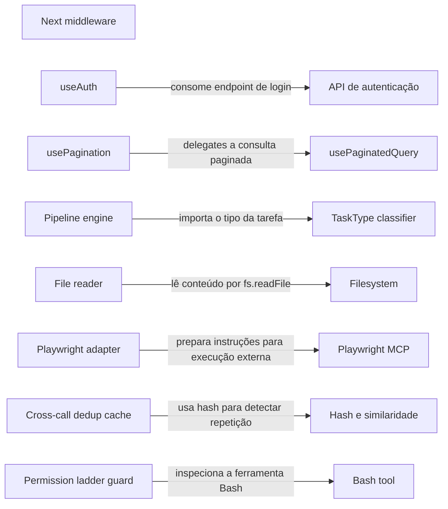

# Arquitetura e organograma

Leitura estática de quatorze arquivos: dez arquivos de código do núcleo MCP, proteção de ferramentas, entrypoint e schema de template, mais quatro manifestos/configurações auxiliares. Regras operacionais do kit são separadas de exemplos de aplicação; não há afirmação de produto ou RPA implantado.

O código revisado se divide em limites de aplicação (middleware e hooks), serviços do núcleo MCP, controles de execução e integrações externas. O mapa abaixo mostra somente relações sustentadas pelos trechos revisados.

O mapa separa níveis C4 quando eles foram identificados e mantém relações inferidas explícitas. Não é organograma de pessoas nem prova de deploy.

## Contextos e limites

| Contexto | O que representa | Evidência |
|---|---|---|
| Runtime do kit e servidor MCP | Núcleo executável que registra ferramentas MCP, carrega serviços e aplica políticas do kit. | [evidence: mcp-server/src/index.ts:61-64] |
| Aplicação consumidora de referência | Template web separado do runtime MCP; serve como exemplo de aplicação que o kit pode apoiar. | [evidence: templates/stack-default/apps/web/package.json:6-8] |
| Benchmark e experimento | Área de benchmark independente, sem evidência de ser parte do caminho de produção do servidor. | [evidence: bench/ab/package.json:2-4] |

## Níveis arquiteturais

| Nível | O que representa | Evidência |
|---|---|---|
| Contexto | Kit de skills com servidor MCP, templates de aplicação e benchmarks em contextos distintos. | [evidence: mcp-server/package.json:4-4] |
| Containers e limites | Servidor MCP, hooks/policies, aplicação web de referência e benchmark possuem responsabilidades e ciclos próprios. | [evidence: mcp-server/package.json:5-8] |
| Componentes | Serviços e bibliotecas internas implementam classificação, pipelines, leitura, deduplicação e guards. | [evidence: mcp-server/src/index.ts:16-16] |

## Organograma de módulos

## Mapa de módulos

| Módulo ou limite | Nível | Tipo | Responsabilidade | Evidência |
|---|---|---|---|---|
| Next middleware | component | control | Aplica fronteiras de rota, sessão por cookie e headers de segurança. | [evidence: src/middleware.ts:42-47] |
| useAuth | component | module | Coordena login, cadastro, logout, cache de queries e navegação do cliente. | [evidence: src/hooks/useAuth.ts:31-35] |
| API de autenticação | component | external | Endpoint consumido pelo hook para iniciar a sessão. | [evidence: src/hooks/useAuth.ts:33-33] |
| usePagination | component | module | Mantém página, parâmetros e limites de navegação sobre uma query paginada. | [evidence: src/hooks/usePagination.ts:29-29] |
| usePaginatedQuery | component | interface | Interface de consulta reutilizada pelo hook de paginação. | [evidence: src/hooks/usePagination.ts:5-5] |
| Pipeline engine | component | module | Transforma o tipo de tarefa em configuração ordenada de etapas, políticas e templates. | [evidence: mcp-server/src/lib/pipeline-engine.ts:158-158] |
| TaskType classifier | component | interface | Fornece o tipo de tarefa usado como chave dos pipelines. | [evidence: mcp-server/src/lib/pipeline-engine.ts:1-1] |
| File reader | component | module | Lê arquivos e monta snippets de código a partir dos caminhos configurados. | [evidence: mcp-server/src/services/file-reader.ts:103-103] |
| Filesystem | component | external | Fonte de conteúdo usada pelo leitor de arquivos. | [evidence: mcp-server/src/services/file-reader.ts:10-10] |
| Playwright adapter | component | module | Monta instruções de screenshot compatíveis com o cliente de browser. | [evidence: mcp-server/src/services/playwright.ts:14-16] |
| Playwright MCP | component | external | Cliente externo que executa as instruções de browser descritas pelo serviço. | [evidence: mcp-server/src/services/playwright.ts:1-1] |
| Cross-call dedup cache | component | module | Mantém uma janela em memória de saídas recentes para detectar duplicação. | [evidence: mcp-server/src/lib/cross-call-dedup.ts:177-179] |
| Hash e similaridade | component | interface | Usa hash exato e comparação de similaridade como caminhos de detecção. | [evidence: mcp-server/src/lib/cross-call-dedup.ts:195-196] |
| Permission ladder guard | component | control | Extrai comandos Bash recebidos pelo hook para aplicar a política de permissão. | [evidence: hooks/scripts/permission-ladder-guard.mjs:104-106] |
| Bash tool | component | external | Ferramenta cuja entrada é inspecionada pelo guard de permissões. | [evidence: hooks/scripts/permission-ladder-guard.mjs:106-106] |

## Relações

| Origem → destino | Relação | Confiança | Evidência |
|---|---|---|---|
| auth-hook → auth-api | consome endpoint de login | observed | [evidence: src/hooks/useAuth.ts:33-33] |
| pagination-hook → paginated-query | delegates a consulta paginada | observed | [evidence: src/hooks/usePagination.ts:29-29] |
| pipeline-engine → task-classifier | importa o tipo da tarefa | observed | [evidence: mcp-server/src/lib/pipeline-engine.ts:1-1] |
| file-reader → filesystem | lê conteúdo por fs.readFile | observed | [evidence: mcp-server/src/services/file-reader.ts:10-10] |
| playwright-adapter → playwright-mcp | prepara instruções para execução externa | inferred | [evidence: mcp-server/src/services/playwright.ts:2-2] |
| dedup-cache → similarity-engine | usa hash para detectar repetição | observed | [evidence: mcp-server/src/lib/cross-call-dedup.ts:195-195] |
| permission-guard → bash-tool | inspeciona a ferramenta Bash | observed | [evidence: hooks/scripts/permission-ladder-guard.mjs:106-106] |

## Lacunas e limites

- O mapa cobre somente os oito arquivos revisados; o wiring completo do servidor MCP e as dependências entre todos os módulos ainda precisam de leitura semântica.
- Não há evidência suficiente nesta amostra para desenhar organogramas de times, ownership ou deploy.
- A relação entre middleware e o hook de autenticação permanece fora do diagrama porque o trecho revisado não mostra uma chamada direta entre eles.
