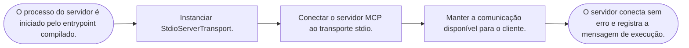

# Workflows e fluxos

Leitura estática de quatorze arquivos: dez arquivos de código do núcleo MCP, proteção de ferramentas, entrypoint e schema de template, mais quatro manifestos/configurações auxiliares. Regras operacionais do kit são separadas de exemplos de aplicação; não há afirmação de produto ou RPA implantado.

Os fluxos revisados cobrem a inicialização do servidor MCP, o consumo de uma ferramenta pelo agente e a decisão do guard de comandos. São fluxos estáticos; não representam uma sessão de produção.

## mcp-startup — Inicialização do servidor MCP via stdio

**Disparador:** O processo do servidor é iniciado pelo entrypoint compilado.

**Atores:** Cliente MCP e processo Node do servidor

**Passos:**
- Instanciar StdioServerTransport.
- Conectar o servidor MCP ao transporte stdio.
- Manter a comunicação disponível para o cliente.

**Sucesso:** O servidor conecta sem erro e registra a mensagem de execução.

**Falha, retry ou exceção:** Falha de inicialização cai no catch de main e termina o processo com exit 1; não há prova de execução nesta análise.

**Confiança:** observed

[evidence: mcp-server/src/index.ts:1505-1506]

## task-routing — Roteamento de uma tarefa para pipeline e plugins

**Disparador:** O cliente chama a ferramenta devkit_route_task com uma descrição.

**Atores:** Cliente MCP, classifier, pipeline engine e plugin router

**Passos:**
- Receber description e project_context opcionais.
- Classificar a tarefa.
- Construir o pipeline correspondente.
- Consultar a composição de plugins.
- Retornar a composição ao cliente.

**Sucesso:** O resultado contém o tipo, as etapas do pipeline e a composição roteada.

**Falha, retry ou exceção:** Falhas do roteador ou de dependências podem rejeitar a chamada; o contrato de erro completo não foi revisado nesta amostra.

**Confiança:** observed

```mermaid
flowchart LR
  start_task-routing([O cliente chama a ferramenta devkit_route_task com uma descrição.])
  step_task-routing_0[Receber description e project_context opcionais.]
  step_task-routing_1[Classificar a tarefa.]
  step_task-routing_2[Construir o pipeline correspondente.]
  step_task-routing_3[Consultar a composição de plugins.]
  step_task-routing_4[Retornar a composição ao cliente.]
  end_task-routing([O resultado contém o tipo, as etapas do pipeline e a composição rotead])
  start_task-routing --> step_task-routing_0
  step_task-routing_0 --> step_task-routing_1
  step_task-routing_1 --> step_task-routing_2
  step_task-routing_2 --> step_task-routing_3
  step_task-routing_3 --> step_task-routing_4
  step_task-routing_4 --> end_task-routing
```

[evidence: mcp-server/src/index.ts:70-71]

## permission-decision — Decomposição de comando para decisão do guard

**Disparador:** O hook recebe um evento Bash com comando composto.

**Atores:** Hook de permissão e comando Bash

**Passos:**
- Extrair o comando do payload do hook.
- Separar substituições e segmentos shell.
- Normalizar aspas simples em barewords.
- Comparar os segmentos com a escada de permissões.
- Permitir ou bloquear conforme a regra encontrada.

**Sucesso:** Uma decisão estruturada é escrita no stdout quando o hook está habilitado.

**Falha, retry ou exceção:** Payload inválido ou configuração desabilitada segue pelo caminho allow; a precedência de múltiplas regras permanece uma melhoria registrada.

**Confiança:** observed

```mermaid
flowchart LR
  start_permission-decision([O hook recebe um evento Bash com comando composto.])
  step_permission-decision_0[Extrair o comando do payload do hook.]
  step_permission-decision_1[Separar substituições e segmentos shell.]
  step_permission-decision_2[Normalizar aspas simples em barewords.]
  step_permission-decision_3[Comparar os segmentos com a escada de permissões.]
  step_permission-decision_4[Permitir ou bloquear conforme a regra encontrada.]
  end_permission-decision([Uma decisão estruturada é escrita no stdout quando o hook está habilit])
  start_permission-decision --> step_permission-decision_0
  step_permission-decision_0 --> step_permission-decision_1
  step_permission-decision_1 --> step_permission-decision_2
  step_permission-decision_2 --> step_permission-decision_3
  step_permission-decision_3 --> step_permission-decision_4
  step_permission-decision_4 --> end_permission-decision
```

[evidence: hooks/scripts/permission-ladder-guard.mjs:116-116]

## Lacunas

- Não há evidência de uma chamada MCP real, de timeout/retry de ferramenta ou de execução de uma automação externa.
- Fluxos de autenticação do app consumidor não foram tratados como fluxo do servidor MCP.
