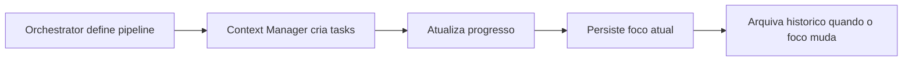

# Context Manager Guide


Guia pratico da skill `08-context-manager` para criacao de tasks, mudanca de foco e persistencia entre sessoes.

## Papel no sistema



## Criando tasks no inicio de um pipeline

Titulos no imperativo, curtos e sem ambiguidade. Uma task por entrega atomica.

```text
- [ ] Criar endpoint POST /users
- [ ] Validar payload com zod
- [ ] Adicionar testes unitarios do service
- [ ] Configurar rate limiting no endpoint
- [ ] Documentar contrato da API
```

Evitar titulos vagos como `Resolver backend` ou `Melhorar codigo`.

## Formato de `docs/context/current-focus.md`

```markdown
# Foco Atual

## Pipeline: cadastro de usuarios
- **Etapa:** backend-api (skill 03)
- **Task ativa:** Criar endpoint POST /users
- **Blocker:** nenhum
- **Dependencias pendentes:** schema do banco (aguardando migration)
- **Ultima atualizacao:** 2026-03-10
```

Manter apenas o foco vigente. Quando o foco mudar, o conteudo anterior vai para `history.md`.

## Formato de `docs/context/history.md`

```markdown
# Historico de Contexto

## 2026-03-10 - cadastro de usuarios (arquivado)
- 5/5 tasks concluidas
- Endpoint POST /users entregue com testes e docs
- Motivo do arquivamento: pipeline concluido

## 2026-03-08 - ajuste de auth (arquivado)
- 3/3 tasks concluidas
- Refresh token implementado
- Motivo do arquivamento: foco mudou para cadastro
```

Cada entrada e um resumo de 2-4 linhas. Sem ruido operacional.

## Mudanca de foco

Quando o usuario muda de assunto no meio de um pipeline:

1. persistir resumo do contexto atual em `history.md`
2. limpar `current-focus.md` e registrar o novo foco
3. criar tasks iniciais do novo pipeline
4. confirmar com o usuario apenas se o arquivamento puder ocultar algo ainda importante

Exemplo de handoff interno:

```text
Context Manager -> Orchestrator:
  foco anterior arquivado (auth - 2/4 tasks pendentes)
  novo foco: dashboard de metricas
  tasks iniciais criadas (3)
```

## Limite de 15 tasks

Maximo de 15 tasks ativas na lista. Ao atingir o limite:

- concluidas: mover para historico
- obsoletas: arquivar com motivo curto
- baixa prioridade: agrupar em uma task guarda-chuva ou postergar

## Integracao com Orchestrator

| Responsabilidade | Orchestrator (09) | Context Manager (08) |
|---|---|---|
| Decidir qual skill executa | sim | nao |
| Montar pipeline | sim | nao |
| Rastrear progresso | nao | sim |
| Detectar mudanca de foco | nao | sim |
| Persistir estado entre sessoes | nao | sim |
| Tornar blockers visiveis | nao | sim |

O Orchestrator decide `o que` e `quem`. O Context Manager rastreia `onde estamos` e `o que falta`.

## Regras rapidas

- uma task `in_progress` por vez quando possivel
- titulo sempre no imperativo
- persistir apenas o que ajuda a proxima sessao
- preferir ferramenta nativa de task do ambiente antes de criar arquivos
