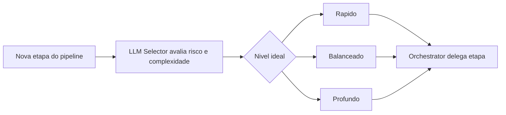

# LLM Selector Guide


Guia auxiliar da skill `16-llm-selector` com tabela de decisao, overrides, integracao com o Orchestrator e exemplos praticos.

## Tabela de Decisao por Nivel

### Rapido

Tarefas mecanicas, repetitivas ou baseadas em template. Baixo risco, baixo custo.

| Skill | Cenario | Exemplo |
|-------|---------|---------|
| Backend | CRUD simples, migration basica | `prisma migrate` com uma tabela nova |
| Frontend | boilerplate, componente estatico | criar page wrapper sem logica |
| Documenter | formatacao, correcao de typo | ajustar heading levels no README |
| Deploy | script de build padrao | adicionar step no Dockerfile |
| Copy | microcopy, placeholder | label de botao, tooltip curto |
| QA | gerar teste unitario trivial | teste de helper puro sem side-effect |
| Context Manager | listar dependencias, mapear estrutura | gerar arvore de pastas |

### Balanceado

Implementacao real com logica, integracao ou decisao de design. Maioria das tasks do dia a dia.

| Skill | Cenario | Exemplo |
|-------|---------|---------|
| Frontend | componente com estado e validacao | form de cadastro com React Hook Form |
| Backend | endpoint com regras de negocio | rota de checkout com calculo de frete |
| QA | teste de integracao, e2e simples | testar fluxo de login com Playwright |
| UI/UX | layout responsivo, design system | criar variante de card com tokens |
| PO | spec de feature media | user story com criterios de aceite |
| Mobile | tela com navegacao e estado | listagem com pull-to-refresh |
| Reviewer | review de PR padrao | PR com 3-5 arquivos, sem auth |

### Profundo

Decisoes estruturais, seguranca, debugging entre camadas ou impacto de longo prazo.

| Skill | Cenario | Exemplo |
|-------|---------|---------|
| Security | revisao de auth flow | validar refresh token + RBAC |
| Orchestrator | plano de execucao complexo | pipeline com 6+ skills e dependencias |
| Backend | refatoracao de modulo critico | reescrever camada de billing |
| Reviewer | review de arquitetura | PR que muda schema de banco + API |
| Frontend | migracao de state management | trocar Redux por Zustand em app grande |
| QA | debugging entre camadas | erro intermitente em SSR + cache |
| PO | decisao de produto critica | pivotar feature core com impacto em 5 modulos |

## Overrides: Quando Subir o Nivel

Mesmo que a tarefa pareca simples, suba de nivel quando:

| Situacao | De | Para | Motivo |
|----------|----|------|--------|
| CRUD que toca auth ou permissoes | Rapido | Balanceado/Profundo | risco de seguranca |
| Migration que altera coluna com FK | Rapido | Balanceado | impacto em integridade de dados |
| Componente simples mas com A11y critico | Rapido | Balanceado | requisito de acessibilidade |
| Teste unitario que mocka servico externo | Rapido | Balanceado | complexidade de mock |
| Review de PR pequeno mas em modulo de pagamento | Balanceado | Profundo | risco financeiro |
| Refatoracao que atinge 10+ dependentes | Balanceado | Profundo | efeito cascata |
| Qualquer tarefa com dados sensiveis (PII, PCI) | qualquer | Profundo | compliance |

Regra geral: na duvida entre dois niveis, escolha o mais alto. O custo de subestimar e maior que o de superestimar.

## Como o Orchestrator Usa

1. **Inicio de etapa** — o Orchestrator invoca `llm-selector` antes de delegar para a skill especialista.
2. **Recomendacao** — o selector retorna nivel, classe de modelo e justificativa.
3. **Decisao** — o Orchestrator registra a recomendacao no plano de execucao.
4. **Acao manual** — se o ambiente suportar, o Orchestrator pode sugerir ao usuario trocar o modelo.

Fluxo tipico:

```text
Orchestrator -> llm-selector: "Backend, criar endpoint de webhook"
llm-selector -> Orchestrator:
  Recomendacao: Balanceado (modelo geral equilibrado)
  Acao manual opcional: nenhuma
  Motivo: integracao com servico externo, logica moderada
Orchestrator -> backend-api: executa com nivel Balanceado
```

## Fluxo visual



## Exemplos Praticos

| Tarefa | Nivel | Justificativa |
|--------|-------|---------------|
| Criar migration Prisma simples (add tabela) | Rapido | schema mecanico, sem logica |
| Implementar componente React com form + validacao | Balanceado | estado, validacao, UX |
| Revisar seguranca de auth flow | Profundo | risco alto, analise de vulnerabilidades |
| Refatorar modulo com 15 dependencias | Profundo | efeito cascata, decisoes estruturais |
| Gerar seed de dados para dev | Rapido | template, sem risco |
| Criar API de relatorio com aggregation | Balanceado | logica de query, mas padrao conhecido |
| Migrar banco de Postgres para schema multi-tenant | Profundo | arquitetura, dados, rollback complexo |
| Escrever teste e2e de fluxo de compra | Balanceado | integracao, mas fluxo linear |
| Debugging de memory leak em SSR | Profundo | multiplas camadas, analise profunda |
| Adicionar campo opcional em form existente | Rapido | alteracao mecanica, baixo risco |

## Uso

- Consultar este guia para decisoes rapidas de nivel sem precisar invocar a skill.
- Preferir a skill principal (`16-llm-selector`) quando houver duvida ou necessidade de justificativa formal.
- Revisar a secao de overrides antes de aceitar o nivel inicial sugerido.
