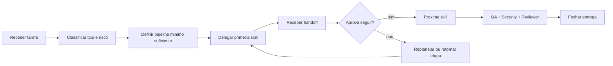

# Orchestrator Playbook


Guia auxiliar da skill `09-orchestrator` para pipelines extensos, replanejamento e fluxos de rejeicao.

## Quando abrir este guia

- quando a task fugir do pipeline padrao
- quando houver 5+ skills envolvidas
- quando existir dependencia forte entre etapas
- quando o fluxo precisar voltar uma etapa apos rejeicao

## Fluxo resumido



## O que o Orchestrator decide

| Decide | Exemplos |
|---|---|
| Pipeline | feature completa, bug fix, hotfix, release |
| Ordem | se Copy entra antes de UI/UX, se Accessibility entra cedo |
| Reexecucao | quando voltar para Backend, Frontend ou QA |
| Escopo transversal | quando incluir Documentador, Observability, Analytics |

## Heuristicas rapidas

### Pipeline curto

Use quando o delta for pequeno e localizado.

Exemplos:
- bug em endpoint sem impacto visual
- ajuste de validacao
- hotfix de seguranca pontual

### Pipeline medio

Use quando houver integracao entre camadas.

Exemplos:
- nova tela com backend e testes
- refactor moderado de fluxo de cadastro
- landing page com copy, UI e SEO

### Pipeline amplo

Use quando houver risco estrutural, rollout ou multiplas especialidades transversais.

Exemplos:
- migracao de auth
- integracao de IA no produto
- release com mudancas operacionais e observabilidade

## Rejeicao e replanejamento

```text
Reviewer rejeita -> Orchestrator identifica skill dona do problema -> delega correcao -> recebe handoff -> reencaminha para validacao do delta
```

Regras praticas:

- nao rerodar o pipeline inteiro sem motivo
- voltar apenas ate a etapa que controla a causa raiz
- se o problema for de seguranca, reencaminhar tambem para `06-security-review`
- se o problema tocar regra de negocio, garantir nova passagem por `05-qa-testing`

## Checklist do plano de execucao

- tipo de tarefa classificado
- risco principal identificado
- pipeline minimo suficiente definido
- skills transversais incluidas quando necessario
- criterio claro de encerramento definido

## Uso

- preferir o core curto da skill para classificacao inicial
- abrir este playbook apenas para cenarios menos padrao ou com retrabalho entre etapas
