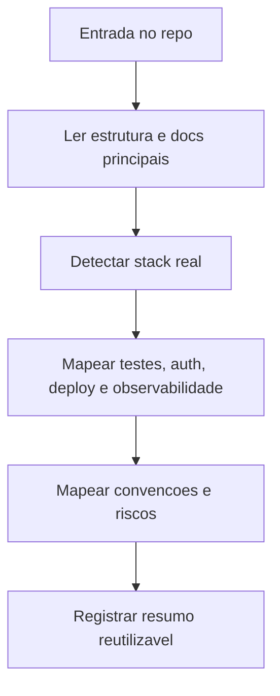

# Repo Auditor Guide

Guia auxiliar da skill `18-repo-auditor` para auditorias mais completas, revisoes incrementais e economia de contexto.

## Quando usar

- quando `docs/repo-audit/current.md` nao existe
- quando o repo mudou de stack, estrutura ou convencoes
- quando houver duvida real sobre testes, deploy, auth ou observabilidade
- quando o contexto visual precisar alimentar `Asset Librarian` ou `Image Generator`

## Saida esperada

O Auditor deve deixar pelo menos:

- `docs/repo-audit/current.md` com stack, convencoes, testes, riscos e operacao
- `docs/repo-audit/assets.md` quando o contexto visual for relevante

## Mapa de leitura

## Checklist de auditoria

| Area | Verificar |
|---|---|
| Stack | framework, runtime, package manager, linguagens |
| Estrutura | pastas principais, entry points, docs reais |
| Qualidade | testes, lint, typecheck, quality gates |
| Seguranca | auth, headers, secrets, superficie externa |
| Operacao | build, deploy, rollback, observabilidade |
| Visual | logos, fontes, icones, tokens, assets existentes |

## Reauditoria incremental

Nao releia o repo inteiro sem necessidade. Prefira:

1. ler `docs/repo-audit/current.md`
2. localizar apenas as areas impactadas pela nova mudanca
3. atualizar os pontos que envelheceram
4. registrar novos riscos ou convencoes detectadas

## Boas praticas

- diferenciar claramente o que e fato do repo e o que e convencao sugerida
- priorizar caminhos reais, nao estrutura idealizada
- registrar gaps importantes, mas sem inflar a auditoria com ruido
- preparar o material para reaproveito de outras skills

## Uso

- preferir `docs/repo-audit/current.md` no dia a dia
- abrir este guia quando a auditoria exigir aprofundamento maior ou revalidacao estrutural
