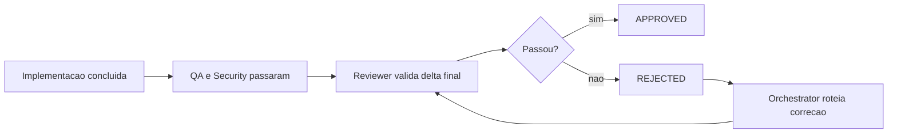

# Reviewer Guide


Guia pratico da skill `11-reviewer` para validacao final, formato de rejeicao e revalidacao.

## Papel no fluxo



## Checklist de validacao

O Reviewer verifica quatro areas obrigatorias antes de aprovar:

| Area | Itens-chave |
|---|---|
| Codigo | nomes descritivos, sem TODO, sem `console.log`, sem `any`, DRY, SOLID |
| Testes | unitarios e E2E passando, cobertura >= 80%, CI green |
| Seguranca | `06-security-review` aprovado, OWASP Top 10, sem credenciais expostas |
| Documentacao | feature documentada, API documentada, ADR se houve decisao arquitetural |

Se qualquer item gate falhar, o status final e `REJECTED`.

## Como emitir rejeicao

Formato curto e direto. Cada finding deve conter:

```markdown
## REJECTED

### Findings

1. **Skill responsavel:** backend-api (03)
   **Finding:** endpoint POST /users retorna 500 sem payload; falta validacao de body vazio
   **Classificacao:** codigo
   **Prioridade:** alta

2. **Skill responsavel:** qa-testing (05)
   **Finding:** cobertura em 62%, abaixo do gate de 80%
   **Classificacao:** teste
   **Prioridade:** alta
```

Listar todos os problemas encontrados, nao apenas o primeiro.

## Gate real vs guideline

| Tipo | Comportamento | Exemplo |
|---|---|---|
| Gate | bloqueia aprovacao | testes falhando, credencial exposta, sem security review |
| Guideline | sugere melhoria, sem bloquear sozinha | nome pouco descritivo, import desordenado |

Regra pratica: se pode causar bug em producao, risco de seguranca ou quebra de contrato, trate como gate.

## Workflow de revalidacao

Depois da correcao, o Reviewer revalida apenas o delta:

1. confirmar que o finding original foi corrigido
2. verificar se a correcao nao criou problema novo no escopo alterado
3. nao rerodar o checklist inteiro sem necessidade
4. exigir `06-security-review` se o fix tocar seguranca
5. exigir `05-qa-testing` se o fix tocar regra de negocio

```text
Reviewer rejeita -> Orchestrator delega -> Skill corrige -> Reviewer revalida delta
```

Maximo recomendado: 3 ciclos de rejeicao antes de reavaliar o pipeline.

## Regras rapidas

- nunca aprovar com finding critico de seguranca
- nunca aprovar sem testes passando
- ser especifico: arquivo, problema e skill responsavel
- re-review valida delta, nao o sistema inteiro
- `Parcialmente corrigido` nao existe
