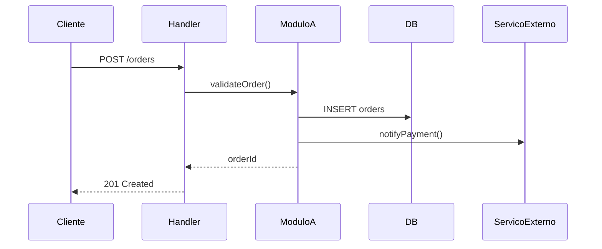

# Como reconstruir o fluxo "criar pedido" end-to-end sem mexer no código

Com 7 módulos, 3 eventos, 4 tabelas e 2 chamadas externas envolvidos, a abordagem recomendada é:

## 1. Mapeie os pontos de entrada

Identifique onde o fluxo começa: rota HTTP (`POST /orders`), comando CLI, job agendado ou mensagem de fila. Use grep para encontrar:
```
grep -r "createOrder\|criar_pedido\|POST.*order" src/
```

## 2. Siga o call chain

A partir do handler de entrada, trace cada chamada de função até os efeitos finais:
- Qual função o handler chama?
- Essa função chama quais outras?
- Onde acontecem os writes no banco?
- Onde acontecem as chamadas externas?

Use `grep -r "nomeDaFuncao"` para cada função identificada.

## 3. Identifique os 3 eventos

Procure por `emit`, `publish`, `dispatch`, `EventEmitter`, `kafka.send`, `queue.push` ou similares no caminho do fluxo. Documente:
- Nome do evento
- Onde é disparado
- Payload enviado

## 4. Mapeie as 4 tabelas

Procure por queries de INSERT/UPDATE nas 4 tabelas afetadas. Documente:
- Em qual step do fluxo cada tabela é escrita
- Se há transação envolvendo múltiplas escritas
- Se há rollback em caso de falha

## 5. Documente as 2 chamadas externas

Procure por `fetch`, `axios`, `http.request`, chamadas a SDKs de terceiros. Documente:
- Qual serviço externo
- Em qual step do fluxo
- O que acontece em caso de falha (retry? rollback?)

## 6. Produza o diagrama de sequência

Com os dados acima, escreva um diagrama Mermaid:


## 7. Documente edge cases

Para cada passo identificado, registre o que acontece quando falha:
- Validação falha → qual erro retorna?
- Chamada externa falha → rollback ou compensação?
- Evento não entregue → retry ou dead-letter?

## Output sugerido

Produza um arquivo `docs/flows/criar-pedido.md` com:
- Happy path step-by-step com referências a arquivos (file:line)
- Edge cases por módulo
- Estado mutado por step
- Falhas possíveis e tratamento
