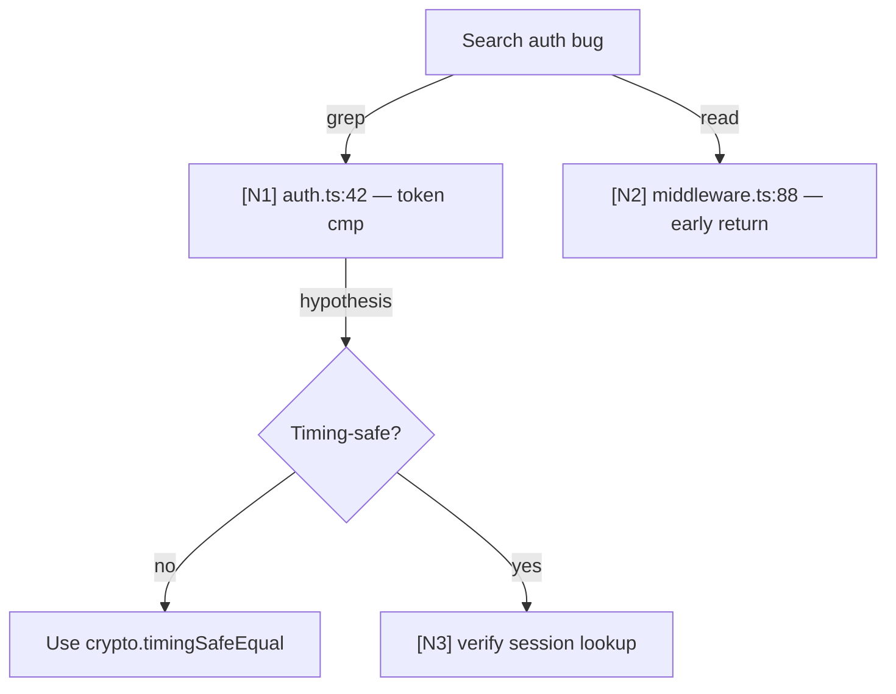

# Symbolic Memory — Mermaid Canvas + `node_id` Drill-Down

## Objetivo

Comprimir **logs verbosos de tool calls** (search results, error traces, file dumps) em um **grafo Mermaid de alta densidade semântica**, preservando rastreabilidade completa via `node_id` para os arquivos crus.

Aplica-se a long-horizon agents — 50+ tool calls na mesma sessão — onde context window vira gargalo antes do trabalho terminar. Casos típicos no kit: `/swarm`, `/auto`, comprehensive reviews (skill 40, Caminho A 4-5 agents), pipelines que iteram (`/loop`).

Padrão absorvido de [Tencent/TencentDB-Agent-Memory](https://github.com/Tencent/TencentDB-Agent-Memory) — v2.14.0 (2026-05-24). Eles publicaram ganhos medidos: WideSearch −61% tokens, SWE-bench −33% tokens, AA-LCR −31% tokens.

## Princípio

> O agente raciocina sobre **símbolos**. Os símbolos apontam para evidência. Evidência fica no disco, símbolos ficam no contexto.

Tradução prática: em vez de manter 50 outputs de `Bash`/`Grep`/`Read` no histórico, mantém um Mermaid de ~300 tokens onde cada nó tem `node_id` que resolve para o arquivo bruto se o agente precisar drill-down.

## Anatomia do canvas



Regras:

- **Node label** = título de 5-10 palavras (não a saída crua)
- **Edge label** = ferramenta usada (`grep`, `read`, `bash`, `agent`, etc)
- **`[Nk]` prefix** = node_id estável dentro da sessão
- **`refs/Nk.md`** = arquivo no disco com a saída crua completa (filesystem fora do contexto)

## Onde mora o que

| Camada | Conteúdo | Local | Vive no contexto? |
|---|---|---|---|
| **Bottom** | Tool outputs crus (search results, file dumps, error traces) | `.auto/refs/Nk.md` ou `.swarm/refs/Nk.md` | ❌ Nunca — só sob demanda |
| **Middle** | Step-level summaries (1-line por tool call) | `.auto/tool-calls.jsonl` | ❌ Não — usado pra rebuild |
| **Top** | Mermaid canvas com `node_id` | `.auto/canvas.mmd` | ✅ Injetado a cada turno |

## Quando ativar

Heurísticas de gatilho (uma basta):

1. **Contagem**: ≥ 30 tool calls na sessão atual
2. **Tamanho**: histórico de mensagens > 50% do context window
3. **Modo**: dentro de `/swarm`, `/auto`, `/loop` longo (>10 iterations)
4. **Pedido explícito**: usuário diz "comprime contexto" ou "use canvas"

Fora desses cenários, **não compactar** — overhead de manter o canvas não compensa pra tarefas curtas.

## Drill-down protocol

Quando o agente precisa de detalhe além do label:

```
1. Identifica node_id no canvas (ex: [N12])
2. Lê refs/N12.md (filesystem, fora do contexto persistente)
3. Usa só o trecho relevante no turno atual
4. Não promove o arquivo todo de volta pro contexto
```

Anti-padrão: ler `refs/Nk.md` e enfiar tudo no próximo prompt — derrota a compressão.

## Como medir

- `cat .auto/tool-calls.jsonl | wc -l` — total de tool calls da sessão
- `wc -c .auto/canvas.mmd` — tamanho do canvas atual (objetivo: < 4000 chars)
- `/savings` mostra tokens economizados via compressão (campo `symbolic_compression`)
- Em benchmarks com Mermaid canvas ativo: tokens consumidos / tokens sem canvas

## Anti-padrões

| Anti-padrão | Por que evita |
|---|---|
| Manter tool outputs crus no contexto após >20 chamadas | Custa 5-10x mais tokens; cache da Anthropic perde efeito |
| Resumir tudo num bloco de texto narrativo (sem grafo) | Perde estrutura de causalidade; recall pior |
| `node_id` não-estáveis (mudar a cada turn) | Quebra drill-down; vira nome novo a cada rebuild |
| Comprimir antes da 30ª tool call | Overhead > ganho; tarefas curtas não precisam |
| Não persistir `refs/Nk.md` em disco | Drill-down impossível; compressão vira lossy summarization |

## Onde **não** aplicar

- **Sessões curtas** (< 30 tool calls) — overhead sem retorno
- **One-shot questions** — sem histórico, nada pra comprimir
- **Skills numeradas isoladas** — playbook vive como markdown, não como tool calls
- **Conversas com usuário humano** — Mermaid no chat é pior UX que prosa direta

## Diferenças vs. TencentDB upstream

Eles têm runtime TypeScript que intercepta tool calls via plugin OpenClaw/Hermes. O kit **não** ataca o problema no runtime — emite o canvas via script `scripts/mmd-canvas-builder.mjs` que lê `.auto/tool-calls.jsonl` (já gerado por `hooks/scripts/session-event-logger.mjs` quando `DEVKIT_TRACE_NAME` está setado).

Trade-off:

- ✅ **A favor do kit**: zero infra, zero LLM extra rodando, funciona em qualquer Claude Code
- ❌ **A favor do upstream**: injeção é automática a cada turno; nosso é manual via prompt explícito

Por ser opt-in via script, esta policy não muda o comportamento default — agentes que não precisarem ignoram.

## Referências cruzadas

- `policies/memory-pyramid.md` — onde o canvas se encaixa na pirâmide L0→L3
- `policies/memory-tiers.md` — tier "Working" recebe o canvas; tier "Episodic" recebe os `refs/Nk.md` ao fim da sessão
- `policies/context-engineering.md` — hierarquia geral de contexto
- `scripts/mmd-canvas-builder.mjs` — builder zero-dep que emite o `.auto/canvas.mmd`
- `skills/40-parallel-dispatcher/SKILL.md` — seção "Long-horizon compression" referencia esta policy
- Upstream: [Tencent/TencentDB-Agent-Memory](https://github.com/Tencent/TencentDB-Agent-Memory) — README seção "Symbolic Memory: Maximum Semantics in Minimum Symbols"
